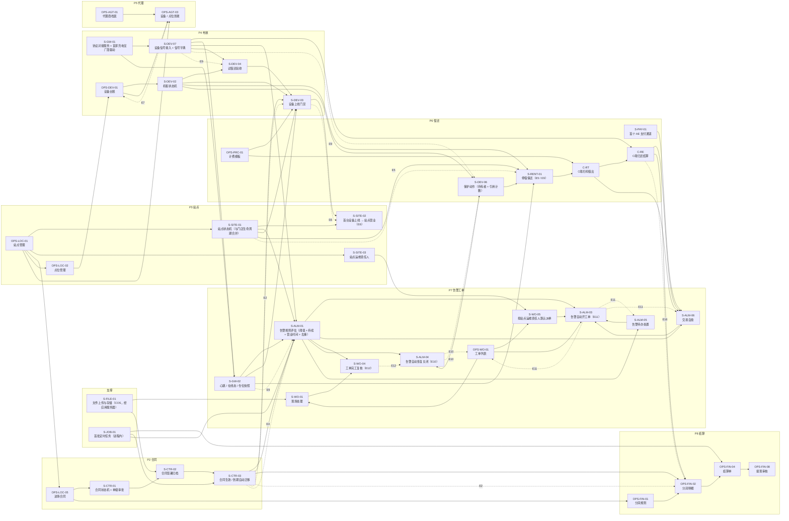

# 运营核心流程 · 功能规划与功能关联

> 2026-09-25 · 上游：[运营核心流程](./运营核心流程.md) · [功能矩阵与对齐总表](./运营核心流程-功能矩阵.md) · [分级矩阵](./功能清单-分级矩阵.md)（分级唯一真源）· 开发设计 [TDD-运营核心流程](../technical/TDD-运营核心流程/README.md)
>
> 本文回答两件事：**每个功能要做成什么样**（规划要点），以及**它和谁有关**（依赖、被依赖、联动、共享对象）。
> 关联关系以一张有向图维护（140 个功能节点、硬 / 软前置边、27 条联动边），下文的层级、关键路径、外部依赖影响面都由图**计算**得出，不是手排的。

---

## 〇、读法

| 关联类型 | 含义 | 例 |
|---|---|---|
| **硬前置** | 缺了它，本功能无法成立 | 上线门禁 S-DEV-03 硬依赖合同生效 S-CTR-03 |
| **软前置** | 缺了能用，但体验差或要人工补位 | 合同生效 S-CTR-03 软依赖事件重投修复 S-ARC-03（修好前靠定时对账兜底） |
| **直接支撑** | 反向：哪些功能以本功能为前置（「（软）」= 软依赖） | 站点 OPS-LOC-01 支撑点位、合同、状态机…… |
| **联动** | 运行期由事件或规则触发的跨功能影响，编号对应流程文档 §四 E1–E18 | E6：上线门禁通过 → 站点自动转营业 |
| **层** | 只看硬前置的依赖深度：0 = 无前置；n = 最深前置链长度。**同层可并行开发** | |
| **批次** | 已有 = 现网已具备 · P0–P4 = TDD 实施批次 · 外部 = 依赖外部方 · 在途 = 其他会话进行中 · L1+/L2+ = 后续 | |

---

## 一、结论

| # | 结论 | 依据 |
|---|---|---|
| 1 | **依赖图无环**，140 个功能可以按层推进 | §三 |
| 2 | **L0 共 13 层**；与 TDD 批次吻合：文件 / 定时（第 0 层）= P0 · 合同（4–6 层）= P1 · 站点（3、8 层）= P2 · 设备与停借（4–7 层）= P3 · 告警工单（7–11 层）= P4 | §3.1 |
| 3 | **只有一处跨级依赖**：L0 的「完工复核」S-WO-04 硬依赖 L1 的「现场处理」S-WO-01 —— 复核要看完工必填项（故障原因、现场照片） | 已处理：S-WO-01 中「完工必填」部分随 L0 做，已回写矩阵备注（§六） |
| 4 | **关键路径 14 步**，从基础字典一直到代理提现：OPS-SYS-09（地区库） → OPS-LOC-04（场地方档案） → OPS-LOC-01（站点管理） → OPS-LOC-02（点位管理） → OPS-DEV-01（设备台账） → S-DEV-02（机柜状态机） → S-DEV-06（保护动作（持有者 + 引用计数）） → S-RENT-01（停借保还（E5 / E9）） → C-RT（C端扫码借出） → C-RE（C端归还结算） → OPS-FIN-02（分润明细） → OPS-FIN-04（结算单） → OPS-FIN-08（提现审核） → AGT-06（申请提现） | §3.2 |
| 5 | **协议网关 S-GW-01 是影响面最大的外部依赖**：33 个 L0 功能直接或间接依赖它；支付 S-PAY-01 影响 22 个 | §3.3 |
| 6 | 被硬依赖最多的是：工单 OPS-WO-01（10）、业务告警判定 S-ALM-01（9）、数据范围 S-AUTH-03（8）、站点 OPS-LOC-01 · 代理档案 OPS-AGT-01 · 订单 OPS-ORD-01（各 7）、站点状态机 S-SITE-01 · 合同生效 S-CTR-03（各 6）—— 它们的**接口一旦变动，波及面最大**，应最先定稿 | §五 各表「直接支撑」列 |

---

## 二、关联总图（L0 主干，39 个关键功能）

实线 = 硬前置（箭头指向依赖它的功能）；虚线 = 运行期联动（E 编号）。

---

## 三、建设顺序

### 3.1 L0 依赖层（同层可并行）

| 层 | 数量 | 功能 |
|:-:|:-:|---|
| 0 | 21 | S-AUTH-01 安全止血 S0 · S-AUTH-02 OTP 落库 + 频控 · OPS-ORG-01 员工 · OPS-SYS-03 通知模板 · OPS-SYS-08 参数字典 · OPS-SYS-09 地区库 · OPS-SYS-12 系统参数 · S-NTF-01 短信 OTP 通道 · S-JOB-01 首批定时任务（进程内） · S-FILE-01 文件上传与存储（COS，经应用服务器） · S-ARC-03 Outbox 进程内事件重投修复 · S-I18N-01 zh / en / ar + RTL（三端） · OPS-MKT-01 公告管理 · S-GW-01 协议对接服务 + 首家充电宝厂商驱动 · OPS-SYS-01 供应商接入 · S-PAY-01 首个 AE 支付通道 · S-NTF-02 借还 Push（APNs / FCM） · OPS-PRC-01 计费模板 · OPS-ALM-03 告警代码 · OPS-SYS-11 问题管理 · OPS-SYS-10 银行管理 |
| 1 | 12 | OPS-ORG-03 角色权限 · OPS-LOC-04 场地方档案 · OPS-LOC-06 BD 拓展 CRM · S-DEV-07 设备信号接入 + 信号字典 · OPS-AGT-01 代理商档案 · OPS-SYS-02 支付渠道 · C-AC C端账户 · C-PAY C端支付 · C-MS-01 借还 / 账单通知 · OPS-DEV-04 远程控制 · 指令记录 · OPS-WO-01 工单列表 · OPS-ALM-04 通知规则 |
| 2 | 11 | S-AUTH-03 数据范围（AGENT / REGION 收敛） · S-CMP-01 PDPL：同意 / 撤回 / 注销 / 数据导出；PII 分库 · OPS-LOC-01 站点管理 · OPS-AGT-02 代理账号管理 · OPS-AGT-04 分润配置（AGENT 维度） · C-DF C端免押 · C-ME-02 信用分 · S-GW-02 心跳 / 在线态 / 仓位快照 · OPS-WO-02 工单看板 · OPS-ALM-02 告警通知 · C-CS-01 自助报障 |
| 3 | 10 | OPS-DSH-01 经营看板 · OPS-LOC-05 进场合同 · OPS-LOC-02 点位管理 · S-SITE-01 站点状态机（与门店生命周期合并） · S-SITE-03 站点运维责任人 · AGT-07 设备报修 · C-MAP C端找柜 · OPS-ORD-04 投诉订单 · OPS-DEV-03 实时监控 · OPS-FIN-07 代理分润配置（深链） |
| 4 | 5 | S-CTR-01 合同状态机 + 单级审批 · OPS-DEV-01 设备台账 · AGT-01 我的看板 · S-WO-05 按站点运维责任人默认派单 · OPS-FIN-01 分润规则 |
| 5 | 4 | S-CTR-02 合同签署归档 · OPS-DEV-02 充电宝管理 · S-DEV-02 机柜状态机 · OPS-AGT-03 设备 / 点位划拨 |
| 6 | 4 | S-CTR-03 合同生效 / 到期自动迁移 · S-DEV-04 试借还验收 · AGT-02 我的设备 · S-DEV-06 保护动作（持有者 + 引用计数） |
| 7 | 3 | S-DEV-03 设备上线门禁 · S-RENT-01 停借保还（E5 / E9） · S-ALM-01 告警规则评估（阈值 + 持续 + 营业时间 + 去重） |
| 8 | 6 | S-SITE-02 首台设备上线 → 站点营业（E6） · C-RT C端扫码借出 · S-ALM-05 告警待办处置 · S-ALM-04 告警自动恢复关闭（E10） · OPS-ALM-01 告警记录 · S-WO-04 工单完工复核（E12） |
| 9 | 3 | C-US C端使用中 · C-RE C端归还结算 · OPS-ORD-01 订单列表 |
| 10 | 6 | AGT-03 我的订单 · C-BL C端订单账单 · OPS-ORD-03 异常订单 · OPS-ORD-05 退款记录 · S-ALM-06 交易自愈 · OPS-FIN-02 分润明细 |
| 11 | 5 | AGT-04 我的收益 · OPS-CS-03 退款 / 补偿（深链） · S-ALM-03 告警自动开工单（E11） · C-CS-03 退款跟踪 · OPS-FIN-04 结算单 |
| 12 | 3 | OPS-AGT-05 代理收益结算（深链） · AGT-05 我的结算 · OPS-FIN-08 提现审核 |
| 13 | 1 | AGT-06 申请提现 |

### 3.2 关键路径

最长硬依赖链（决定 L0 全部成立的最短周期）：

OPS-SYS-09（地区库） → OPS-LOC-04（场地方档案） → OPS-LOC-01（站点管理） → OPS-LOC-02（点位管理） → OPS-DEV-01（设备台账） → S-DEV-02（机柜状态机） → S-DEV-06（保护动作（持有者 + 引用计数）） → S-RENT-01（停借保还（E5 / E9）） → C-RT（C端扫码借出） → C-RE（C端归还结算） → OPS-FIN-02（分润明细） → OPS-FIN-04（结算单） → OPS-FIN-08（提现审核） → AGT-06（申请提现）

链上任何一环延期，整条链后移；其中 **S-DEV-02 机柜状态机 → S-DEV-06 保护动作 → S-RENT-01 停借保还** 与 **C-RT 借出 → C-RE 归还 → OPS-FIN-02 分润** 两段是本期新建或受外部阻塞的，是排期的重点。

### 3.3 外部依赖的影响面

| 外部依赖 | 等待什么 | 受影响的 L0 功能数 | 不等它也能先做的 |
|---|---|:-:|---|
| S-GW-01 协议对接 + 首家厂商驱动 | 厂商协议文档与测试机 | 33 | 信号全部可经 `/internal/events/device` 模拟注入，判定 / 处置 / 门禁逻辑先完成 |
| S-PAY-01 首个 AE 支付通道 | nearpay 商户资料与联调 | 22 | 借还、退款、自愈的资金侧用桩；`PAYMENT_STATE_UNKNOWN` 出厂关闭 |
| S-AUTH-01 安全止血 S0 | 内部（在途） | 27 | — |
| S-NTF-01 短信 OTP 通道 | 短信服务商 | 25 | 开发 / 测试用固定验证码（仅 dev） |
| S-NTF-02 借还 Push | APNs / FCM 证书 | 1 | 自愈的用户通知先走站内消息 |

---

## 四、核心对象 × 功能

一个对象被哪些功能**创建（C）**、**改状态 / 关键属性（U）**、**读取做判定或展示（R）**。改对象的规则时，按行找到所有受影响的功能。

| 对象（表） | C 创建 | U 改状态 / 关键属性 | R 读取 |
|---|---|---|---|
| 场地方（`loc_venue`） | OPS-LOC-04 · OPS-LOC-07（进件通过）· S-LEAD-04 | — | OPS-LOC-05 · OPS-LOC-01 |
| 商机（`loc_lead`） | OPS-LOC-06 | S-LEAD-02 · S-LEAD-03 · S-LEAD-04 | OPS-LOC-08 · S-MAP-01 |
| 合同（`loc_contract`） | OPS-LOC-05 · S-LEAD-04 · S-CTR-06（续签） | S-CTR-01 · S-CTR-02 · S-CTR-03 · S-CTR-07 | S-DEV-03 · S-SITE-01（恢复前置）· S-ALM-01 · OPS-FIN-01 · OPS-FIN-02 · S-STL-01 |
| 站点（`loc_site`） | OPS-LOC-01 | S-SITE-01 · S-SITE-02 · S-EXIT-01 · S-EXIT-03 | S-RENT-01 · S-DEV-03 · S-ALM-01 · C-MAP · S-WO-05 |
| 站点责任（`loc_site_agent` · `ops_employee_no`） | S-SITE-03 | S-AGT-02 · S-AGT-03 | S-WO-05 · OPS-FIN-02 |
| 点位（`loc_location`） | OPS-LOC-02 | — | OPS-DEV-01 |
| 机柜（`dev_cabinet`） | OPS-DEV-01 | S-DEV-02 · S-DEV-03 · OPS-AGT-03（归属）· OPS-DEV-06 | S-RENT-01 · S-ALM-01 · C-MAP · OPS-DEV-03 |
| 充电宝（`dev_powerbank`） | OPS-DEV-02 | C-RT · C-RE · C-US（买断）· S-DSP-03 | S-DEV-04 · S-RENT-01 |
| 保护动作（`dev_protection`） | S-DEV-07（信号）· S-ALM-01（经端口）· 人工 | S-ALM-04（释放） | S-RENT-01 · C-MAP |
| 设备信号（事件 + `dev_event_code`） | S-DEV-07 | — | S-ALM-01 · S-DEV-04 · OPS-DEV-05 |
| 订单（`ord_order`） | C-RT | C-US · C-RE · S-ALM-06 · OPS-ORD-05 | OPS-ORD-01 · S-ALM-01（交易类）· OPS-FIN-02 · S-EXIT-03 |
| 业务告警（`dev_alarm`） | S-ALM-01 | S-ALM-03 · S-ALM-04 · OPS-ALM-01（确认 / 关闭）· S-WO-04 | OPS-ALM-01 · OPS-DSH-01 |
| 工单（`wo_order`） | S-ALM-03 · AGT-07 · OPS-WO-04 · OPS-CS-01 · S-EXIT-02 · S-WO-03 | S-WO-05 · S-WO-01 · S-WO-04 · S-ALM-04（撤单）· S-AGT-02（改派） | OPS-WO-02 · S-EXIT-03 · OPS-AGT-06 |
| 告警待办（`dev_alarm_todo`） | S-ALM-05 | S-ALM-05（完成）· S-ALM-04（撤销） | OPS-DSH-01 |
| 文件（`sys_file`） | S-FILE-01 | S-CTR-02 · S-WO-01 · C-CS-01（绑定） | 各详情页 |
| 分润明细（`share_record`） | OPS-FIN-02 | — | OPS-FIN-03 · OPS-FIN-04 · AGT-04 · OPS-RPT-02 |
| 结算单（`stl_settlement`） | OPS-FIN-04 | S-STL-01 · S-STL-02 | AGT-05 · OPS-FIN-08 |
| 提现（`stl_withdrawal`） | AGT-06 | OPS-FIN-08 | — |
| 代理商（`agt_agent`） | OPS-AGT-01 · OPS-AGT-07 | S-AGT-02 · S-AGT-03 | OPS-AGT-03 · S-WO-05 · S-SITE-03 |

---

## 五、逐环功能规划

「规划要点」取自分级矩阵的要点列（真源），C 端按分组列出成员与级别；「直接支撑」「联动」由依赖图反算。

### X 贯穿支撑

| 编号 | 功能 | 级 | 批次 | 层 | 规划要点（子功能 / 规则） | 硬前置 | 软前置 | 直接支撑 | 联动 |
|---|---|:-:|---|:-:|---|---|---|---|---|
| OPS-MKT-01 | 公告管理 | **L0** | 已有 | 0 | 三语 + 生效期 + 置顶；停业 / 维护要能通知用户 | — | — | — | — |
| OPS-ORG-01 | 员工 | **L0** | 已有 | 0 | 建号 / 启停 / 重置密码 / 角色分配；**个人账号取代共享管理员** | — | — | OPS-LOC-06 · OPS-ORG-03 · OPS-WO-01 · S-SITE-03 | — |
| OPS-SYS-03 | 通知模板 | **L0** | 已有 | 0 | 多通道模板，ar / en；OTP 短信模板是登录的前提 | — | — | OPS-ALM-04 · S-CTR-04（软） | — |
| OPS-SYS-08 | 参数字典 | **L0** | 已有 | 0 | 业务字典维护 | — | — | — | — |
| OPS-SYS-09 | 地区库 | **L0** | 已有 | 0 | 区域 / 城市（站点建档要选） | — | — | OPS-AGT-01 · OPS-LOC-01 · OPS-LOC-04 | — |
| OPS-SYS-12 | 系统参数 | **L0** | 已有 | 0 | 心跳阈值 / 指令超时 / 计费默认值 | — | — | S-CTR-05 | — |
| S-ARC-03 | Outbox 进程内事件重投修复 | **L0** | 修复任务 | 0 | 进程内监听失败的事件由轮询器真正重投（现状：被直接标 SENT，静默丢失）；监听方幂等 | — | — | OPS-FIN-02（软） · S-CTR-03（软） · S-SITE-02（软） · S-WO-04（软） | — |
| S-AUTH-01 | 安全止血 S0 | **L0** | 外部/在途 | 0 | 去掉前端指定角色；后端永远校验凭据；固定验证码只在 dev；内存会话过期；两端登出调后端；401 跳登录 | — | — | C-AC · OPS-AGT-02 | — |
| S-AUTH-02 | OTP 落库 + 频控 | **L0** | 在途 | 0 | 5 分钟有效、只存哈希、错 5 次锁、60 秒 / 天 10 次 | — | — | C-AC · OPS-AGT-07 | — |
| S-FILE-01 | 文件上传与存储（COS，经应用服务器） | **L0** | P0 | 0 | 按用途定策略；先传后绑；下载按归属对象鉴权；本地 / COS 双适配器 | — | — | C-CS-01（软） · OPS-AGT-07（软） · OPS-LOC-02（软） · OPS-LOC-07（软） · S-CTR-02 · S-LEAD-01（软） · S-WO-01 | — |
| S-I18N-01 | zh / en / ar + RTL（三端） | **L0** | 已有 | 0 | 前后端文案、错误文案按 `Accept-Language` | — | — | — | — |
| S-JOB-01 | 首批定时任务（进程内） | **L0** | P0 | 0 | 预授权超时释放、订单超时买断、结算单生成、会话清理 | — | — | OPS-FIN-04 · OPS-WO-04（软） · S-ALM-01 · S-CTR-03 · S-LEAD-03 | — |
| S-NTF-01 | 短信 OTP 通道 | **L0** | 外部 | 0 | 登录验证码；发送失败不泄露账号是否存在 | — | — | C-AC · OPS-ALM-04（软） | — |
| OPS-ORG-03 | 角色权限 | **L0** | 已有 | 1 | 角色 = 功能权限集 + 数据范围；内置角色只读 | OPS-ORG-01 | — | S-AUTH-03 · S-CTR-01 | — |
| S-AUTH-03 | 数据范围（AGENT / REGION 收敛） | **L0** | 已有 | 2 | `iam_data_scope` + SQL 拦截器；**AGENT 强制 = 自己；`ord_rent` / `wo_order` 的 `agent_no` 注册进数据范围** | OPS-ORG-03 | — | AGT-01 · AGT-02 · AGT-03 · AGT-04 · AGT-05 · AGT-06 · AGT-07 · OPS-DSH-01 | E7←OPS-AGT-03 |
| S-CMP-01 | PDPL：同意 / 撤回 / 注销 / 数据导出；PII 分库 | **L0** | 在途 | 2 | `usr_consent` · `sharehub_pii` | C-AC | — | — | — |
| OPS-DSH-01 | 经营看板 | **L0** | 已有 | 3 | 今日 GMV / 订单 / 活跃柜机 / 在线率 + 趋势 + 实时告警 + 待办 + 排名 | S-AUTH-03 | — | AGT-01 · S-ALM-05 | — |

### P1 场地拓展

| 编号 | 功能 | 级 | 批次 | 层 | 规划要点（子功能 / 规则） | 硬前置 | 软前置 | 直接支撑 | 联动 |
|---|---|:-:|---|:-:|---|---|---|---|---|
| OPS-LOC-04 | 场地方档案 | **L0** | 已有 | 1 | 主体 / 联系人 / 行业 / 银行账户（分成打款用）；只归档不删除 | OPS-SYS-09 | — | OPS-LOC-01 · OPS-LOC-05 · OPS-LOC-07 · S-LEAD-04 | — |
| OPS-LOC-06 | BD 拓展 CRM | **L0** | 已有 | 1 | 商机（意向场地）· 跟进记录 · 签约漏斗；L0 只要「记得住谈到哪了」，不要自动化 | OPS-ORG-01 | S-MAP-01 | OPS-LOC-08 · S-LEAD-01 · S-LEAD-02 · S-LEAD-03 · S-LEAD-04 | — |
| S-LEAD-01 | 选址评估 | L1 | L1+ | 2 | 人流 / 停留时长 / 场景 / 竞品 / 电源与网络 / 可摆放位置；作为合同审批附件 | OPS-LOC-06 | S-FILE-01 | — | — |
| S-LEAD-02 | 线索查重与保护期 | L1 | L1+ | 2 | 同地址 / 同场地方 90 天内只能一个 BD 跟进；超期释放 | OPS-LOC-06 | — | — | — |
| S-MAP-01 | 地图组件（站点 / 设备 / BD 地图） | L1 | L1+ | 3 | 统一地图底座（Google Maps）；站点撒点、设备状态图、BD 商机地图 | OPS-LOC-01 | — | OPS-LOC-06（软） · S-WO-02（软） | — |
| S-LEAD-04 | 商机签约转化（E1） | L1 | L1+ | 5 | 签约 → 生成 / 关联场地方 + 合同草稿（带谈判条款）+ 写拓展归因 `DEVELOP` | OPS-LOC-06 · OPS-LOC-04 · S-CTR-01 | — | — | E1→S-CTR-01 |
| OPS-LOC-07 | 门店自助 Onboarding | L2 | 已有 | 2 | 场地方自助进件 + 审核抽屉；进件通过自动建场地方档案 | OPS-LOC-04 | S-FILE-01 | — | — |
| S-LEAD-03 | 跟进超时提醒与回收 | L2 | L2+ | 2 | N 天无跟进提醒、M 天回收（定时） | OPS-LOC-06 · S-JOB-01 | — | — | — |
| OPS-LOC-08 | 门店生命周期 | L3 | P2 | 4 | 进件 → 签约 → 装机 → 运营 → 退场 阶段看板 | S-SITE-01 · OPS-LOC-06 | — | — | — |

### P2 合同签约

| 编号 | 功能 | 级 | 批次 | 层 | 规划要点（子功能 / 规则） | 硬前置 | 软前置 | 直接支撑 | 联动 |
|---|---|:-:|---|:-:|---|---|---|---|---|
| OPS-LOC-05 | 进场合同 | **L0** | 已有 | 3 | 分成比例 / 进场费 / 期限 / 结算周期；**合同是场地方分成的唯一依据** → 分润规则 VENUE 维度的数据源 | OPS-LOC-04 · OPS-LOC-01 | — | OPS-FIN-01 · S-CTR-01 | — |
| S-CTR-01 | 合同状态机 + 单级审批 | **L0** | P1 | 4 | DRAFT → PENDING → SIGNED → ACTIVE → EXPIRED / TERMINATED；驳回 / 撤回回 DRAFT；只有 DRAFT 可改条款；审批意见留痕 | OPS-LOC-05 · OPS-ORG-03 | — | S-CTR-02 · S-CTR-05 · S-LEAD-04 · S-STL-01 | E1←S-LEAD-04 |
| S-CTR-02 | 合同签署归档 | **L0** | P1 | 5 | 上传盖章扫描件 + 签署日期，才允许 SIGNED → ACTIVE | S-CTR-01 · S-FILE-01 | — | S-CTR-03 | — |
| S-CTR-03 | 合同生效 / 到期自动迁移 | **L0** | P1 | 6 | 生效日 SIGNED → ACTIVE；到期日 ACTIVE → EXPIRED | S-CTR-02 · S-JOB-01 | S-ARC-03 | OPS-FIN-02 · S-ALM-01 · S-CTR-04 · S-CTR-06 · S-CTR-07 · S-DEV-03 · S-SITE-01（软） | E2→OPS-FIN-02 · E2→S-DEV-03 · E4→S-ALM-01 |
| S-CTR-05 | 合同条件加签财务 | L1 | L1+ | 5 | 分成比例 / 保底 / 进场费超阈值时加签 | S-CTR-01 · OPS-SYS-12 | — | — | — |
| S-CTR-04 | 合同到期提醒（E3） | L1 | L1+ | 7 | 到期前 60 / 30 / 7 天通知 BD 与运营 | S-CTR-03 | S-ALM-05 · OPS-SYS-03 | — | — |
| S-CTR-06 | 补充协议与版本链 | L1 | L1+ | 7 | SIGNED 之后改条款 = 新版本；新条款只影响生效日后的订单 | S-CTR-03 | — | — | — |
| S-CTR-07 | 合同提前终止（E4） | L1 | L1+ | 7 | 终止走审批；生效后站点进入撤场评估，不自动撤机 | S-CTR-03 | — | S-EXIT-01（软） | — |

### P3 站点与点位

| 编号 | 功能 | 级 | 批次 | 层 | 规划要点（子功能 / 规则） | 硬前置 | 软前置 | 直接支撑 | 联动 |
|---|---|:-:|---|:-:|---|---|---|---|---|
| OPS-LOC-01 | 站点管理 | **L0** | 已有 | 2 | 建档（名称 / 地址 / 区域 / 场地方 / 归属代理）· 营业状态 · **经纬度必填**（C 端找附近的前提）；暂停营业 | OPS-LOC-04 · OPS-SYS-09 | — | C-MAP · OPS-AGT-03 · OPS-LOC-02 · OPS-LOC-05 · S-MAP-01 · S-SITE-01 · S-SITE-03 | — |
| OPS-LOC-02 | 点位管理 | **L0** | 已有 | 3 | 站点内投放位（「L1 东门」）、设备关联、启停；归属继承站点 | OPS-LOC-01 | S-FILE-01 | OPS-DEV-01 | — |
| S-SITE-01 | 站点状态机（与门店生命周期合并） | **L0** | P2 | 3 | PREPARING → ACTIVE ⇄ PAUSED → WITHDRAWING → CLOSED；PREPARING → CLOSED；不再自由跳转；只有 CLOSED 可归档 | OPS-LOC-01 | S-CTR-03 | OPS-LOC-08 · S-ALM-01 · S-DEV-03 · S-EXIT-01 · S-RENT-01 · S-SITE-02 | E5→S-RENT-01 |
| S-SITE-03 | 站点运维责任人 | **L0** | P2 | 3 | L0 只要「运维责任人」一个必填字段（派单依据）；多伙伴 × 多责任随 ADR-027 另计 L2 | OPS-LOC-01 · OPS-ORG-01 | OPS-AGT-01 | S-WO-05 | — |
| S-SITE-02 | 首台设备上线 → 站点营业（E6） | **L0** | P2 | 8 | 自动 PREPARING → ACTIVE，记首次上线时间 | S-SITE-01 · S-DEV-03 | S-ARC-03 | — | E6←S-DEV-03 |

### P4 设备布放上线

| 编号 | 功能 | 级 | 批次 | 层 | 规划要点（子功能 / 规则） | 硬前置 | 软前置 | 直接支撑 | 联动 |
|---|---|:-:|---|:-:|---|---|---|---|---|
| OPS-SYS-01 | 供应商接入 | **L0** | 已有 | 0 | 厂商建档 + HTTP / TCP / MQTT 接入配置 + 驱动挂载状态 + 连通性测试 | — | S-GW-01 | OPS-DEV-01 | — |
| S-GW-01 | 协议对接服务 + 首家充电宝厂商驱动 | **L0** | 外部 | 0 | `sharehub-gateway` 进程；`transport-http`（厂商云 Webhook）；驱动 SPI + manifest；指令生命周期（下发 / 确认 / 超时 / 失败）；事件归一化 → `/internal/events/device` | — | — | OPS-DEV-04 · OPS-SYS-01（软） · S-DEV-07 · S-GW-02 | — |
| S-DEV-07 | 设备信号接入 + 信号字典 | **L0** | P3 | 1 | `/internal/events/device` 统一入口（网关推送与联调注入同一条路）；厂商码 → 信号码；信号触发保护动作并发布信号事件 | S-GW-01 | — | C-RE · OPS-DEV-05 · S-ALM-01 · S-DEV-04 · S-DSP-03 · S-GW-02 | E9→S-DEV-06 · E9→S-DEV-04 |
| OPS-DEV-01 | 设备台账 | **L0** | 已有 | 4 | 机柜建档 / 编辑 / 绑定点位 / 归档；按供应商 / 状态 / 点位 / 在线 / 代理筛选；**导入**（G2） | OPS-LOC-02 · OPS-SYS-01 | — | OPS-AGT-03 · OPS-DEV-02 · OPS-DEV-06 · OPS-DEV-08 · S-DEV-02 · S-DEV-05 | E7←OPS-AGT-03 |
| OPS-DEV-02 | 充电宝管理 | **L0** | 已有 | 5 | 充电宝入库 / 状态流转 / 报废；柜 ↔ 宝 ↔ 仓位三级 | OPS-DEV-01 | — | S-DSP-03 | E17←C-US |
| S-DEV-02 | 机柜状态机 | **L0** | P3 | 5 | IN_STOCK → IN_TRANSIT → DEPLOYED ⇄ FAULT → RETIRED；在线 / 离线是独立维度 | OPS-DEV-01 | — | OPS-DEV-06（软） · S-DEV-03 · S-DEV-04 · S-DEV-06 · S-RENT-01 | E15←OPS-DEV-06 |
| S-DEV-04 | 试借还验收 | **L0** | P3 | 6 | 运维扫码借一次、还一次，结果记入设备 | S-DEV-02 · OPS-DEV-04 · S-DEV-07 | — | S-DEV-03 | E9←S-DEV-07 |
| S-DEV-03 | 设备上线门禁 | **L0** | P3 | 7 | 合同生效 + 设备在线 + 试借还通过 + 计费方案命中，缺一项不上线 | S-DEV-02 · S-CTR-03 · S-GW-02 · S-DEV-04 · OPS-PRC-01 · S-SITE-01 | — | S-SITE-02 · S-WO-03（软） | E6→S-SITE-02 · E2←S-CTR-03 |
| S-WO-03 | 装机工单（`INSTALL`） | L1 | L1+ | 2 | 装机时效、装机人、照片可追溯 | OPS-WO-01 | S-DEV-03 | — | — |
| OPS-DEV-08 | 设备编码 | L1 | 已有 | 5 | 出厂码 / 贴码批次，按批次 + 供应商归集 | OPS-DEV-01 | — | — | — |
| S-DEV-05 | 入库质检 | L1 | L1+ | 5 | 开机 / 仓位 / 宝电量与循环次数；不合格不进可用库存 | OPS-DEV-01 | — | — | — |
| OPS-DEV-06 | 库存调拨 | L2 | 已有 | 5 | 库存查询 / 调拨单 / 盘点；跨站点 / 跨代理流转 | OPS-DEV-01 | S-DEV-02 | S-EXIT-04 | E15→S-DEV-02 |

### P5 代理商

| 编号 | 功能 | 级 | 批次 | 层 | 规划要点（子功能 / 规则） | 硬前置 | 软前置 | 直接支撑 | 联动 |
|---|---|:-:|---|:-:|---|---|---|---|---|
| OPS-AGT-07 | C 端 · OPS-AGT-07 | ? | 已有 | 2 |  | OPS-AGT-01 · S-AUTH-02 | S-FILE-01 | — | — |
| OPS-AGT-01 | 代理商档案 | **L0** | 已有 | 1 | 主体 / 联系人 / 辖域 / 默认分润比例 / 结算账户 / 状态；加盟商 = 城市合伙人 = 同一实体（ADR-012） | OPS-SYS-09 | — | OPS-AGT-02 · OPS-AGT-03 · OPS-AGT-04 · OPS-AGT-07 · S-AGT-01 · S-AGT-02 · S-AGT-04 · S-SITE-03（软） | — |
| OPS-AGT-02 | 代理账号管理 | **L0** | 已有 | 2 | 开通 / 停用 AGENT 账号、重置密码；账号绑定 `agent_no`；**必须真建凭据**（今天只建记录，缺口 G5） | OPS-AGT-01 · S-AUTH-01 | — | AGT-01 | — |
| OPS-AGT-04 | 分润配置（AGENT 维度） | **L0** | 已有 | 2 | 代理分润比例 / 模式（ADR-004 双模式）；与财务「分润规则」同一份数据 | OPS-AGT-01 | — | OPS-FIN-01 · OPS-FIN-07 | — |
| AGT-07 | 设备报修 | **L0** | 已有 | 3 | 对自己设备开工单，看进度 | OPS-WO-01 · S-AUTH-03 | — | — | — |
| AGT-01 | 我的看板 | **L0** | 已有 | 4 | 自己辖内的今日 GMV / 订单 / 在线设备 / 待处理告警 | OPS-AGT-02 · S-AUTH-03 · OPS-DSH-01 | — | — | — |
| OPS-AGT-03 | 设备 / 点位划拨 | **L0** | 已有 | 5 | 机柜 / 点位归属到 `agent_no`；划拨级联回写点位与机柜；收回（reclaim） | OPS-AGT-01 · OPS-LOC-01 · OPS-DEV-01 | — | AGT-02 · OPS-AGT-06 · S-AGT-03 | E7→OPS-DEV-01 · E7→S-AUTH-03 |
| AGT-02 | 我的设备 | **L0** | 已有 | 6 | 自己归属的机柜状态 / 在线率 / 仓位 | OPS-AGT-03 · S-AUTH-03 | — | — | — |
| AGT-03 | 我的订单 | **L0** | 已有 | 10 | 自己设备产生的订单（脱敏，不含用户手机） | OPS-ORD-01 · S-AUTH-03 | — | — | — |
| AGT-04 | 我的收益 | **L0** | 已有 | 11 | 逐单分润明细 + 月度汇总 | OPS-FIN-02 · S-AUTH-03 | — | — | — |
| AGT-05 | 我的结算 | **L0** | 已有 | 12 | 结算单列表 / 详情 / 确认 | OPS-FIN-04 · S-AUTH-03 | — | — | — |
| OPS-AGT-05 | 代理收益结算（深链） | **L0** | 已有 | 12 | → `/finance?tab=settlements`，对象 = 代理 | OPS-FIN-04 | — | — | — |
| AGT-06 | 申请提现 | **L0** | 已有 | 13 | 按结算单发起提现，选银行账户；状态跟踪 | OPS-FIN-08 · S-AUTH-03 | — | — | — |
| S-AGT-01 | 代理协议要素 | L1 | L1+ | 2 | 区域 / 责任 / 保证金 / 考核指标 / 协议期限 | OPS-AGT-01 | — | — | — |
| S-AGT-02 | 代理暂停联动（E8） | L1 | L1+ | 13 | 冻结提现（分润照常计提）· 名下待处理工单改派平台运维 · 禁止新划拨 | OPS-AGT-01 · S-WO-05 · OPS-FIN-08 | — | S-AGT-03 · S-WO-06 | E8→S-WO-05 |
| S-AGT-04 | 代理类型（代理商 / 城市合伙人） | L2 | L2+ | 2 | ADR-027；档案一列枚举 | OPS-AGT-01 | — | — | — |
| OPS-AGT-06 | 代理绩效 | L2 | 已有 | 10 | 片区 GMV / 设备数 / 在线率 排名 | OPS-AGT-03 · OPS-ORD-01 | S-WO-04 | — | — |
| S-AGT-03 | 代理清退 | L2 | L2+ | 14 | 资产收回 → 结清分润 → 退保证金 → 停账号（顺序强制） | S-AGT-02 · OPS-AGT-03 · OPS-FIN-04 | — | S-STL-02（软） | — |

### P6 日常运营（借还 · 调度 · 效益）

| 编号 | 功能 | 级 | 批次 | 层 | 规划要点（子功能 / 规则） | 硬前置 | 软前置 | 直接支撑 | 联动 |
|---|---|:-:|---|:-:|---|---|---|---|---|
| OPS-PRC-01 | 计费模板 | **L0** | 已有 | 0 | 免费时长 / 单位价 / 日封顶 / 买断价；改动只影响新订单；**L0 一个默认方案** | — | — | C-RT · C-US · S-DEV-03 | — |
| S-NTF-02 | 借还 Push（APNs / FCM） | **L0** | 外部 | 0 | 弹出成功 / 归还成功 / 请款结果；设备 token 注册 | — | — | C-MS-01 · S-ALM-06（软） | — |
| S-PAY-01 | 首个 AE 支付通道 | **L0** | 外部 | 0 | 收款 / **预授权 → 请款 / 释放** / 退款 / 打款 / 回调验签与回查；`pay-svc` 独立进程（共享 neargo-pay） | — | — | C-DF · C-PAY · OPS-FIN-06 · OPS-FIN-08（软） · OPS-ORD-05 · OPS-SYS-02 · S-ALM-06 | — |
| C-AC | C 端 · 账户与登录 | **L0** | 已有/在途 | 1 | C-AC-01 登录建户（L0）；C-AC-02 实名 / 免押授权（L0）；C-AC-03 自动登录 / 会话续期（L0）；C-AC-04 我的资料（L0）；C-AC-05 账号注销（L0）；C-AC-06 隐私与协议（L0） | S-AUTH-01 · S-AUTH-02 · S-NTF-01 | — | C-CS-01 · C-DF · C-ME-02 · C-RT · S-CMP-01 | — |
| C-MS-01 | 借还 / 账单通知 | **L0** | 外部 | 1 | 弹出成功 / 归还成功 / 请款结果；必达 | S-NTF-02 | — | — | — |
| C-PAY | C 端 · 支付收银 | **L0** | 外部 | 1 | C-PAY-01 收银台唤起（L0）；C-PAY-02 免密请款 capture（L0）；C-PAY-03 支付结果回调（L0）；C-PAY-05 支付失败重试（L0）；C-PAY-04 支付方式管理（L1） | S-PAY-01 | — | C-RE | — |
| OPS-SYS-02 | 支付渠道 | **L0** | 已有 | 1 | 渠道列表 + 配置抽屉，密钥掩码；L0 只配一个 AE 通道 | S-PAY-01 | — | — | — |
| C-DF | C 端 · 免押与授权 | **L0** | 外部 | 2 | C-DF-01 卡预授权免押（L0）；C-DF-03 免押降级押金（L0）；C-DF-04 授权 / 冻结状态（L0）；C-DF-02 微信支付分免押（L3） | S-PAY-01 · C-AC | — | C-RT · OPS-ORD-06 | — |
| C-ME-02 | 信用分 | **L0** | 已有 | 2 | 展示与影响说明（免押额度） | C-AC | — | — | — |
| C-MAP | C 端 · 找柜与地图 | **L0** | 已有 | 3 | C-MAP-01 附近网点地图（L0）；C-MAP-02 可借 / 可还数（L0）；C-MAP-03 网点详情（L0）；C-MAP-04 导航到网点（L0）；C-MAP-05 搜索 / 筛选（L1） | OPS-LOC-01 · S-GW-02 | S-RENT-01 | — | — |
| OPS-ORD-04 | 投诉订单 | **L0** | 已有 | 3 | 承接 C-CS-01：问题类型 / 描述 / 截图 / 处理人 / 状态；转工单（幂等） | C-CS-01 | — | — | —←C-CS-01 |
| S-DEV-06 | 保护动作（持有者 + 引用计数） | **L0** | P3 | 6 | 整柜停借 / 仓位禁用 / 仓位锁定 / 降功率；持有者 = 信号 / 告警 / 人工；全部解除才恢复 | S-DEV-02 | — | S-ALM-04 · S-RENT-01 | E9←S-DEV-07 · E10←S-ALM-04 |
| S-RENT-01 | 停借保还（E5 / E9） | **L0** | P3 | 7 | 站点暂停 / 撤场中、设备离线 / 故障、仓位禁用时不可借但可还 | S-SITE-01 · S-DEV-02 · S-DEV-06 · S-GW-02 | — | C-MAP（软） · C-RT | E5←S-SITE-01 |
| C-RT | C 端 · 扫码借出 | **L0** | 外部 | 8 | C-RT-01 扫码识别（L0）；C-RT-02 借出确认页（L0）；C-RT-03 借出下单（L0）；C-RT-04 等待弹出（L0）；C-RT-05 弹出失败兜底（L0）；C-RT-06 借出结果（L0） | C-AC · C-DF · S-RENT-01 · OPS-DEV-04 · OPS-PRC-01 | — | C-RE · C-US · OPS-ORD-01 · S-ALM-06 | — |
| C-RE | C 端 · 归还与结算 | **L0** | 外部 | 9 | C-RE-01 任意网点归还（L0）；C-RE-02 归还成功通知（L0）；C-RE-03 费用结算展示（L0）；C-RE-04 请款 / 解冻（L0）；C-RE-05 归还异常（L0） | C-RT · S-DEV-07 · C-PAY | — | C-BL · OPS-FIN-02 · S-ALM-06 | E16→OPS-FIN-02 |
| C-US | C 端 · 使用中 | **L0** | 已有 | 9 | C-US-01 实时计时计费（L0）；C-US-02 封顶 / 买断提示（L0）；C-US-03 归还指引（L0）；C-US-04 进行中订单入口（L0）；C-US-05 使用异常入口（L0） | C-RT · OPS-PRC-01 | — | — | E17→OPS-DEV-02 |
| OPS-ORD-01 | 订单列表 | **L0** | 已有 | 9 | 按状态 / 时间 / 点位 / 用户 / 柜机 筛选；详情带时间线 | C-RT | — | AGT-03 · OPS-AGT-06 · OPS-LOC-03 · OPS-ORD-03 · OPS-ORD-05 · OPS-RPT-02 · S-EXIT-03 | — |
| C-BL | C 端 · 订单与账单 | **L0** | 已有 | 10 | C-BL-01 我的订单（L0）；C-BL-02 订单详情（L0）；C-BL-03 费用明细（L0）；C-BL-04 欠费与补缴（L0）；C-BL-05 订单搜索（L1） | C-RE | — | — | — |
| OPS-ORD-03 | 异常订单 | **L0** | 已有 | 10 | 未弹出 / 未归还 / 超时买断 / 重复扣费；干预：强制归还 / 免单 / 补偿 | OPS-ORD-01 | — | — | E11←S-ALM-06 |
| OPS-ORD-05 | 退款记录 | **L0** | 已有 | 10 | 客服申请 → 财务审批；幂等键 / PSP 流水号 / 驳回原因 | OPS-ORD-01 · S-PAY-01 | — | C-CS-03 · OPS-CS-03 | — |
| OPS-CS-03 | 退款 / 补偿（深链） | **L0** | 已有 | 11 | → `/orders`，客服模块入口 | OPS-ORD-05 | — | — | — |
| OPS-ORD-06 | 押金与欠费 | L1 | 已有 | 3 | 押金冻结 / 解冻 / 买断清单；欠费清单与催缴 | C-DF | — | — | — |
| S-DSP-01 | 缺宝 / 满柜判定 | L1 | L1+ | 8 | 业务告警 `RENTABLE_LOW` / `RETURN_SPACE_LOW`（可借 / 可还位不足） | S-ALM-01 | — | S-DSP-02 | — |
| S-DSP-02 | 调度工单（`REFILL`）按路线合并 | L1 | L1+ | 12 | 复用工单，不新建对象与菜单；同区域当日合成一条路线 | S-DSP-01 · S-ALM-03 · S-WO-05 | — | — | — |
| S-DSP-03 | 充电宝健康与待报废 | L2 | L2+ | 6 | 循环次数 / 容量衰减阈值 → 标待报废 | OPS-DEV-02 · S-DEV-07 | — | — | — |
| OPS-RPT-02 | 点位坪效 | L2 | L2+ | 11 | 收入 / 成本 / 回本 | OPS-ORD-01 · OPS-FIN-02 | — | S-EFF-01 | — |
| S-EFF-01 | 低效站点预警（E18） | L2 | L2+ | 12 | 单柜日均收入连续 N 月低于阈值 → 迁机 / 撤场评估 | S-ALM-01 · OPS-RPT-02 | — | — | E18→S-EXIT-01 |
| OPS-LOC-03 | 站点坪效 | L3 | L2+ | 11 | 收入 / 成本 / 回本周期 | OPS-ORD-01 · OPS-FIN-02 | — | — | — |

### P7 监控 · 告警 · 工单

| 编号 | 功能 | 级 | 批次 | 层 | 规划要点（子功能 / 规则） | 硬前置 | 软前置 | 直接支撑 | 联动 |
|---|---|:-:|---|:-:|---|---|---|---|---|
| OPS-ALM-03 | 告警代码 | **L0** | P4 | 0 | 码 / 等级 / 建议处置 / 是否自动开工单（字典即预案） | — | — | S-ALM-01 | — |
| OPS-SYS-11 | 问题管理 | **L0** | 已有 | 0 | C 端报障问题类型字典（三语）+ 建议处置 + 是否自动开工单 | — | — | C-CS-01 | — |
| OPS-ALM-04 | 通知规则 | **L0** | 已有 | 1 | 码 → 目标 / 渠道；静默窗口；升级策略 | OPS-SYS-03 | S-NTF-01 | OPS-ALM-02 | — |
| OPS-DEV-04 | 远程控制 · 指令记录 | **L0** | 外部 | 1 | 弹出 / 锁定 / 重启；下发历史 + 状态（下发 / 确认 / 超时 / 失败）；客服救场靠它 | S-GW-01 | — | C-RT · S-DEV-04 | — |
| OPS-WO-01 | 工单列表 | **L0** | 已有 | 1 | 开单 → 派单 → 接单 → 处理 → 完工 → 验收 → 关闭；来源：告警 / 报障 / 人工 | OPS-ORG-01 | — | AGT-07 · OPS-WO-02 · OPS-WO-03 · OPS-WO-04 · S-ALM-03 · S-EXIT-02 · S-EXIT-03 · S-WO-01 · S-WO-03 · S-WO-05 | E10←S-ALM-04 · E11←S-ALM-03 · E14←OPS-WO-04 |
| C-CS-01 | 自助报障 | **L0** | 已有 | 2 | 未弹出 / 无法归还 / 多扣费；生成投诉单或工单，关联订单 | OPS-SYS-11 · C-AC | S-FILE-01 | C-CS-02 · OPS-CS-01 · OPS-ORD-04 | —→OPS-ORD-04 |
| OPS-ALM-02 | 告警通知 | **L0** | 已有 | 2 | 触达流水：渠道 / 目标 / 成败 / 原因 | OPS-ALM-04 | — | — | — |
| OPS-WO-02 | 工单看板 | **L0** | 已有 | 2 | 5 状态列 | OPS-WO-01 | — | — | — |
| S-GW-02 | 心跳 / 在线态 / 仓位快照 | **L0** | P3/外部 | 2 | 离线扫描任务、遥测查询接口 | S-GW-01 · S-DEV-07 | — | C-MAP · OPS-DEV-03 · S-ALM-01 · S-DEV-03 · S-RENT-01 | E9→S-ALM-01 |
| OPS-DEV-03 | 实时监控 | **L0** | 已有 | 3 | 心跳 / 在线率 / 离线高亮 / 仓位快照 | S-GW-02 | — | — | — |
| S-WO-05 | 按站点运维责任人默认派单 | **L0** | P4 | 4 | 责任人缺失 / 停用 / 代理暂停 → 区域平台运维 | S-SITE-03 · OPS-WO-01 | — | S-AGT-02 · S-ALM-03 · S-DSP-02 · S-WO-02 | E8←S-AGT-02 |
| S-ALM-01 | 告警规则评估（阈值 + 持续 + 营业时间 + 去重） | **L0** | P4 | 7 | 业务视角：信号 → 业务告警（九域）→ 处置；影响评估算优先级；同对象同码未关闭只累加 `count` | S-DEV-07 · S-GW-02 · S-SITE-01 · S-CTR-03 · S-JOB-01 · OPS-ALM-03 | — | OPS-ALM-01 · S-ALM-02 · S-ALM-03 · S-ALM-04 · S-ALM-05 · S-ALM-06 · S-DSP-01 · S-EFF-01 · S-WO-04 | E4←S-CTR-03 · E9←S-GW-02 |
| OPS-ALM-01 | 告警记录 | **L0** | P4 | 8 | 告警码 + 厂商错误码双列；关联工单号；一键转工单（幂等） | S-ALM-01 | — | — | — |
| S-ALM-04 | 告警自动恢复关闭（E10） | **L0** | P4 | 8 | 恢复 + 防抖 → CLOSED；未接单的工单自动撤单；安全类只随工单关闭 | S-ALM-01 · S-DEV-06 | — | — | E10→OPS-WO-01 · E10→S-DEV-06 · E12←S-WO-04 |
| S-ALM-05 | 告警待办处置 | **L0** | P4 | 8 | 合作 / 经营 / 资金类告警落到角色待办（经营看板 › 待办中心）；完成待办即关闭告警，条件仍成立则再生成 | S-ALM-01 · OPS-DSH-01 | — | S-ALM-03 · S-CTR-04（软） | E11←S-ALM-03 |
| S-WO-04 | 工单完工复核（E12） | **L0** | P4 | 8 | 完工后复核关联告警与设备状态；通过即验收，否则返工 | S-WO-01 · S-ALM-01 | S-ARC-03 | OPS-AGT-06（软） | E12→S-ALM-04 |
| S-ALM-06 | 交易自愈 | **L0** | P4 | 10 | 付了款没拿到宝 → 撤单释放；还了没被认 → 按宝首次在柜中上报的时刻结单；各 3 次失败转客服 | S-ALM-01 · C-RT · C-RE · S-PAY-01 | S-NTF-02 | S-ALM-03 | E11→OPS-ORD-03 · E11←S-ALM-03 |
| C-CS-03 | 退款跟踪 | **L0** | 已有 | 11 | 申请 → 审批 → 到账 进度 | OPS-ORD-05 | — | — | — |
| S-ALM-03 | 告警自动开工单（E11） | **L0** | P4 | 11 | 按码配置：开单延迟 / 工单类型与优先级 / 合并范围；`source_ref` 幂等 | S-ALM-01 · OPS-WO-01 · S-WO-05 · S-ALM-05 · S-ALM-06 | — | S-DSP-02 | E11→OPS-WO-01 · E11→S-ALM-05 · E11→S-ALM-06 |
| OPS-DEV-05 | 设备日志 | L1 | 已有 | 2 | 指令记录 + 设备上报双流同一时间轴 | S-DEV-07 | — | — | — |
| S-WO-01 | 现场处理 | L1 | P4 | 2 | 打卡 / 拍照 / 备注 / 配件更换（今天在工单详情里做；运维 App 另议）；⚠️ 其中「完工必填：故障原因 + 现场照片」随 L0 的 S-WO-04 一起做（TDD 06 §4.3） | OPS-WO-01 · S-FILE-01 | — | S-WO-04 | — |
| OPS-CS-01 | 报障受理 | L1 | 已有 | 3 | 客服工作台：报障队列 → 转工单 / 转退款 / 回复用户 | C-CS-01 | — | C-CS-02 | — |
| C-CS-02 | 报障进度 | L1 | 已有 | 4 | 工单 / 投诉单进度、结果通知 | C-CS-01 · OPS-CS-01 | — | — | — |
| S-ALM-02 | 窗口计数判定 | L1 | L1+ | 8 | 柜级 → 站点级层级取代（`CABINET_*` → `SITE_*`）；窗口计数（`EJECT_FAIL_RATE`） | S-ALM-01 | — | — | — |
| OPS-WO-03 | SLA 管理 | L2 | L2+ | 2 | 响应 / 解决时限、超时升级、考核 | OPS-WO-01 | — | S-WO-06 | E13→S-WO-06 |
| OPS-WO-04 | 巡检计划 | L2 | 已有 | 2 | 周期巡检路线，自动开单 | OPS-WO-01 | S-JOB-01 | S-WO-07 | E14→OPS-WO-01 |
| S-WO-07 | 巡检派生维修工单 | L2 | L2+ | 3 | 保留来源链；已有同柜 FAULT 单则挂上 | OPS-WO-04 | — | — | — |
| S-WO-02 | 派单策略 | L2 | L2+ | 5 | 就近 / 技能 / 负载 自动派单，抢单 | S-WO-05 | S-MAP-01 | — | — |
| S-WO-06 | 超时升级 + 平台接管（E13） | L2 | L2+ | 14 | 响应超时通知组长；解决超时通知区域经理，代理的单可由平台接管 | OPS-WO-03 · S-AGT-02 | — | — | E13←OPS-WO-03 |

### P8 结算分润

| 编号 | 功能 | 级 | 批次 | 层 | 规划要点（子功能 / 规则） | 硬前置 | 软前置 | 直接支撑 | 联动 |
|---|---|:-:|---|:-:|---|---|---|---|---|
| OPS-SYS-10 | 银行管理 | **L0** | 已有 | 0 | 提现收款方字典：国家 / 币种 / IBAN | — | — | OPS-FIN-08 | — |
| OPS-FIN-07 | 代理分润配置（深链） | **L0** | 已有 | 3 | → `/agents?tab=commission` | OPS-AGT-04 | — | — | — |
| OPS-FIN-01 | 分润规则 | **L0** | 已有 | 4 | 维度 VENUE（← 进场合同）/ AGENT（← 代理档案）；双模式（ADR-004）；规则优先级 | OPS-LOC-05 · OPS-AGT-04 | — | OPS-FIN-02 | — |
| OPS-FIN-02 | 分润明细 | **L0** | 已有 | 10 | **订单结算后按规则自动生成逐单分润记录**：场地方按进场合同、代理按分润规则，费率来源写进 `source_no`；幂等键防重投 | OPS-FIN-01 · C-RE · S-CTR-03 | S-ARC-03 | AGT-04 · OPS-FIN-03 · OPS-FIN-04 · OPS-FIN-06 · OPS-LOC-03 · OPS-RPT-02 | E2←S-CTR-03 · E16←C-RE |
| OPS-FIN-04 | 结算单 | **L0** | 已有 | 11 | 按周期汇总分润明细 → 结算单（对象 = 场地方 / 代理）→ 确认 | OPS-FIN-02 · S-JOB-01 | — | AGT-05 · OPS-AGT-05 · OPS-FIN-08 · S-AGT-03 · S-STL-01 · S-STL-02 | — |
| OPS-FIN-08 | 提现审核 | **L0** | 已有 | 12 | 代理 / 场地方提现申请 → 审核 → 打款（经支付通道）；手续费 / 审批人 / 驳回原因 | OPS-FIN-04 · OPS-SYS-10 | S-PAY-01 | AGT-06 · S-AGT-02 | — |
| OPS-FIN-03 | 分润统计 | L1 | 已有 | 11 | 一张表按主体维度切换（场地方 / 代理 / 平台） | OPS-FIN-02 | — | — | — |
| OPS-FIN-06 | 对账 | L1 | L1+ | 11 | 支付通道 ↔ 支付引用 ↔ 账务 三方核对；差错处理 | OPS-FIN-02 · S-PAY-01 | — | — | — |
| S-STL-01 | 保底差额补齐 | L1 | L1+ | 12 | 「保底 + 分成」合同在结算单层补差，不进逐单分润 | OPS-FIN-04 · S-CTR-01 | — | — | — |
| S-STL-02 | 结算调整项 | L2 | L2+ | 12 | 撤场押金 / 进场费退还、代理保证金退还；不走提现 | OPS-FIN-04 | S-EXIT-03 · S-AGT-03 | — | — |

### P9 撤场回收

| 编号 | 功能 | 级 | 批次 | 层 | 规划要点（子功能 / 规则） | 硬前置 | 软前置 | 直接支撑 | 联动 |
|---|---|:-:|---|:-:|---|---|---|---|---|
| S-EXIT-01 | 撤场审批 → 站点撤场中 | L1 | L1+ | 4 | 属 S-SITE-01 的一段；审批通过即停借保还并生成撤机工单 | S-SITE-01 | S-CTR-07 | S-EXIT-02 | —→S-EXIT-02 · E18←S-EFF-01 |
| S-EXIT-02 | 撤机工单（`REMOVE`） | L1 | L1+ | 5 | 有时限、责任人、照片 | S-EXIT-01 · OPS-WO-01 | — | S-EXIT-03 · S-EXIT-04 | —←S-EXIT-01 |
| S-EXIT-03 | 关闭 / 归档前置校验 | L1 | L1+ | 10 | 站点、点位、设备归档前：无设备 · 无进行中工单 · 无在借订单 | S-EXIT-02 · OPS-ORD-01 · OPS-WO-01 | — | S-STL-02（软） | — |
| S-EXIT-04 | 撤场回收清点比对 | L2 | L2+ | 6 | 逐颗清点并与系统在柜数比对，差异记丢失 | S-EXIT-02 · OPS-DEV-06 | — | — | — |

---

## 六、回写与待定

| 事项 | 处理 |
|---|---|
| S-WO-04（L0）硬依赖 S-WO-01（L1） | 已回写分级矩阵 S-WO-01 备注：「完工必填（故障原因 + 现场照片）随 L0 的 S-WO-04 做；打卡、配件管理等其余部分仍 L1」。不拆行、不调级 |
| 依赖图的维护 | 图随本文维护：新增功能或改变前置时，同步改本文 §五 的硬 / 软前置列，并复核「无环」「无跨级硬依赖」两条 |
| 外部依赖到位顺序 | 建议优先推动协议网关（影响 33 个 L0），其次支付（22 个） |
