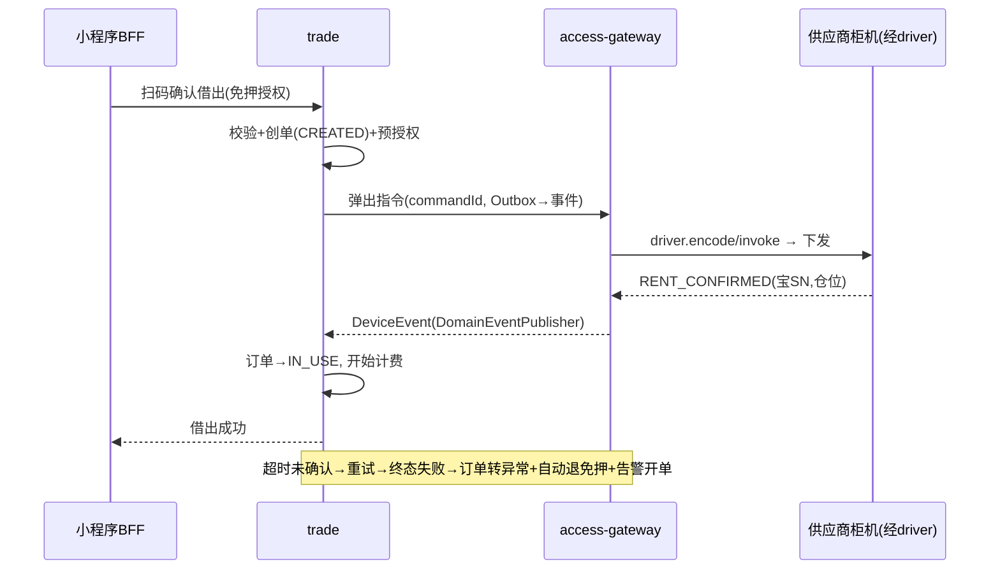

# 系统整体架构（architecture.md）

> 📐 **可视化视图见 [架构图.md](./架构图.md)**（2026-07-29 新增）—— 本文是**架构决策与选型**（技术栈、ADR、演进路线），架构图是**结构与链路的图示**（前端/接入/业务域/基础支撑/部署/数据/时序），两者互补。
> ⚠️ **本文 §4 的部署图与 §13 的工程结构写于 2026-07-11，已落后于代码实际**（BFF 三应用未独立、端点前缀已治理为 6 个）。以架构图 §三/§四/§六 为准。
>
> 状态：草稿（待确认）
> 创建日期：2026-07-11 · 修订：2026-07-11（对齐 ai-neargo 技术栈与基础框架）
> 关联需求：[功能矩阵.md](../requirements/功能矩阵.md) · [功能矩阵-分端对照.md](../requirements/功能矩阵-分端对照.md)
> 基础框架来源：**ai-neargo**（`/Users/robin/work/ai/ai-neargo`），复用其 L1 commons + 工程规范
> 决策记录：见 `ADR/` 目录

---

## 1. 概述

共享充电宝/充电桩 SaaS 运营管理平台。**主市场 MENA（UAE 起步），兼顾少量海外微信中国用户**（[ADR-009](./ADR/ADR-009-市场区域与合规.md)）。核心特征：

1. **复用 ai-neargo 基础框架**：直接依赖 neargo 的 8 个 commons + auth-core 作为 L1 底座，沿用其工程规范（BaseEntity / Result / TenantContext / DomainEventPublisher / RestClient / MyBatis-Plus）。powerbank 只写自己的业务域。neargo 本即 UAE/MENA 平台（AED/PDPL/CBUAE/ar-en-RTL），区域/合规/i18n/支付契约可最大化对齐。
2. **单运营方自营；多租户是休眠口子**（关键定位，2026-07-11，ADR-011）：MVP 是**一个运营方（= 主租户）自营**，核心逻辑全围绕这一个租户。`tenant_id` 全链路隔离**只保留数据列作最低成本口子，管理面不建、可能永不启用**（AI 时代更可能每租户一套独立部署）。口子若启用，语义泛指"隔离经营实体"——最现实是**同一运营商跑多业态**（充电宝/充电桩各算一租户），而非招别的运营方。当前设备/订单模型为**充电宝专用**，充电桩(EV)属未来业态、抽象上尽量不写死。见 §5。
3. **硬件适配层是核心增量**（多供应商，TCP/MQTT/HTTP 三种南向接入）；**支付委托 neargo nearpay API**（不自建 PSP 适配，集成延后，见 §7）。powerbank 相对 neargo 的增量 = 柜机接入 + 租借计费/账务（neargo 无充电宝柜机与租借模型）。
4. **域=逻辑边界，部署=物理进程**：沿用 neargo「域分而不裂」，MVP 以模块化单体 + 独立设备接入网关部署，按信号裂解为粗粒度服务。

## 2. 复用 ai-neargo 基础框架（L1）

> 原则：**基础能力只依赖不重写**。powerbank 各模块 `pom.xml` 直接引 `ai.neargo:neargo-common-*`，与 neargo 保持同一套契约与约定。

| commons 组件 | 提供能力 | powerbank 用法 |
|-------------|---------|---------------|
| `neargo-common-core` | `Result<T>` / `ErrorCode` / `ServerException` / `IdGenerator` / `PageResult` / `Query` / `AssertUtils` / `JsonUtils` / `Sensitive` / `BusinessDay` | 统一响应、异常、ID、分页、脱敏 |
| `neargo-common-data` | `BaseEntity`(id/tenantId/regionId/createdAt/updatedAt/version/deleted) · `BaseRepository` · `NeargoTenantLineHandler`(MyBatis-Plus 租户自动注入) · `AuditMetaObjectHandler` | 所有实体继承 BaseEntity，租户条件自动拼接 |
| `neargo-common-security` | `TenantContext` · `TenantContextFilter` · `AuthHeaders`(X-Tenant-Id/X-Region-Id/X-User-Id) · `OpaqueTokenAuthFilter` · `SessionStore` · `TenantPropagationInterceptor` | 租户上下文 + 鉴权 + 跨服务头透传 |
| `neargo-auth-core` | Token 签发/吊销 · Credential · OTP · Redis 会话 · 密码认证（内嵌库） | 员工/C端登录、设备 JWT 签发 |
| `neargo-common-mq` | `DomainEventPublisher` · `DomainEvent`（默认 Logging，可换 Kafka） | 域间/域内事件发布 |
| `neargo-common-web` | `ServerExceptionHandler` · `OperateLog`(审计切面) · `ClientHttpFactories`(RestClient 工厂) | 全局异常、操作审计、服务间调用 |
| `neargo-common-config` | `NacosConfigImporter`（裸 Nacos SDK，不引 Spring Cloud Alibaba） | 平台级配置导入 |
| `neargo-common-i18n` | `CurrencyUtil` · `LocaleContextHolderUtil` | 多币种/多语言（按目标市场裁剪） |
| `neargo-common-api` | 跨模块共享契约（DTO/枚举/事件） | powerbank 新增自己的 api 契约模块，风格对齐 |

**可借鉴的既有设计（模式复用，非直接依赖）**：
- neargo `platform-device-ops`(PF10)：device/heartbeat、三层 OTA（release→rollout→task）、alert_event 监控告警 —— powerbank 柜机运维直接套这套模式（对象换成柜机/仓位/充电宝）。
- neargo `mqtt-realtime-topics`：EMQX 5 + MQTT5（LWT/retain/QoS）+ topic 文法 + JWT(auth-core) + broker ACL —— powerbank 对「MQTT 直连型供应商」南向接入复用。

## 3. 技术栈（对齐 ai-neargo）

| 层 | 选型 | 说明 / 与 neargo 差异 |
|----|------|----------------------|
| 语言/框架 | **Java 21 + Spring Boot 4.0.x（Spring Framework 7）+ Maven 多模块** | 与 neargo 完全一致；父 pom 锁 JDK 21（maven-enforcer） |
| 服务间调用 | **Spring `RestClient`**（`ClientHttpFactories`） | **不引 Spring Cloud / 不用 Feign**（遵循 neargo） |
| 持久层 | **MyBatis + MyBatis-Plus** | 租户插件 `NeargoTenantLineHandler`；`@TableId(INPUT)`/`@Version`/`@TableLogic` |
| 数据库 | **MySQL 8 优先 / PG 兼容** | 行级多租户，大租户预留分库 |
| 缓存 | Redis | 设备影子、指令幂等、分布式锁、auth 会话 |
| 事件 | **`DomainEventPublisher`（默认 Logging，生产换 Kafka）** | **不用 RocketMQ**；事务一致性用「本地事务 + Outbox 表 + Kafka」 |
| 配置中心 | **Nacos（裸 SDK，`NacosConfigImporter`）** | 平台级；租户级配置落 platform 库 |
| 设备实时链路 | **EMQX 5 + MQTT 5** | 复用 neargo topic 文法与 ACL |
| 设备私有协议 | **Netty**（access-gateway 内嵌 TCP server） | powerbank 增量（neargo 无私有协议柜机） |
| 任务调度 | XXL-Job（对账/结算/超时/巡检） | |
| 对象存储 | OSS/MinIO（工单照片/合同/对账单） | |
| 可观测 | Prometheus + Grafana + SkyWalking | |
| 运营 Web | 沿用 neargo 前端基线（React/Next 或 Vue，随 neargo `tech-stack.md` 定） | 平台/租户两级同工程按角色渲染 |
| C端 App/小程序 | **App P0 → 微信小程序 P1**（uni-app 一套，MENA 以 App 为主）| ADR-005/008；本地 PSP 支付 |

## 4. 总体架构与部署形态

沿用 neargo「域=逻辑边界、部署单元=物理进程」。powerbank 划 **5 个业务域 + 1 个设备接入网关**，触点用 **BFF 应用**（对齐 neargo 的 nearboss/neargo/nearadmin，而非 Spring Cloud Gateway）。

```
┌──────────────────────────────────────────────────────────────┐
│  触点应用（BFF/编排，Spring Boot）                              │
│  admin-app(平台超管+租户后台) · ops-app(运维) · mp-app(小程序BFF) │
└───────────────┬──────────────────────────────────────────────┘
                │ RestClient（透传 X-Tenant-Id/Region/User）
   ┌────────────┼─────────────┬──────────────┬─────────────┐
   ▼            ▼             ▼              ▼             ▼
┌──────┐  ┌─────────┐   ┌─────────┐   ┌─────────┐   ┌──────────┐
│trade │  │  ops    │   │  user   │   │platform │   │  access  │
│交易   │  │ 设备运维 │   │ 用户营销 │   │ 租户/权限│   │ -gateway │
└──┬───┘  └────┬────┘   └────┬────┘   └────┬────┘   └────┬─────┘
   └───────────┴─── DomainEventPublisher(Kafka) ──┴──────┘  │南向
                                                     TCP/MQTT/HTTP
   MySQL · Redis · Nacos · XXL-Job · OSS · EMQX          ┌───▼────────┐
                                                          │供应商柜机 A/B/C│
                                                          └────────────┘
```

> **MVP 部署建议（遵循 neargo modulith-default）**：5 业务域先合并为 1 个模块化单体进程（域内按包隔离、事件走进程内 `DomainEventPublisher`），**access-gateway 独立进程**（长连接与业务解耦）。规模化后按「先拆支付账务、再拆工单」裂解到粗粒度服务。代码按域分模块，拆分=搬迁不重写。

### 服务/域职责

| 域 | 职责 | 关键增量 |
|----|------|---------|
| **access-gateway** | 南向接入：Netty TCP 私有协议 + EMQX MQTT 订阅 + HTTP 供应商回调；DeviceDriver 插件；统一指令/事件；会话管理；验签；报文留痕 | powerbank 独有 |
| **trade** | 租借订单状态机、计费引擎、**支付编排（`PaymentPort`→委托 nearpay，延后）**、免押编排、账务记账、分润规则、结算 | 柜机租借计费；支付/收单外包 nearpay |
| **ops** | 柜机/仓位/充电宝三级台账与生命周期、设备影子、点位/商户、库存调拨、工单（状态机+派单+SLA）、告警联动、OTA（套 PF10 三层模型） | 借鉴 neargo PF10 |
| **user** | C端账户（openid×租户）、会员、钱包、信用/黑名单、优惠券/营销、客服诉求 | 复用 auth-core |
| **platform** | 租户管理与租户配置中心（支付商户号/计费模板/品牌/启用供应商渠道/配额）、员工/组织/RBAC、审计、消息通知、报表、OpenAPI | 复用 security + auth-core |

### 通信

- **同步**：`RestClient`（仅查询与强一致操作），透传 `AuthHeaders`（X-Tenant-Id/Region/User）。
- **异步**：`DomainEventPublisher` 抽象。进程内单体阶段=同步分发；拆分后=Kafka。核心事件：`DeviceEvent`(设备上行)、`OrderEvent`、`PayEvent`、`WorkOrderEvent`。
- **事务一致性**：「创单→下发弹出指令」用**本地事务 + Outbox 表 + Kafka**（替代 neargo 未用的 RocketMQ 事务消息）；超时关单用 XXL-Job 扫描或延迟消息。

## 5. 多租户架构（ADR-002 / ADR-011，实现复用 neargo）

> **定位（ADR-011）：单运营方自营为主，多租户是预留口子。** MVP 存在**一个主租户**（`tenant_no = MAIN`，即平台运营方自己），所有运营在其下进行。租户隔离机制全建（下方 1/2/5），但**平台层多租户管理能力（租户开通/SaaS 计费/超管跨租户切换）后置为 P1+**——它们是口子的"管理面"，MVP 不做，用一个主租户顶上。

**单库行级隔离（tenant_id）起步，预留按租户垂直分库（ShardingSphere）。** 直接复用 neargo 机制，不重造：

1. **租户上下文**：BFF/网关从 JWT 解析 → `AuthHeaders`(X-Tenant-Id 等) → `TenantContextFilter` 写入 `TenantContext` → `TenantPropagationInterceptor` 跨 RestClient 透传；MQ 事件属性携带 tenantId。
2. **数据隔离**：所有实体继承 `BaseEntity`（含 `tenantId`）；`NeargoTenantLineHandler` 自动拼 `tenant_id` 条件，防漏写。
3. **主租户 MVP**：MVP 全部数据挂 `tenant_no=MAIN`；上下文默认注入主租户，无需前台切换。**平台超管跨租户切换（P1+ 口子）**：白名单角色跨租户（放行 + 强制 `OperateLog` 审计）——招商引入第二个租户时才启用。
4. **租户配置中心**（platform 域）：计费模板、品牌、启用的供应商/渠道、配额，按租户存储 + 缓存 + 变更通知（支付委托 nearpay，无 sub_mchid）。MVP 只有主租户一份配置。
5. **regionId**：BaseEntity 自带 `regionId`，powerbank 单区起步（多区扩展时复用）。

## 6. 硬件接入层设计（ADR-003）

### 6.1 三种南向接入（access-gateway）

| 接入型 | 通道 | 说明 |
|--------|------|------|
| **协议直连型** | Netty TCP 长连接 | 供应商固件私有二进制协议直连我方网关（powerbank 增量，neargo 无） |
| **MQTT 型** | EMQX 5（复用 neargo MQTT 基建） | 供应商固件走 MQTT，我方订阅设备 topic；JWT(auth-core) + broker ACL |
| **云对接型** | HTTP API + Webhook | 供应商有开放云平台，我方调其 API 下发、接其回调上行 |

### 6.2 DeviceDriver SPI（统一抽象）

```java
public interface DeviceDriver {
    String vendor();
    AccessMode accessMode();                 // TCP / MQTT / HTTP_API
    byte[] encode(DeviceCommand cmd);        // 长连型：统一指令 → 协议帧
    List<DeviceEvent> decode(ByteBuf raw, SessionInfo s);
    CommandResult invoke(DeviceCommand cmd); // 云对接型：调供应商 API
    List<DeviceEvent> parseWebhook(WebhookPayload p);
    boolean verify(WebhookPayload p);        // 验签
    String resolveSn(Object rawIdentity);    // 供应商标识 → 平台 SN
}
```

- **统一指令** `DeviceCommand.type`：`EJECT_ANY / EJECT_SLOT / LOCK / UNLOCK / REBOOT / QUERY_SLOTS / LOCATE / VOICE / OTA_PUSH`
- **统一事件** `DeviceEvent.type`：`ONLINE / OFFLINE / HEARTBEAT / SLOT_REPORT / RENT_CONFIRMED / RETURNED / FAULT / OTA_RESULT`（发布为 `DomainEvent`）

### 6.3 MQTT topic 文法（对齐 neargo，改造隔离键）

neargo：`ng/{region}/{store}/...`；powerbank 柜机在点位而非门店，改为按 **租户 + SN**：

```
pb/{region}/{tenantId}/device/{sn}/up/{event}      设备上行（心跳/仓位/借还/故障）
pb/{region}/{tenantId}/device/{sn}/cmd/{action}    指令下发（弹出/锁仓/重启）
pb/{region}/{tenantId}/device/{sn}/status          在线态（retain + LWT）
```

- QoS1 至少一次；消费端按业务键幂等（`commandId`/`orderNo`）。
- clientId=`sn`；鉴权用 auth-core 签发 JWT（claim 带 region/tenant）；broker ACL 按 topic 前缀限制供应商设备只能收发自己命名空间。

### 6.4 可靠性

- **指令幂等**：`commandId` 全局唯一（`IdGenerator`），Redis SETNX 去重，杜绝重复弹出。
- **下发确认**：入队 → 下发 → 等 ACK/事件确认 → 超时可配重试 N 次 → 终态失败回调业务（订单转异常流程）。
- **会话共享**：`SN → 网关实例` 存 Redis，跨实例转发；实例宕机由设备重连自愈。
- **报文留痕**：上下行原始报文异步落库（脱敏 `Sensitive`），支持按 SN/时间回放。

## 7. 支付与资金设计（委托 neargo nearpay · ADR-005/004）

> **决策（2026-07-11）：powerbank 不自建支付渠道/PSP 适配，直接对接 neargo 支付 API（nearpay），且该集成延后（非 MVP 首批）。** neargo 是 UAE 平台，nearpay 已规划承载 MENA 本地 PSP、卡收单、预授权、退款、对账。

### 7.1 委托模型
- powerbank **trade 域持有**：租借订单、计费引擎、押金/免押的**业务编排**、分润规则、账务记账。
- powerbank **不持有**：支付渠道对接、PSP 密钥、卡收单/Apple/Google Pay、渠道回调验签、渠道对账 —— 这些**调用 neargo nearpay API** 完成。
- 交互（延后实现）：trade 经 `RestClient`（跨系统，非同 reactor）调 nearpay：
  - `pay`（下单/收银台参数）、`preAuth/capture/release`（免押预授权冻结/请款/解冻）、`refund`、查单。
  - 支付结果以 nearpay 回调/事件 或 trade 主动查单 落 powerbank 侧支付引用（`pay_order` 存 nearpay txn 引用），驱动订单状态机。
- **抽象隔离**：trade 内定义 `PaymentPort` 接口（pay/preAuth/capture/refund/query），先给 **Stub 实现**（MVP 用于跑通借还状态机），后接 **NearpayAdapter 实现**（延后）。业务代码只依赖 `PaymentPort`，切换零改动。

### 7.2 MVP 影响
- 支付集成延后 → **MVP 用 `PaymentPort` 的 Stub**（模拟预授权成功/请款/退款）跑通"借出→计费→归还"状态机；**真实收费待 nearpay 对接**。
- 免押、多币种（AED）、PSP、合规（CBUAE）随 nearpay 落地，powerbank 侧不重复建设。

### 7.3 分账/账务（ADR-004）
- 分润**规则**在 powerbank；分润**执行/打款**优先复用 nearpay（若其提供 split/结算能力），否则 powerbank 平台记账（复式）后经 nearpay 打款。具体随 nearpay 契约确定，与支付一并延后。

按「租户 + 分成方」配置，可混用。复式记账（`account/ledger_entry/voucher`）先记账后执行，日切三方对账（渠道账单 ↔ 支付单 ↔ 账务分录）。

## 8. 核心域模型（概要，均继承 BaseEntity）

| 聚合 | 关键实体 | 要点 |
|------|---------|------|
| 租户 | tenant, tenant_config | 配额、渠道参数、计费模板引用 |
| 设备 | cabinet(机柜), slot(仓位), powerbank(充电宝), device_shadow | 三级台账；影子 Redis+落库；SN 全局唯一（借 PF10 device 模式） |
| 点位 | location(POI), merchant, contract | 点位-设备 1:N；合同含分成比例 |
| 订单 | rent_order, order_event_log | 状态机 CREATED→DISPENSING→IN_USE→RETURNED→SETTLED / 异常态 |
| 支付 | pay_order, auth_order, refund_order | 押金+租金+买断，与租借订单 1:N |
| 账务 | account, ledger_entry, profit_share, settlement, withdrawal | 复式分录 |
| 工单 | work_order, dispatch_record, sla_timer | 状态机+派单（可套 PF10 alert_event→工单联动） |
| 用户 | c_user, credit_profile, coupon, membership | openid×租户 隔离 |
| 员工 | employee, role, permission, data_scope | 复用 auth-core + security；审计走 OperateLog |

## 9. 关键时序（借出）



## 10. 非功能设计

- **幂等清单**：设备指令(commandId)、支付回调(渠道单号)、事件消费(msgKey去重表)、退款(refund_no)、结算(周期+对象键)。
- **可用性**：access-gateway 多实例 + Redis 会话共享；MySQL 主从；借出链路降级——渠道故障切备渠道、免押失败降级押金。
- **安全合规**：手机号/身份 `Sensitive` 脱敏 + 加密存储；支付参数 KMS；`OperateLog` 审计；个保法（授权/注销/导出）；接口防重放（时间戳+nonce+签名）；MQTT 只传运营态信号，资金明细走 REST 鉴权拉取。
- **监控 SLI**：设备在线率、指令成功率、支付成功率、回调延迟、订单异常率；告警经通知域推送。

## 11. 演进路线

| 阶段 | 范围 | 里程碑 |
|------|------|--------|
| M1 MVP | 依赖 neargo commons 起骨架 + access-gateway(1-2 家 driver) + trade(微信/支付宝+免押+租借闭环) + ops(台账+工单) + platform(租户+RBAC) + 共用小程序；模块化单体部署 | 单城试点可运营 |
| M2 规模化 | 对账/结算/提现、分账双模式全量、支付宝小程序、营销券、报表、OTA、按信号拆服务 | 多租户正式售卖 |
| M3 增强 | 大租户分库、OLAP 报表/BI、独立品牌小程序、App、大屏 | 平台化 |

## 12. ADR 索引

| ADR | 决策 |
|-----|------|
| [ADR-001](./ADR/ADR-001-技术栈与服务粒度.md) | 对齐 neargo：Java21/Boot4 + 粗粒度域，modulith 起步 |
| [ADR-002](./ADR/ADR-002-多租户隔离方案.md) | 行级隔离起步（复用 NeargoTenantLineHandler），预留分库 |
| [ADR-003](./ADR/ADR-003-硬件接入driver插件化.md) | DeviceDriver SPI 三栈接入（TCP/MQTT/HTTP） |
| [ADR-004](./ADR/ADR-004-分账双模式.md) | 官方分账 + 平台记账可配 |
| [ADR-005](./ADR/ADR-005-C端载体与MENA支付.md) | App 优先 + 本地 PSP 支付 |
| [ADR-006](./ADR/ADR-006-复用neargo基础框架与依赖方式.md) | 依赖 neargo commons L1，依赖分发方式 |
| [ADR-007](./ADR/ADR-007-租户隔离键与命名映射.md) | 隔离键用 tenant_id + 自有 handler |
| [ADR-008](./ADR/ADR-008-前端技术栈.md) | 运营端 ai-boss 栈 · C端 uni-app |
| [ADR-009](./ADR/ADR-009-市场区域与合规.md) | MENA/AED/ar-en/PDPL/CBUAE |
| [ADR-010](./ADR/ADR-010-库合并.md) | 库合并为 3：pb_core + pb_pii + pb_auth |
| [ADR-011](./ADR/ADR-011-单运营方为主多租户为口子.md) | 单运营方自营为主，多租户为预留口子 |
| [ADR-012](./ADR/ADR-012-代理商模型.md) | 代理商=运营方体内分润伙伴（数据受限），非租户 |
| [ADR-013](./ADR/ADR-013-场所层级站点与点位.md) | 场所两层：站点 Site（网点）→ 点位 Point |
| [ADR-014](./ADR/ADR-014-平台更名ShareHub与设备类型抽象.md) | 平台更名 ShareHub + 设备类型抽象 |
| [ADR-015](./ADR/ADR-015-权限模块化与打包方式.md) | 权限：基础设施走 starter、IAM 走业务模块、不独立服务 |

## 13. 工程结构（Maven 多模块，groupId=ai.neargo.powerbank）

依赖方式=**私仓坐标**（ADR-006）：powerbank 独立仓库，依赖 neargo commons BOM。部署=**模块化单体 + 独立 access-gateway**（ADR-001）。

```
pom.xml  (ai.neargo.powerbank:powerbank-parent, 继承 spring-boot-starter-parent 4.0.x)
│  dependencyManagement: import neargo-BOM + mybatis-plus-BOM; maven-enforcer 锁 JDK21
│
├─ powerbank-common-api         powerbank 自有共享契约(DTO/枚举/事件), 风格对齐 neargo-common-api
├─ modules/
│   ├─ access-gateway          ★独立进程: Netty(TCP) + MQTT(EMQX) + HTTP回调; DeviceDriver SPI
│   │   └─ drivers/            供应商 driver 子模块(vendor-a-tcp / vendor-b-mqtt / vendor-c-http)
│   ├─ trade                   订单/计费/账务/分润/结算 + 支付编排(PaymentPort→nearpay,延后)
│   ├─ ops                     柜机-仓位-充电宝台账/影子/生命周期/点位商户/工单/OTA/告警
│   ├─ user                    C端账户/会员/钱包/信用/优惠券/客服诉求
│   └─ platform                租户/租户配置中心/员工RBAC/审计/通知/报表/OpenAPI
├─ app-modulith                ★业务单体启动器: 装配 trade+ops+user+platform(进程内事件)
└─ bff/
    ├─ admin-app               平台超管+租户后台 BFF
    ├─ ops-app                 运维 App BFF
    └─ mp-app                  小程序/App BFF

依赖: 各 module 依赖 ai.neargo:neargo-common-*(私仓) + powerbank-common-api
      app-modulith 聚合 modules; bff 经 RestClient 调 app-modulith(单体阶段=同进程可直调)
```

> 拆分路径：`app-modulith` 是 MVP 单体启动器；按信号裂解时，把某 module 抽出独立启动类 + 独立 pom 打包即成服务，业务代码不改（域内已隔离、事件经 `DomainEventPublisher`）。

---
确认记录：架构决策已确认（2026-07-11）——技术栈对齐 neargo / 私仓依赖 / groupId=ai.neargo.powerbank / modulith 部署。**前置阻塞**：neargo commons 需先发私仓（ADR-006 前置任务）。下一步进入首个模块 PRD/TDD（建议 access-gateway）。
