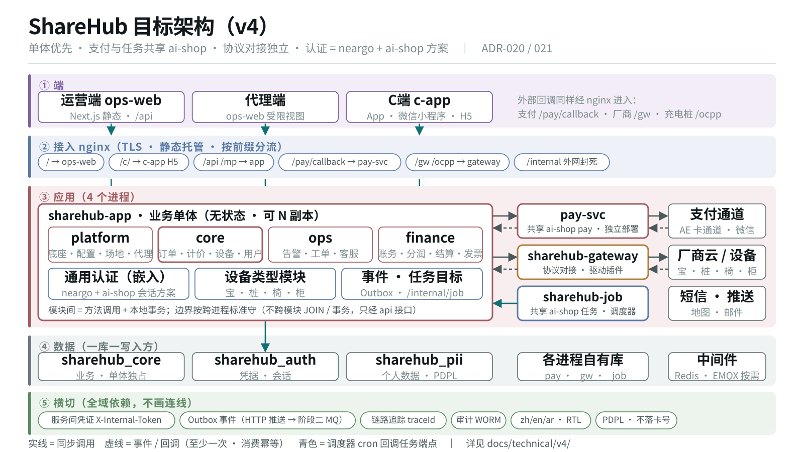
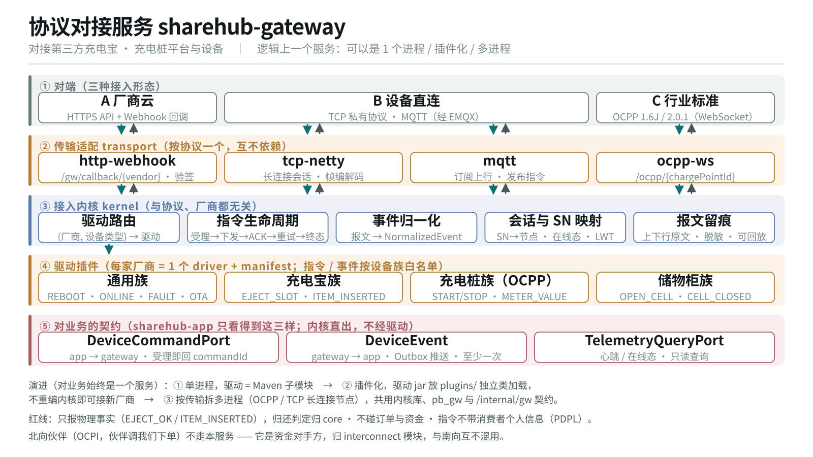
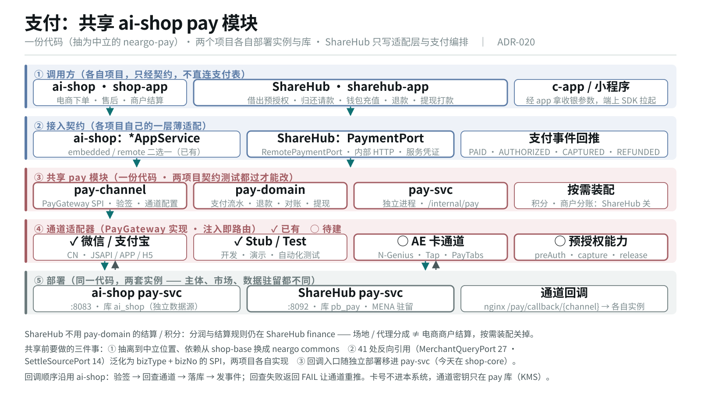
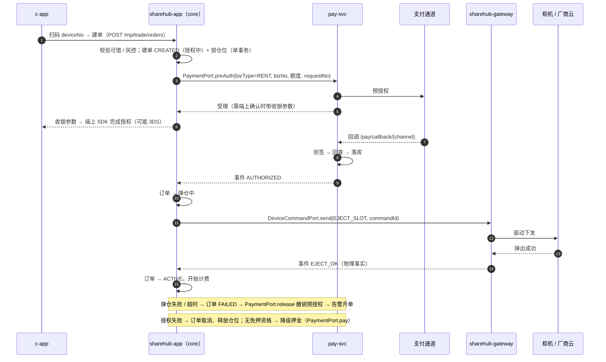
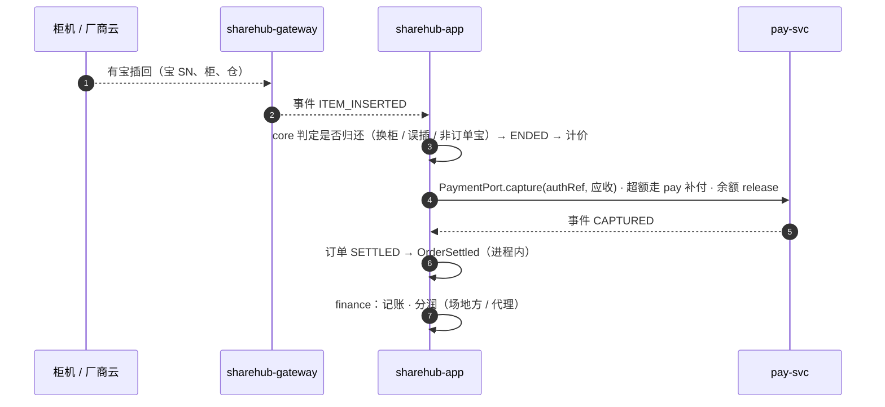
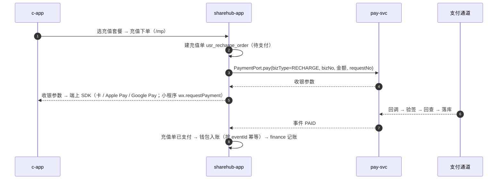

# ShareHub 技术架构方案 v4 —— 单体优先 · 支付与任务共享 · 协议对接独立 · 通用设备

> 状态：**待确认**（2026-09-23 起草）· 决策记录：[ADR-020](./ADR/ADR-020-单体优先-支付与协议对接独立部署.md) · [ADR-021](./ADR/ADR-021-通用设备命名与使用形态.md)
> 起因：用户 2026-09-23 多轮要求（支付独立部署且**共享 ai-shop pay 模块** · 协议对接独立服务 · C 端 App + 小程序 ·
> 平台运营管理 · 认证**基于 neargo framework 与 ai-shop 方案**（含 ops-web / c-app）· **定时任务共享 ai-shop 任务服务** · 尽量单体 ·
> **以充电宝为主、可扩到充电桩与按摩椅等共享设备，命名尽量通用**）。
>
> 📚 **详细规划（数据库 / 服务 / 模块 / 接口 / 网关 / 认证 / 任务 / 路线）见 [v4/](./v4/README.md)**；本文是总览。
>
> **本文是当前的架构入口**。与既有文档的关系：
> - [architecture.md](./architecture.md) §4 部署 / §7 支付 / §13 工程结构、[架构设计总纲](./架构设计总纲-多设备共享平台.md) §三 / §五 的**部署形态**以本文为准；
> - 总纲的**领域抽象**（订单主表 + 扩展表、计价引擎、驱动分族、互联互通）**继续有效**，本文不重复；
> - [ADR-005](./ADR/ADR-005-C端载体与MENA支付.md) 的支付部分（委托 nearpay）被 ADR-020 取代。
>
> 架构图（1600×900 矢量，可直接插 PPT）：
> [`10-target-architecture.svg`](./diagrams/10-target-architecture.svg) 总体 ·
> [`11-gateway-service.svg`](./diagrams/11-gateway-service.svg) 协议对接 ·
> [`12-pay-service.svg`](./diagrams/12-pay-service.svg) 支付共享 ·
> [`13-device-model.svg`](./diagrams/13-device-model.svg) 通用设备模型

---

## 〇、一页结论



**4 个进程 + 2 个前端 + 3 个共享模块**：

| | 是什么 | 形态 | 为什么 |
|---|---|---|---|
| **`sharehub-app`** | 业务单体：平台底座、场地代理、设备资产、订单计价、用户营销、告警工单客服、账务分润结算 | 1 个进程，可 N 副本 | 借还主链路要本地事务；单运营方、未规模化，拆开只换来运维成本 |
| **`sharehub-gateway`** | 协议对接服务：对接第三方充电宝 / 充电桩平台与设备（HTTP API、Webhook、TCP、MQTT、OCPP） | 独立进程；逻辑上一个服务，物理上可插件化 / 多进程 | 变化原因与业务完全不同（每接一家厂商改一次）；长连接技术栈；故障域隔离 |
| `ai-shop-pay`（**共用实例**） | ai-shop 在跑的支付服务：通道、支付流水、预授权、退款、回调、对账、提现打款；改造为多系统后按 `system` 隔离（[ADR-025](./ADR/ADR-025-直接复用ai-shop在跑的支付与任务服务-多系统改造.md)） | 独立进程 + 独立库 | 用户要求独立部署且不重做；资金数据要与业务库物理隔离 |
| c-app | C 端：App（Android / iOS）+ 微信小程序 + H5，一套 uni-app 代码 | 静态 / 原生包 | 扫码借还、钱包充值、下单、订单 |
| ops-web | 平台运营管理（含代理商受限视图） | Next.js 静态站 | 运营 / 财务 / 客服 / 代理 |
| `ai-shop-job`（**共用实例**） | ai-shop 在跑的调度器：到点回调各系统各目标的任务端点；改造为多系统后按 `system` 隔离 | 独立进程，无端口 | 用户要求直接用现成服务；ShareHub 今天没有任何定时调度 |
| 共用服务 · 支付 | ai-shop 的 `pay/`（含全部通道与微信能力），**暂留 ai-shop**，本项目只依赖 `pay-client`（[ADR-024](./ADR/ADR-024-共用服务暂由ai-shop托管-组件并入框架.md)） | **代码与实例都共用一套**，按 `system` 隔离（[ADR-025](./ADR/ADR-025-直接复用ai-shop在跑的支付与任务服务-多系统改造.md)） | 见 §五 |
| 共用服务 · 任务 | ai-shop 的 `shop-job-*`，**暂留 ai-shop**，本项目只依赖 `shop-job-api` · `shop-job-target` | **代码与实例都共用一套**，按 `system` 隔离 | 见 [v4/07](./v4/07-定时任务.md) |
| 共享 · neargo 认证底座 | neargo commons（RBAC / 数据权限 / OTP）+ ai-shop 会话方案（`auth-store`） | 嵌入各进程的库 | 见 §六 |

**认证不单独部署**：只有 `sharehub-app` 接受终端用户令牌；pay-svc 与 gateway 只接受服务凭证。

---

## 一、需求 → 架构

| # | 用户要求 | 落在哪 | 本文章节 |
|---|---|---|---|
| 1 | 支付模块独立部署 | `pay-svc` 独立进程 + `sharehub_pay` 独立库 | §五 |
| 2 | 独立服务对接第三方充电宝 / 充电桩平台，HTTP API 及其他协议；将来插件化或多模块，逻辑上一个服务 | `sharehub-gateway`：传输 / 内核 / 驱动三层，对业务只暴露三样契约；三种物理形态 | §四 |
| 3 | C 端 App + 小程序：扫码、充值、下单 | c-app（uni-app 条件编译）+ `/mp/**` + 支付经 pay-svc | §七、§九 |
| 4 | 平台端运营管理 | ops-web + `/api/**` 六前缀 + RBAC + 数据权限 | §三、§七 |
| 5 / 8 | 认证是通用服务；基于 neargo framework 与 ai-shop 方案 | 嵌入式认证模块：neargo 底座 + ai-shop 会话方案 | §六 |
| 6 | 尽量单体，高度独立的必要服务才独立部署 | 业务 1 个单体 + 2 个独立服务 + 1 个调度器；ops / finance / platform 不拆，信号出现再拆（ADR-017） | §二 |
| 9 | 支付用 ai-shop pay 模块，两项目共用一个模块 | 共用服务、暂留 ai-shop（含通道与微信）；**一份代码一套实例**，按 `system` 隔离（ADR-024 · ADR-025） | §五 |
| 10 | ops-web 与 c-app 的权限也基于 ai-shop，给详细方案 | 会话分池 · 功能点模型 · 前端请求层与守卫 | [v4/06](./v4/06-认证与权限.md) |
| 11 | 定时任务共享 ai-shop 任务服务 | ai-shop 任务服务 + `sharehub-job` 调度器实例，三个任务目标 | [v4/07](./v4/07-定时任务.md) |
| 12 | 充电宝为主，可扩充电桩、按摩椅等；命名尽量通用，不能通用优先充电宝 | 使用形态 RENTAL / SESSION、类型模块 SPI、通用命名与改名表 | [v4/01](./v4/01-通用设备与命名.md) · ADR-021 |

---

## 二、总体架构

### 2.1 分层

| 层 | 内容 | 说明 |
|---|---|---|
| ① 端 | ops-web（运营 / 代理）· c-app（App / 小程序 / H5） | 端只认 `Result{code,message,data}` / `PageResult{list,total}` 契约 |
| ② 接入 | nginx：TLS、静态托管、按前缀分流、`/internal` 外网封死 | **不设独立 API 网关 / BFF 进程**：BFF 职责由单体内的 portal 层承担（§3.3） |
| ③ 应用 | `sharehub-app` · `pay-svc` · `sharehub-gateway` · `sharehub-job` | 单体内模块间 = 方法调用；跨进程 = 内部 HTTP + 事件；调度器回调各进程 |
| ④ 数据 | `sharehub_core` · `sharehub_auth` · `sharehub_pii` · `sharehub_pay` · `sharehub_gw` · `sharehub_job`；Redis / EMQX 按需 | **一个库只有一个写入方** |
| ⑤ 外部 | 支付通道 · 厂商云 / 设备 · 短信 / 推送 / 地图 | 外部回调同样经 nginx 进入 |
| 横切 | 认证、服务凭证、Outbox 事件、链路追踪、审计、i18n、PDPL | 全域依赖 |

### 2.2 部署单元一览

| 部署单元 | Maven 启动模块 | 端口（腾讯云现网） | 库 | 副本 | 对外路径 | 现状 |
|---|---|---|---|---|---|---|
| `sharehub-app` | `sharehub-app` | 8082 | `sharehub_core` · `sharehub_auth` · `sharehub_pii` | N（无状态） | `/api/**` `/mp/**` | ✅ 已上线（单副本） |
| `sharehub-gateway` | `sharehub-app-gateway` | 8091 | `sharehub_gw` | 1 起，按连接数扩 | `/gw/**` `/ocpp/**`；TCP 端口；EMQX | 🟡 骨架可启动，未部署，暂共用现库 `pb_core` |
| `ai-shop-pay`（共用实例） | ai-shop `backend/pay/` | 8083（已在跑） | 服务自有库，按 `system` | 2 | `/pay/callback/{system}/**` | ⬜ 待多系统改造；ShareHub 侧是 `StubPaymentPort` |
| `ai-shop-job`（共用实例） | ai-shop `backend/job/` | 无（已在跑） | 服务自有库，按 `system` | 1 | 无（出站回调各目标） | ⬜ 待多系统改造；ShareHub 今天没有任何定时调度 |

**开发 / 演示形态**：可合成一个进程（ADR-017 双形态：本地实现在 classpath 上就走本地；任务用进程内调度），
本机只起一个 jar。生产才拆成四个进程。

---

## 三、业务单体 `sharehub-app`

### 3.1 定位

承载**全部业务规则**。内部按 32 个模块 / 6 层组织（[业务模块分层](./业务模块分层.md)，脚本生成），
模块边界**按跨进程的标准维护**（ADR-017 四条纪律）：不跨模块 JOIN（例外只有 `ReportMappers`）·
不跨服务事务 · 只经 `*-api` 接口调用 · 写操作幂等。守住它们，将来拆 ops / finance 只是换打包方式。

### 3.2 模块说明

按「服务分组 → 模块」列出。服务分组是**逻辑边界**，在单体里是 Maven 模块（`sharehub-svc-*`）。

**platform · 底座与运营配置面**（`sharehub-svc-platform`）

| 模块 | 职责 | 主要表 |
|---|---|---|
| 租户 | 隔离锚点；单运营方下休眠（ADR-011） | `tenant*` |
| 认证授权 | RBAC 角色 / 权限码 / 菜单 / 数据范围（**会话表不在此**，属基础设施） | `iam_role*` `iam_permission` `iam_menu` `iam_data_scope` |
| 组织架构 | 部门、员工、员工角色、绩效 | `iam_dept` `iam_employee*` |
| 审计 | WORM 留痕，只写不改 | `iam_audit_log` |
| 主数据 · 数据字典 · 系统参数 | 设备类型、地区、国家、银行、问题库；字典；业务规则、版本、税、Outbox | `md_*` `dict_item` `sys_*` |
| 通知 | 模板、发送日志、退订 | `notify_*` |
| 开放平台 | 对外 AppKey | `openapi_app` |
| 代理商 · 资产归属 | 代理档案 / 账号 / 区域；划拨（事件驱动回写，ADR-019） | `agt_*` |
| 场地拓展 · 场地与点位 | 线索、合同、场地方、站点、点位、站点生命周期 | `loc_*` |

**core · 借还 / 充电主链路**（`sharehub-svc-core`）

| 模块 | 职责 | 主要表 |
|---|---|---|
| 消费者 | C 端账号、身份绑定（unionid 归并）、钱包与充值单、信用、黑名单、免押白名单、授权同意、消息 | `usr_*` |
| 权益与营销 | 券、会员、营销活动、广告 | `coupon_tpl` `mbr_*` `mkt_*` `ad_*` |
| 计价 | 方案 → 费用项 → 阶梯 + 分时（总纲 §1.4） | `price_*` |
| 订单 | 共性主表 + 类型扩展表、预约、押金、异常、投诉、退款申请；**支付编排**（何时冻结 / 请款 / 撤销） | `ord_*` |
| 设备资产 · 库存 | 柜机（容器）/ 仓位（槽位）/ 充电宝；设备影子；仓库调拨 | `dev_device`（原 `dev_cabinet`）`dev_slot` `dev_powerbank` `dev_shadow` `inv_*` |

> 支付的**流水与通道**不在 core：原 `pay_*` 表随共享 pay 模块迁出（§五）。core 只保留编排与 `PaymentPort` 适配。

**ops · 异常发现与人工处置**（`sharehub-svc-ops`）

| 模块 | 职责 | 主要表 |
|---|---|---|
| 告警 | 告警码、规则、告警单、通知（设备事件驱动） | `dev_alarm*` `dev_alert` |
| 工单 | 派单、处理、SLA、巡检计划；告警 → 自动开单（同事务幂等） | `wo_*` |
| 客服 | 会话、消息、工单（转工单 / 转退款两个出口） | `cs_*` |

**finance · 钱怎么记 / 分 / 结 / 核**（`sharehub-svc-finance`）

| 模块 | 职责 | 主要表 |
|---|---|---|
| 账务 | 复式记账（订单已结算事件驱动） | `acct_*` |
| 分润 | 场地方 / 代理分润规则与记录 | `share_*` `agt_commission` |
| 结算提现 | 结算单、提现申请与审批；**打款执行交给 pay-svc** | `stl_settlement*` `stl_withdrawal` |
| 发票 | 开票 | `fin_invoice*` |
| 对账 | 业务侧对账（订单 ↔ 支付事件 ↔ 分录）；通道侧对账在 pay-svc | `recon_*` |

**迁出单体的模块**：厂商目录、设备接入、固件（→ `sharehub-gateway`，ADR-018）；支付、支付渠道（→ 共享 pay 模块）。

### 3.3 portal：按端分包的接入面（替代独立 BFF）

控制器按端分包，放在**各业务域**的 `api.{ops,mp,internal}` 子包（照 ai-shop，[v4/09 §四](./v4/09-后端代码架构.md)）；只有跨域编排（报表、看板）放 `sharehub-app` 的 `portal`：

| 包 / 前缀 | 面向 | 鉴权 |
|---|---|---|
| `/api/{auth,ops,trade,user,agent,platform}/**` | ops-web（6 个运营前缀，**不得新增**） | 员工 / 代理 Bearer + RBAC + 数据范围 |
| `/mp/**` | c-app | 消费者 Bearer + 属主校验（防 IDOR） |
| `/internal/**` | pay-svc、gateway 的回推；将来拆分后的服务间调用 | 服务凭证或透传 Bearer（§六.5）；nginx 外网封死 |

独立 BFF 进程（旧文档里的 ops-bff / mp-bff / agent-bff）**不建**：portal 层已承担形状裁剪与鉴权，
拆成进程只多一跳。

### 3.4 边界卡口（已有，继续用）

`backend/scripts/`：`arch-guard.py`（跨模块 JOIN / 跨服务事务 / 跨服务注入，`--strict` 进 CI）·
`module-graph.py`（表归属与分层）· `split-readiness.py` · `entity-column-diff.py` · `api-align.py`；
测试侧 `PortWiringTest`（单体必须装本地实现）。本方案新增的卡口见 §十三。

---

## 四、协议对接服务 `sharehub-gateway`



### 4.1 职责与红线

**做**：把第三方充电宝 / 充电桩平台和设备的各种协议，统一成平台内的**指令**与**事件**。
厂商目录运行时、传输适配、会话与 SN 映射、指令生命周期、事件归一化、报文留痕、OTA 下发。

**不做（红线，总纲 §1.5）**：
- 只报**物理事实**（`EJECT_OK` / `ITEM_INSERTED`），不判定业务语义 —— 「这算不算归还」由 core 判定；
- 不碰订单与资金 —— 厂商云自带的下单 / 代收款能力一律不用，manifest 白名单之外的能力在驱动层就不存在；
- 指令与报文**不带消费者个人信息**（PDPL）—— 设备只需要知道弹哪个仓。

### 4.2 三种对接形态

| 形态 | 对端 | 协议 | 传输适配 | 驱动要实现 |
|---|---|---|---|---|
| **A 厂商云** | 充电宝 / 充电桩厂商的开放平台 | HTTPS API + Webhook | `http-webhook`：`/gw/callback/{vendor}` 验签入口 + 出站 HTTP 客户端 | 调厂商 API 下发；解析 Webhook；验签；SN 映射 |
| **B 设备直连** | 设备本体 | TCP 私有协议 / MQTT | `tcp-netty`（长连接、帧编解码）· `mqtt`（经 EMQX 订阅上行、发布指令） | 帧编码 / 解码 |
| **C 行业标准** | 充电桩本体或桩企云 | OCPP 1.6J / 2.0.1（WebSocket） | `ocpp-ws`：`/ocpp/{chargePointId}` | **一次实现**，各桩企只配差异参数 |

充电宝主流是 A；充电桩主流是 C。**首个落地的传输是 `http-webhook`**（覆盖面最大、无长连接运维负担）。

### 4.3 内部分层

```
对端 ──► ② 传输适配 transport ──► ③ 接入内核 kernel ──► ④ 驱动插件 driver
          按协议一个，互不依赖        与协议、厂商都无关        每家厂商一个 + manifest
                                         │
                                         ▼
                              ⑤ 对业务的三样契约（sharehub-api）
```

**内核**（`sharehub-gateway-kernel`，原 `sharehub-svc-gateway`，已有部分）：

| 组件 | 职责 | 现状 |
|---|---|---|
| 驱动路由 `DriverRegistry` | 按 `(vendor, deviceType)` 找驱动；重复注册拒绝 | ✅ 已有 |
| 驱动 SPI `DeviceDriver` / `DriverManifest` / `CommandFamily` | `manifest()` · `send(sn, command, params)` · `parse(raw) → NormalizedEvent`；manifest 声明指令 / 事件白名单，越出设备族启动即失败 | ✅ 已有（仅 Demo 驱动） |
| 指令生命周期 | 受理（返回 `commandId`）→ 下发 → 等 ACK / 事件 → 超时重试 N 次 → 终态回推；`commandId` 全局唯一，重复受理返回同一结果 | ⬜ |
| 事件归一化 | 原始报文 → `NormalizedEvent` → `DeviceEvent`（带 `eventId`） | 🟡 接口有，无实现 |
| 会话与 SN 映射 | 长连接会话、`SN → 节点`（多实例时存 Redis）、在线态（MQTT 用 LWT） | ⬜ |
| 报文留痕 | 上下行原文异步落库（脱敏），可按 SN / 时间回放；月分区 | 🟡 表有 |

**驱动分族**（ADR-018）：通用族（REBOOT / ONLINE / OFFLINE / FAULT / OTA）+ 充电宝族（EJECT_SLOT / ITEM_INSERTED）+
充电桩族（START / STOP_CHARGE / METER_VALUE / TX_STOP，对齐 OCPP）+ 储物柜族。
**新增一家厂商 = 写一个驱动 + 后台注册 manifest，内核与业务零改动。**

### 4.4 对业务的三样契约

| 契约 | 方向 | 形态 | 端点 / 载体 |
|---|---|---|---|
| `DeviceCommandPort` | app → gateway | 同步受理、异步结果 | `POST /internal/gw/commands`（带 `commandId`，幂等）· `GET /internal/gw/commands/{id}` |
| `DeviceEvent` | gateway → app | Outbox 推送，至少一次 | `POST /internal/events/device`（app 侧按 `eventId` 去重） |
| `TelemetryQueryPort` | app → gateway | 只读查询 | `GET /internal/gw/heartbeats`（✅ 已有）· 在线态 |

厂商管理页（ops-web「厂商与驱动」）的读写：ops-web → app `/api/**` → `VendorPort` → gateway。
**今天 `/internal/gw/vendors` 由 app 提供**（`portal/shared/VendorController`），迁到 gateway 是 P1 的一项。

### 4.5 逻辑一个服务，物理三种形态

| 形态 | 驱动怎么装 | 触发信号 |
|---|---|---|
| ① 单进程（默认） | 驱动与传输都是 Maven 子模块，编进 jar | 现在 |
| ② 插件化 | 驱动 jar 放 `plugins/`，独立类加载（`ServiceLoader` + 隔离 ClassLoader），启动时读 manifest 注册；**不重编内核即可接新厂商** | 「每接一家就要发一次版」成为负担 |
| ③ 多进程 | 按**传输**拆：如 OCPP / TCP 长连接节点单独成组；共用内核库、`sharehub_gw` 与 `/internal/gw` 契约，前面一个地址 | 长连接数，或某厂商的故障开始拖累其他厂商 |

三种形态下，`sharehub-app` 看到的都是同一组契约 —— 这就是「逻辑上一个服务」的操作定义。
**按传输拆，不按厂商拆**（ADR-003）。

### 4.6 数据与伸缩

- 库 `sharehub_gw`：`gw_vendor*` · `gw_device_binding` · `gw_command_log` · `gw_message_log` · `gw_heartbeat` · `gw_ota_*`（原 `dev_heartbeat` / `dev_ota_*`，迁库时改前缀）；
  报文与心跳按月分区；
- 与 core 的关联只存业务键（`device_no`），不 JOIN；`gw_command_log.order_no` 改为 `biz_type + biz_ref`（总纲 §2.3 欠账）——
  指令也可能由工单或运维触发；
- 单实例起步；多实例时 HTTP 回调无状态可任意扩，长连接用 `SN → 节点` 映射转发，节点宕机靠设备重连自愈。

---

## 五、支付：共享 ai-shop pay 模块



### 5.1 原则：不重做，一份代码，**一套实例**（按 `system` 隔离，[ADR-025](./ADR/ADR-025-直接复用ai-shop在跑的支付与任务服务-多系统改造.md)）

ai-shop 的 `pay/` 已经是一个成熟的支付域：

| 已有能力 | 位置（ai-shop） |
|---|---|
| 通道 SPI `PayGateway`（prepay / query / queryRefund / refund / split / splitReverse / subsidy），`PayGatewayRouter` 注入即路由 | `pay-channel` |
| 微信（服务商 / 直连）· 支付宝 · Stub · Test · Free 适配器；API v3 签名；报文留痕与脱敏 | `pay-channel` |
| 回调：验签 → 回查通道 → 落库；回查失败返回 FAIL 让通道重推 | 验签器在 `shop-base`，入口在 `shop-core` |
| 支付流水、退款、提现、资金不变式、四轴对账（Payment / Split / Payout / PointsPool） | `pay-domain` |
| 幂等：`request_no` 唯一 + 幂等服务 | `shop-store-mybatis` |
| 独立进程、独立数据源与事务管理器、embedded / standalone 双形态、反向依赖棘轮 | `pay-svc` · ai-shop ADR-021 |
| 多区域通道模型（市场 × 通道 × 支付方式 × 币种），AE / SA / 东南亚通道已预置（未启用） | ai-shop `TDD-支付域-多区域通道` |

ShareHub **用这份代码**，部署自己的实例：

| 层 | 选择 | 理由 |
|---|---|---|
| 代码 | 一份 | 通道对接、验签、对账最贵也最容易错，维护两份是浪费 |
| 实例 | 各自一套（ShareHub `pay-svc` + `sharehub_pay`） | 两项目签约主体、商户号、市场（CN / MENA）、数据驻留都不同 |

### 5.2 ShareHub 只写两样东西

1. **适配层 `RemotePaymentPort`** —— 实现 ShareHub 业务侧已有的 `PaymentPort`
   （`pay` · `preAuth` · `capture` · `release` · `refund` · `query`，均带幂等键），调 pay-svc 的内部 API；
   `PaymentPort` 从 `svc-core` 移到 `sharehub-api`，`StubPaymentPort` 保留为开发实现；
2. **支付编排** —— 留在 core 订单状态机：借出前冻结多少、归还后请款多少、超额走补付、弹仓失败撤销。

支付服务**只认 `bizType + bizNo`**（`RENT` / `RECHARGE` / `DEPOSIT` / `PAYOUT` …），不认识「租借」「充值」。

### 5.3 共享前要做的三件事（跨仓，需与 ai-shop 协调）

| # | 现状（实测） | 要做 | 受益方 |
|---|---|---|---|
| 1 | `pay-channel` / `pay-domain` 依赖 `shop-base` + `shop-store-mybatis`；包名 `ai.neargo.shop.pay` | **暂留 ai-shop**（[ADR-024](./ADR/ADR-024-共用服务暂由ai-shop托管-组件并入框架.md)，2026-09-23 用户定）；内部依赖不必改，但对外只发布不依赖 `shop-*` 的 `pay-client`；两项目按坐标依赖（同 ADR-006） | 两者 |
| 2 | 对 ai-shop 业务口 41 处反向引用：`MerchantQueryPort` 27 · `SettleSourcePort` 14 | 泛化为 `bizType + bizNo` 的 SPI（收款主体 / 结算来源），两项目各自实现；ShareHub 不用的能力不装配 | 两者（ai-shop 的棘轮本来就要清零） |
| 3 | 回调入口在 `shop-core`；standalone 的 pay-svc 只暴露费率与结算发票端点，其余 11 个远程 Port 是「调用即抛」的桩 | 收款 API 与回调入口移进 pay-svc | 两者（即 ai-shop ADR-021「切产物」阶段） |

**过渡**：抽离完成前，ShareHub 可以先按坐标依赖 ai-shop 现有构件起一个 pay-svc 实例联调，
代价是把 `shop-base` 整个带进来 —— 只作过渡，不作目标。

### 5.4 ShareHub 需要、共享模块要补的

| 能力 | 说明 | 补在哪 |
|---|---|---|
| **预授权族** `preAuth` / `capture` / `release` | 免押的前提（C 端 C-DF-01）；`PayGateway` 的**可选能力接口**，不支持的通道不实现 | 共享模块 |
| **首个 AE 卡通道** | ai-shop 已预置 N-Genius / Tap / PayTabs（卡 · Apple Pay · Google Pay，AED），未实现；选哪家取决于签约 | 共享模块 |
| AED 币种 | 走已有的「按通道取币种」机制 | 配置 |
| 微信小程序支付 | 已有（服务海外中国用户，P1） | 直接用 |

**ShareHub 不用**：积分（`pts_*`）、电商商户分账 / 补贴、商户结算单 —— 这些是电商模型。
ShareHub 的分润与结算规则（场地方 / 代理分成）**仍在 ShareHub finance**，只把「打款」交给 pay-svc。

### 5.5 回调、幂等、对账、合规

- **回调**：nginx `/pay/callback/{channel}` → ShareHub 的 pay-svc。顺序固定为 验签 → 回查 → 落库 → 发事件
  （`PAID` / `AUTHORIZED` / `CAPTURED` / `RELEASED` / `REFUNDED` / `FAILED`）。
  端上（c-app）拿到的支付结果**只用于展示**，状态以回调 / 回查为准；
  ShareHub 原为 nearpay 预留的 `/notify/**` 前缀不再使用（[api/README](../api/README.md) §1.2 待同步）；
- **幂等**：每次调用带 `requestNo`（唯一键），重复请求返回同一结果；事件带 `eventId`，app 侧去重；
- **对账**：通道账单 ↔ 支付流水在 pay-svc 内完成；业务对账（订单 ↔ 支付事件 ↔ 分录）在 ShareHub finance；
- **合规**：卡号不进本系统（通道令牌化 / 托管页）；通道密钥只在 `sharehub_pay`，KMS 加密，业务侧拿不到；
  金额类数据只追加不改写；`sharehub_pay` 部署在 MENA 区域内（PDPL / CBUAE）。

### 5.6 迁移影响（ShareHub 侧）

- `svc-core` 的 `trade.pay`（`pay_order` / `pay_auth` / `pay_refund` / `pay_event_log` / `pay_channel*` 及其服务）退役，
  由共享模块的表与服务替代；存量均为 Stub 数据，**无真实资金**，可直接切换；
- ops-web「支付渠道」页（`/api/platform/payment-channels`）改为经 app 代理到 pay-svc 的通道配置接口；
- `RentController` 的 `cashierParams: null`、`freeDeposit: false` 等占位随 `RemotePaymentPort` 落地变为真实值。

---

## 六、认证：neargo 底座 + ai-shop 会话方案

### 6.1 为什么是库，不是服务

参照 ai-shop：认证是**可嵌入的库**，持久层只用 JDBC，任何进程都能嵌入（包括没有 MyBatis 的进程）。
ShareHub 里只有 `sharehub-app` 接受终端用户令牌，认证独立成进程只会给每个请求加一跳。
**拆分信号**：第二个产品要共用账号体系（SSO）时，同一套代码加内省端点单独部署。

### 6.2 能力来源

| 能力 | 来源 | ShareHub 现状 |
|---|---|---|
| RBAC 权限码 `@PreAuthorize("@perm.can('码')")`、通配、`PermissionResolver` SPI | neargo `neargo-common-security`（rbac） | ✅ 已接 |
| 数据权限引擎 `DataScopeHandler` + 注册表 + `DataScopeResolver` SPI | neargo `neargo-common-data`（scope） | ✅ 已接 |
| 租户上下文、受信头、跨服务透传 | neargo `neargo-common-security` | 部分 |
| OTP、凭据、密码 | neargo `neargo-auth-core` | ShareHub 自有 `OtpService`，待对齐 |
| 会话：Realm 前缀路由、不透明令牌、哈希存储、软撤销、`SessionProfile` 分池、堆内缓存 + 撤销轮询 | **ai-shop 方案**（`shop-auth-store` + `shop-base-auth`） | `TokenStore` SPI 四实现已有；**缺**前缀路由 / 哈希 / 分池 |
| 登录策略（`grantType` 分发） | 两边同构 | ✅ 5 个：phone_otp / apple / google / wechat_miniapp / wechat_oauth |
| 权限版本戳（改权限即时生效） | ShareHub 自有 | ✅ 保留 |

**`shop-auth-store` 建议下沉共享**（ADR-020 待确认 3）：它本来就与产品无关（包名 `ai.neargo.auth.store`，
只依赖 spring-jdbc + ehcache），下沉为 `neargo-auth-store` 后两项目共用一份会话持久层。

### 6.3 Realm 与令牌

| Realm | 前缀 | 过滤器链 | 登录方式 | 会话参数（初值，照 ai-shop） |
|---|---|---|---|---|
| CONSUMER | `ctk_` | `/mp/**` | 手机 OTP · Apple · Google · 微信小程序 · 微信公众号 | 缓存 5 分钟 · 撤销轮询 10 秒 |
| STAFF | `stk_` | `/api/**` | 账号密码 | 缓存 60 秒 · 撤销轮询 5 秒 |
| AGENT | `atk_` | `/api/**`（强制 `agent_no` 数据范围） | 账号密码 / OTP | 同 STAFF |

- 不透明令牌 = 前缀 + 随机串；库里只存 SHA-256；撤销写 `revoked_at`（软撤销）；
- 前缀不符直接 401，不查库；少配一个池启动即失败；
- 权限与身份**不存进会话**，每次请求现算（带缓存）；
- 会话表每个 Realm 一张，在 `sharehub_auth`（基础设施表，不属于任何业务服务，ADR-019）。

### 6.4 会话存储

**库为权威 + 堆内缓存**（同 ai-shop 线上形态），Redis 可选。
**缓存时长与踢人延迟分开调**。修订 ADR-019「生产配 Redis」—— 少一个必须高可用的中间件。
⚠️ 现网 `token-store: memory`：`sharehub-app` 扩到 2 副本前必须先切库实现，否则副本间互不认令牌。

### 6.5 服务间与设备侧凭证

| 调用 | 凭证 | 由谁校验 |
|---|---|---|
| 业务服务 ↔ 业务服务（将来拆分后） | 透传用户 Bearer（[设计v3](./设计v3-工程骨架.md) 已定） | 对端 `TokenStore` 反查 |
| app → pay-svc / gateway；pay-svc / gateway → app 的事件回推 | `X-Internal-Token`（每个调用方一把，可轮换；同 ai-shop `InternalClient`：直连内网、不经 nginx） | 被调方的服务凭证过滤器 |
| 厂商 Webhook | 每个厂商的签名密钥 | gateway 驱动 `verify` |
| MQTT 设备 | 每台设备的凭证 + EMQX ACL（只能收发自己的 topic） | EMQX |
| OCPP 充电桩 | 每个 chargePointId 的 Basic Auth / TLS 证书 | gateway `ocpp-ws` |
| 支付通道回调 | 通道签名 | pay-svc 验签器 |

---

## 七、前端

### 7.1 C 端 c-app

| 项 | 内容 |
|---|---|
| 栈 | uni-app（Vue 3 + TS + Vite）+ wot-design-uni + UnoCSS + Pinia + vue-i18n（zh / en / ar + RTL） |
| 载体 | **App 优先**（Android / iOS；当前 Android 用 Capacitor 壳）· **微信小程序**（P1，海外中国用户）· H5（`/c/`） |
| 核心流程 | 扫码借出 → 免押预授权 / 押金 → 弹仓 → 使用中 → 任意点归还 → 请款结算；钱包充值；券 / 会员；订单与报障 |
| 端能力 | `src/ports/`：scan / payment / map / push / auth 抽象 + 条件编译（`#ifdef APP-PLUS` / `MP-WEIXIN`） |
| 支付 | 端上**不直连 pay-svc**：app 下单 → 返回收银参数 → `ports/payment` 按端拉起（App：卡 / Apple Pay / Google Pay SDK；小程序：`wx.requestPayment`）→ 结果只作展示，以后端为准 |
| 契约 | 唯一契约 + mock / 真实一键切换（`VITE_USE_MOCK`），`/mp/**` |

### 7.2 运营端 ops-web

Next.js 16 静态导出 + React 19 + Tailwind 4 + shadcn/ui + TanStack。
平台运营（设备 / 场地 / 订单 / 财务 / 用户营销 / 客服 / 系统）与**代理商受限视图**同一工程，按 Realm 与权限码渲染；
菜单与权限码由后端下发（`/api/auth/menus`、`/api/auth/permissions`）。设计规范见 CLAUDE.md 所列两份文档。

---

## 八、进程间通信

### 8.1 同步调用

| 调用方 → 被调方 | 接口 | 用途 | 失败语义 |
|---|---|---|---|
| app → pay-svc | `PaymentPort`（`/internal/pay/**`） | 下单、预授权、请款、撤销、退款、查单、打款 | 抛异常，不返回空；带 `requestNo` 的可安全重试 |
| app → gateway | `DeviceCommandPort` | 下发指令（受理即返回） | 受理失败抛异常；执行结果走事件 |
| app → gateway | `TelemetryQueryPort` | 在线态 / 心跳 | 只读，可降级 |
| pay-svc → 通道 · gateway → 厂商 | 通道 SPI / 驱动 | 出站 | 各自重试与超时 |

**寻址**：用 `/etc/hosts` 名（`app.svc.internal` · `pay.svc.internal` · `gw.svc.internal`），同现网 `db.svc.internal` 与 ai-shop 的做法，不引服务发现中间件。

### 8.2 事件（跨进程）

```
发布方本地事务 ── 写业务表 + sys_outbox（原子）
                        │
          投递器（多副本安全：按批认领 FOR UPDATE SKIP LOCKED）
                        │  POST /internal/events/{topic}  + X-Internal-Token
                        ▼
   消费方 ── 按 eventId 去重（去重表主键）→ 处理 → 2xx
                        │ 失败：指数退避重试 N 次 → 死信 + 告警
```

- `sys_outbox` 与 `OutboxEventBus` **已有**（ADR-019），今天在单体内 `afterCommit` 同步投递；本方案补**跨进程投递器**与**消费去重**；
- `DomainEventBus` 接口不变 —— 事件量上来后换 MQ，发布 / 订阅代码零改动；
- **事件自带消费方需要的全部字段**，消费方不回调查询（ADR-017）。

### 8.3 事件目录

| 事件 | 发布方 → 消费方 | 关键字段 |
|---|---|---|
| `DeviceEvent.ONLINE / OFFLINE / HEARTBEAT / FAULT` | gateway → app（设备、告警） | `eventId` `sn` `deviceNo` `deviceType` `occurredAt` `payload` |
| `DeviceEvent.EJECT_OK / EJECT_FAIL / ITEM_INSERTED` | gateway → app（订单） | + `commandId` `slotNo` `powerbankNo` |
| `DeviceEvent.METER_VALUE / TX_START / TX_STOP` | gateway → app（充电订单） | + `connectorNo` `energyWh` `meterStart/Stop` |
| `CommandResult.ACKED / FAILED / TIMEOUT` | gateway → app | `commandId` `bizType` `bizRef` `reason` |
| `PaymentEvent.PAID / AUTHORIZED / CAPTURED / RELEASED / REFUNDED / FAILED` | pay-svc → app（订单、钱包、finance） | `eventId` `bizType` `bizNo` `amountMinor` `currency` `channel` `tradeNo` |
| `OrderSettled` · `AssetAssigned` 等 | 单体内（进程内事件，不出进程） | 见 ADR-017 / 019 |

---

## 九、关键链路

### 9.1 扫码借出（免押预授权）



**补偿不靠分布式事务**：每一步都是「本地事务 + 事件」，失败走反向动作（撤销预授权 / 释放仓位），
兜底是对账任务（订单状态 ↔ 支付事件 ↔ 指令结果三方比对）。

### 9.2 归还结算



### 9.3 钱包充值



⚠️ 储值余额在 UAE 受 CBUAE 储值类（SVF）监管，上线前需合规确认（ADR-020 待确认 6）。

### 9.4 充电桩（OCPP）

用户扫桩码 → core 建充电单并预授权 → gateway 经 OCPP `RemoteStartTransaction` → 桩回 `StartTransaction`（`TX_START`）→
过程 `MeterValues` 只展示 → `StopTransaction`（`TX_STOP` 带表底）→ core 按 kWh 计价 → 请款。
订单模型与计价见总纲 §1.2 / §1.4。

---

## 十、数据架构

### 10.1 库划分

| 库 | 写入方 | 内容 | 隔离要求 |
|---|---|---|---|
| `sharehub_core` | sharehub-app | 全部业务表（约 130 张，子域前缀区分） | — |
| `sharehub_auth` | sharehub-app（认证模块） | 凭据、各 Realm 会话表、登录日志 | 独立 KMS |
| `sharehub_pii` | sharehub-app | 个人数据 | 独立 KMS · PDPL，上线前必须拆出 |
| `sharehub_pay` | pay-svc | 共享 pay 模块的表：流水、预授权、退款、提现、通道配置与密钥、对账 | 独立数据源与事务管理器 · KMS · 金额只追加 |
| `sharehub_gw` | sharehub-gateway | 厂商、绑定、指令 / 报文日志、心跳、OTA | 报文 / 心跳月分区 |

**规则**：一个库只有一个写入方 · 跨库只存业务键 + 快照列，不跨库 JOIN · 报表跨库部分走读模型 ·
每个进程只跑自己库的迁移（Flyway 按写入方分目录）。
**演进**：先同一实例分 schema → 出现独立扩容 / 合规信号再分实例（生产 MENA 区域独立实例）。

### 10.2 中间件

| 中间件 | 用途 | 何时需要 |
|---|---|---|
| MySQL 8 / MariaDB | 全部库 | 现在（现网 MariaDB 12，迁移脚本用了 MariaDB 语法，见部署记录） |
| Redis | 长连接 `SN → 节点` 映射、分布式锁；会话可选加速 | gateway 多实例时 |
| EMQX 5 | MQTT 型设备 | 接第一家 MQTT 厂商时 |
| 对象存储 | 工单照片、合同、对账单 | 现在（腾讯云 COS / 区域内等价物） |
| MQ（Kafka 等） | 替换 Outbox 的 HTTP 投递 | 事件量上来时 |

---

## 十一、部署拓扑

### 11.1 nginx 路由

| 路径 | 去向 | 备注 |
|---|---|---|
| `/` | ops-web 静态 | |
| `/c/` | c-app H5 静态 | |
| `/api/**` `/mp/**` | sharehub-app :8082 | |
| `/pay/callback/**` | pay-svc :8092 | 通道回调；路径由共享模块定义 |
| `/gw/**` | gateway :8091 | 厂商 Webhook |
| `/ocpp/**` | gateway（WebSocket 升级） | 充电桩 |
| TCP 私有协议端口 | gateway（nginx stream 或直连） | 按厂商分配 |
| MQTT 1883 / 8883 | EMQX | gateway 作为客户端订阅 |
| `/internal/**` | **外网拒绝** | 进程间直连内网，不经 nginx |

### 11.2 环境

| 环境 | 形态 | 说明 |
|---|---|---|
| 本机开发 | 1 个进程（pay / gateway 本地实现在 classpath） | `StubPaymentPort` + Demo 驱动；零外部依赖 |
| 腾讯云（现网 · 演示 / 联调） | 4 进程同机（调度器无端口） | 与 ai-shop 同机：ai-shop 占 8081 / 8083，ShareHub 用 8082 / 8091 / 8092 |
| MENA 生产 | 4 进程，app 与 pay-svc 各 ≥2 副本 | 数据驻留区域内（PDPL）；会话必须是库实现 |

---

## 十二、横切能力

| 能力 | 做法 |
|---|---|
| 链路追踪 | **跨进程前置条件**：W3C `traceparent` 在 RestClient 与 Outbox 事件里透传，日志带 traceId；拆进程前必须就绪 |
| 可观测 | actuator 健康 / 指标；SLI：设备在线率、指令成功率、预授权成功率、回调延迟、订单异常率 |
| 安全 | `/internal` 外网封死 + 服务凭证；回调验签；密钥 KMS；OTP 频控；接口防重放 |
| 审计 | 写操作审计拦截器（已有，`iam_audit_log` WORM） |
| 定时任务 | **共享 ai-shop 任务服务**：`sharehub-job` 调度器按 cron 回调 app / gateway / pay-svc 的 `/internal/job/{handler}/run`，ShedLock 保证多副本只跑一份；业务只写 `JobHandler`，禁止 `@Scheduled`；任务目录见 [v4/07](./v4/07-定时任务.md) |
| i18n / 多租户 | 不变：zh / en / ar + RTL；`tenant_id` 休眠口子（ADR-011） |

---

## 十三、工程结构（目标态）

```
ShareHub 仓库 backend/
├─ sharehub-common            🔁 内核（≈ ai-shop shop-base）：BizException / ErrorCode · 业务号 · AfterCommit · 内部调用
├─ sharehub-store             🆕 持久（≈ shop-store-mybatis）：BaseEntity · CRUD 基类 · 幂等 · 事件去重 · Outbox 投递
├─ sharehub-auth              🆕 从 common/auth、svc-core 登录、svc-platform AuthController 抽出（纯搬迁）
│                                依赖 neargo-common-security / -data / neargo-auth-core （+ neargo-auth-store）
├─ sharehub-api               ✅ 跨进程契约；🆕 DeviceCommandPort · DeviceEvent · PaymentPort（从 svc-core 移入）
├─ sharehub-svc-platform      ✅
├─ sharehub-svc-core          ✅ 🔁 trade.pay 缩为「支付编排 + RemotePaymentPort」
├─ sharehub-svc-ops           ✅
├─ sharehub-svc-finance       ✅
├─ sharehub-app               ✅ 业务单体启动器（4 svc + auth + portal）
├─ sharehub-gateway-kernel    🔁 原 sharehub-svc-gateway：接入内核（DriverRegistry / DeviceDriver SPI 已有）
│   ├─ gateway-transport-http    🆕 首个
│   ├─ gateway-transport-mqtt    🆕 接 MQTT 厂商时
│   ├─ gateway-transport-tcp     🆕 接私有协议厂商时
│   ├─ gateway-transport-ocpp    🆕 接充电桩时
│   └─ gateway-driver-<vendor>   🆕 每家一个
└─ sharehub-app-gateway       ✅ 协议对接服务启动器（:8091）

neargo-framework 仓库（框架，按坐标依赖；✅ 2026-09-23 已从 ai-neargo 带历史抽出，v4/13）
├─ neargo-common-* · neargo-auth-core   ✅ 1.x（rbac、scope 由 ShareHub 上推）
├─ 2.x 分层 + 多 ORM                    🆕 含 neargo-auth-store（由 ai-shop shop-auth-store 下沉）· neargo-store · neargo-security
└─ components/                          🆕 组件：neargo-notify（通知通道）· neargo-media（媒体存储）

ai-shop 仓库（暂托管两个共用服务，ADR-024；本项目只依赖 pay-client · shop-job-api · shop-job-target）
├─ pay/                       支付服务
│   ├─ pay-client                🆕 产品唯一可依赖的支付构件
│   ├─ pay-channel               通道适配（微信支付 · 支付宝 · + 预授权能力、AE 通道）· 🆕 微信小程序能力（登录 · 手机号 · 小程序码 · 发货信息 · 订阅消息）
│   ├─ pay-domain                流水 · 退款 · 对账 · 提现（积分 / 商户分账按需装配）
│   └─ pay-svc                   独立进程启动器 —— 两项目各自部署一套
└─ shop-job-*                 任务服务
    ├─ shop-job-api / -store / -core    任务声明 · 存储 · 调度引擎
    ├─ shop-job-target          🆕 目标侧：JobHandlerRegistry · /internal/job 端点 · ShedLock 自动配置
    └─ shop-job                 调度器启动器 —— 两项目各自部署一套
```

**依赖规则**（新增进卡口）：
- `svc-*` 只依赖 `common` + `auth` + `store` + `api`，互不依赖；
- 任何 ShareHub 模块**不得**依赖支付服务的实现包（`pay-channel` / `pay-domain` / `pay-svc`），只经 `pay-client` / `PaymentPort` → 远程调用；ai-shop 构件只放行 `pay-client` · `shop-job-api` · `shop-job-target`；
- gateway 内核不得依赖任何 `transport-*` / `driver-*`（反过来依赖内核）；`driver-*` 之间互不依赖；
- 共享模块的变更须 ai-shop 与 ShareHub 两边的契约测试都通过。

---

## 十四、现状差距与落地路线

> 细化的阶段 S0–S8（含**先修的安全问题**、命名通用化、认证、任务、按摩椅试点）见 [v4/08 落地路线](./v4/08-落地路线.md)；下表为总览。

### 14.1 差距

| 部分 | 现状（2026-09-23 实测） | 目标 |
|---|---|---|
| 业务单体 | ✅ 已上线 :8082；22 个场景测试；卡口脚本齐 | 保持；会话切库实现后可多副本 |
| 协议对接 | 🟡 SPI + Demo 驱动；**无任何传输实现**；`/internal/gw/vendors` 在 app；未部署；共用现库 `pb_core` | 传输 + 真实驱动 + 指令生命周期；独立 `sharehub_gw`；部署 |
| 支付 | 🟡 `StubPaymentPort` 恒成功；无回调入口；`cashierParams: null` | 共享 pay 模块实例 + `RemotePaymentPort` |
| 认证 | 🟡 散在 common / svc-core / svc-platform / app；现网 memory 会话；无前缀 / 哈希 | `sharehub-auth` 模块；ai-shop 会话方案；库为权威 |
| 事件 | 🟡 `sys_outbox` + 进程内同步投递 | 跨进程投递器 + 消费去重 |
| 可观测 | ⬜ 无跨进程追踪 | traceparent 透传 |

### 14.2 路线（每步可单独交付、单独停下）

| 步 | 内容 | 跨仓 | 交付判据 |
|---|---|---|---|
| **P0 契约与地基** | `PaymentPort` 移入 `sharehub-api`；新增 `DeviceCommandPort` / `DeviceEvent` 与事件目录；Outbox 跨进程投递器 + 消费去重；服务凭证过滤器；traceparent 透传 | 否 | 单体形态全量测试绿；`PortWiringTest` 扩到新 Port；两进程冒烟通 |
| **P1 协议对接可部署** | `http-webhook` 传输 + 首家真实厂商驱动 + 指令生命周期 + 报文留痕；vendor 接口迁入 gateway；`sharehub_gw` 分出；部署 :8091 | 否 | 真实柜机借还闭环（扫码 → 弹仓 → 归还） |
| **P2 共享 pay 模块** | ① ai-shop 整理并发布 `pay-client`、微信能力并入 ② 反向依赖泛化 ③ 收款 API 与回调进 pay-svc ④ 预授权能力 + 首个 AE 通道 ⑤ ShareHub `RemotePaymentPort` + 实例 :8092 + `sharehub_pay` | **是**（ai-shop 协同） | ai-shop 全量测试不回归；ShareHub 借出预授权 / 归还请款 / 充值在通道沙箱闭环 |
| **P3 认证模块化** | 抽 `sharehub-auth`（纯搬迁）→（若下沉）接 `neargo-auth-store` → Realm 前缀 + 哈希 + 软撤销 → 现网切库会话 | 视待确认 3 | RBAC / 数据范围测试全绿；2 副本互认令牌；踢人在轮询周期内生效 |
| **P4 按需扩展** | MQTT / TCP / OCPP 传输按厂商签约逐个加；驱动插件化、传输拆进程按 §4.5 信号 | 否 | 各自实机回归 |

P0 先做；P1、P3 与 P2 可并行。P2 依赖 ai-shop 侧排期，是本路线**唯一的跨团队依赖**。

---

## 十五、风险与待确认

| 风险 | 缓解 |
|---|---|
| 共享 pay 模块变成两项目互相阻塞的瓶颈 | 坐标 + 版本号发布，两项目各自升级；改动须两边契约测试都过；通道适配器之间互不依赖，新增通道不影响已有通道 |
| 支付跨进程后补偿遗漏（弹仓失败没撤销预授权） | 撤销走事件 + 重试；对账任务三方比对兜底；预授权到期自动释放 |
| 跨进程排障成本 | traceparent 是 P0 的一部分，先于拆进程 |
| 会话仍是 memory 时扩副本 | P3 前 `sharehub-app` 保持单副本，写进部署清单 |
| 储值合规 | 见待确认 6 |

**待确认**（详见 [ADR-020 §待确认](./ADR/ADR-020-单体优先-支付与协议对接独立部署.md)）：
1. 共享 pay 模块的位置 —— ✅ 已定：暂留 ai-shop（[ADR-024](./ADR/ADR-024-共用服务暂由ai-shop托管-组件并入框架.md)）；
2. 部署实例 —— ✅ 已定：**共用一套**，按 `system` 隔离（[ADR-025](./ADR/ADR-025-直接复用ai-shop在跑的支付与任务服务-多系统改造.md)）；
3. `shop-auth-store` 是否下沉为 `neargo-auth-store`（推荐是，归框架 L3）；
4. 跨进程事件用 Outbox + HTTP（推荐）还是直接 MQ；
5. 首个 AE 通道选哪家；
6. 钱包储值的 CBUAE 合规。
