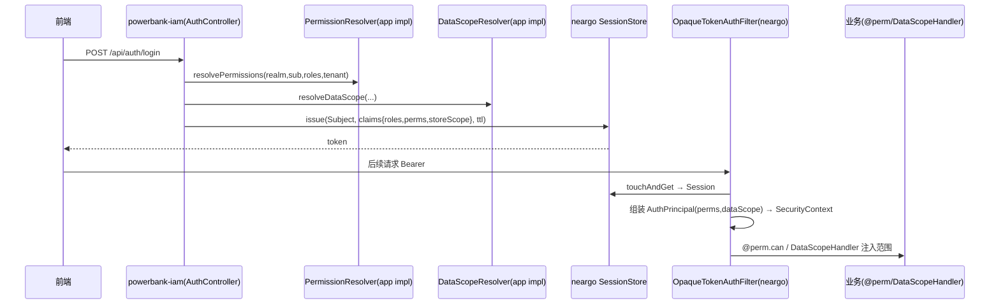

# 权限 SPI 契约与模块落位方案（无表基座 × 有表 IAM 的解耦落地）

> 状态：具体方案（待确认）· 创建 2026-07-12 · 承接 [权限能力上推清单 §4.1](./权限能力上推清单.md)、[ADR-015](./ADR/ADR-015-权限模块化与打包方式.md)。
> 主张：**neargo commons 定「无表的 SPI 契约 + enforcement」，powerbank-iam 用自己的 `iam_*` 表实现契约**。通用落在**接口**，不落在 schema。

---

## 1. 三产物落位（谁拥有什么）

```
┌─ neargo-common-security（无表·上推）─────────────────────────┐
│  enforcement：PermChecker(@perm) · DataScopeHandler · SecurityUtils │
│  契约 SPI：PermissionResolver · DataScopeResolver · PrincipalRefresher │
│  模型：AuthPrincipal · DataScopeSpec · ScopeRule(String dim)         │
│  默认实现：RolesAsPermissions · AllDataScope（@ConditionalOnMissingBean）│
└───────────────▲───────────────────────────────▲────────────────────┘
                │ 实现 SPI（有表）                │ 只用 @perm/SecurityUtils
┌─ powerbank-iam（有表·app）──────────┐   ┌─ 业务模块 trade/ops/user ─┐
│ IamPermissionResolver(读 iam_role_perm)│   │ @perm.can(...) · 注册数据权限表 │
│ IamDataScopeResolver(读 iam_data_scope)│   └────────────────────────────┘
│ iam_* 表 · IamAdminController · MenuService · Seeder │
└────────────────────────────────────┘
```

**要点**：`iam_*` 表**只属 powerbank-iam**；neargo 只认 SPI 返回值（权限码集合 / 数据范围），**永不 import iam 表**。

---

## 2. 上推到 neargo 的 SPI 契约（无表，具体接口）

### 2.1 模型（泛化 powerbank 的 LoginUser/DataScope）
```java
// 认证后的规范主体（建在 neargo Session 之上，realm 无关）
public record AuthPrincipal(
    String realm, String subjectId, String tenantId,
    List<String> roles,
    Set<String> permissions,          // 由 PermissionResolver 解析（非 roles）
    DataScopeSpec dataScope,
    Map<String,Object> attributes) {   // app 扩展位（powerbank 放 agentNo）
  public boolean hasPerm(String code) { // 通配：精确 | pattern 去尾前缀
    if (permissions == null || code == null) return false;
    for (String p : permissions)
      if (p.equals(code) || (p.endsWith("*") && code.startsWith(p.substring(0, p.length()-1)))) return true;
    return false;
  }
}

// 数据范围（通用；dim 用 String 便于 app 扩展维度）
public record DataScopeSpec(boolean all, List<ScopeRule> rules) {
  public static final DataScopeSpec ALL = new DataScopeSpec(true, List.of());
}
public record ScopeRule(String dim, Set<String> refs) {}  // dim: "ALL"/"REGION"/"DEPT"/"SELF" | app: "AGENT"/"SITE"
```

### 2.2 SPI（app 实现）
```java
/** 主体 → 权限码集合（app 用自己的角色-权限表实现）。 */
public interface PermissionResolver {
  Set<String> resolvePermissions(String realm, String subjectId, List<String> roles, String tenantId);
}

/** 主体 → 数据范围（app 用自己的 data-scope 表 + 领域规则实现）。 */
public interface DataScopeResolver {
  DataScopeSpec resolveDataScope(String realm, String subjectId, List<String> roles, String tenantId);
}

/** 口径 B：权限变更后按主体重建（app 用最新配置重解析）。 */
public interface PrincipalRefresher {
  AuthPrincipal rebuild(AuthPrincipal current);
}
```

### 2.3 neargo 默认实现（无 app 覆盖时可用，@ConditionalOnMissingBean）
```java
@Bean @ConditionalOnMissingBean
PermissionResolver rolesAsPermissions() {          // 退化：roles 即 perms（neargo 现状）
  return (realm, sub, roles, tenant) -> new HashSet<>(roles == null ? List.of() : roles);
}
@Bean @ConditionalOnMissingBean
DataScopeResolver allDataScope() {                 // 退化：全放行
  return (realm, sub, roles, tenant) -> DataScopeSpec.ALL;
}
```

---

## 3. neargo 侧 enforcement（用 SPI，无表）

| 组件 | 职责 | 依赖 |
|------|------|------|
| `AuthAssembler` | 登录/刷新时调 `PermissionResolver`+`DataScopeResolver` → 组装 `AuthPrincipal` → 写入 Session claims（perms + storeScope）| 2 个 Resolver SPI |
| `OpaqueTokenAuthFilter`（增强）| Bearer→Session→`AuthPrincipal`→SecurityContext；版本变则经 `PrincipalRefresher` 刷新 | SessionStore + PrincipalRefresher |
| `PermChecker`(`@perm`) | `@PreAuthorize("@perm.can('码')")` → `AuthPrincipal.hasPerm` | 当前 principal |
| `DataScopeHandler` + `DataScopeRegistry` + `DataScopeContext` | 读 principal.dataScope，向业务 SQL 注入归属条件 | 当前 principal |
| `SecurityUtils` | 业务读当前 principal（不碰 SecurityContextHolder）| — |

> neargo 出**通用维度** `ALL/REGION/DEPT/SELF` 的锚点约定 + 注册 API；app 注册**自有维度**与列。

---

## 4. powerbank-iam 侧实现（有表，实现 SPI）

```java
@Component
class IamPermissionResolver implements PermissionResolver {   // 读 iam_role_perm（含缓存）
  public Set<String> resolvePermissions(String realm, String subjectId, List<String> roles, String tenantId) {
    return new HashSet<>(permissionService.permsOfRoles(roles));   // 现有 PermissionService 复用
  }
}

@Component
class IamDataScopeResolver implements DataScopeResolver {     // 读 iam_data_scope + AGENT 领域规则
  public DataScopeSpec resolveDataScope(String realm, String subjectId, List<String> roles, String tenantId) {
    // "AGENT" realm → ScopeRule("AGENT", {agentNo})；否则 iam_data_scope(ROLE/EMPLOYEE) 并集
    return permissionService.scopeSpecOf(roles, realm, attr(subjectId).agentNo());
  }
}

@Component
class IamPrincipalRefresher implements PrincipalRefresher {   // 口径 B：用最新配置重解析
  public AuthPrincipal rebuild(AuthPrincipal cur) {
    return cur.withPermissions(resolver.resolvePermissions(...)).withScope(scopeResolver.resolveDataScope(...));
  }
}
```
+ **保留不动**：`iam_*` 表、`IamAdminController`(`/api/platform/iam/*`)、`MenuService`(`/api/auth/menus`)、`IamSeeder`。菜单是 UI 概念，**留 app**（不进 neargo SPI）。

> powerbank 注册自有数据权限维度与表锚点（app 启动时）：
```java
dataScopeRegistry.register("loc_site", Map.of("AGENT","agent_no","REGION","region_id","SITE","site_no"));
dataScopeRegistry.register("ord_rent", Map.of("AGENT","agent_no"));   // 逐表
```

---

## 5. 数据流（登录 → 鉴权，一图）



---

## 6. 现状代码 → 目标落位（重构映射表）

| powerbank 现有 | 目标 | 动作 |
|---------------|------|------|
| `auth/PermChecker`(@perm) | neargo `rbac` | 上推（用 AuthPrincipal.hasPerm）|
| `auth/LoginUser` | neargo `AuthPrincipal` | 泛化上推（`agentNo`→attributes）|
| `auth/DataScope`/`ScopeDim` | neargo `DataScopeSpec`/`ScopeRule(String dim)` | 泛化上推（dim 改 String 可扩展）|
| `auth/DataScopeHandler`/`TableRegistry`/`Context` | neargo `datascope` | 上推（维度/锚点由 app 注册）|
| `auth/PermVersion`/`PrincipalRefresher` | neargo `session` | 上推 |
| `auth/SecurityUtils` | neargo | 上推 |
| `auth/{Staff,Consumer}TokenAuthFilter` | neargo `OpaqueTokenAuthFilter(allowedRealms)` | **退役**（用 neargo 已有，见上推清单堆B）|
| `auth/TokenStore`+store/* / `Realm` / OtpService | neargo `SessionStore`/`Realm`/auth-core OTP | **退役对齐** |
| `platform.iam/PermissionService` | 拆：**实现 `PermissionResolver`** 留 powerbank-iam；缓存留 | 改造 |
| `platform.iam/{IamAdminController,MenuService,IamSeeder,iam_* 实体}` | **powerbank-iam（不动）** | 保留 app |
| `iam_*` 表 | powerbank-iam / `pb_core` | 保留 app（**不上推**）|

---

## 7. 落地步骤（分批，先本地稳定再上推）

| 批 | 动作 | 位置 |
|----|------|------|
| **S1 ✅ 已实施（2026-07-13）** | 抽 `auth/{PermissionResolver, DataScopeResolver, AuthSubject}` SPI；`PermissionService implements` 二者（+`PrincipalRefresher`）；`AuthController` 登录/口径B rebuild 改经 SPI 解析。`@perm`/`DataScopeHandler` 本就读 `LoginUser`（已解耦）。**29 测试全绿 + 口径B 冒烟通过，行为不变** | powerbank-app |
| S2 | `DataScope`→`DataScopeSpec`(dim 改 String)；`DataScopeTableRegistry` 改由 app 启动注册（去硬编码 loc_site）| powerbank-app |
| **U1 上推** | 把 `rbac`（@perm+PermissionResolver+AuthPrincipal）上推 neargo-common-security | neargo 私仓 |
| U2 上推 | `datascope`（Handler+Registry+Context+DataScopeResolver+DataScopeSpec）上推 | neargo |
| U3 上推 | `PermVersion`/`PrincipalRefresher`/`SecurityUtils` 上推 | neargo |
| B 退役 | powerbank 换用 neargo `SessionStore`/`OpaqueTokenAuthFilter(allowedRealms)`/OTP，删自造 TokenStore/双Filter/Realm/OtpService | powerbank-app |
| 保留 | `powerbank-iam` 持 `iam_*` + 管理 API + Resolver 实现；菜单留 app | powerbank |

> **S1/S2 先做**（本地按 SPI 解耦，零跨仓协调）→ 验证矩阵不变 → 再分批 U1–U3 上推 neargo（需协调发版）。上推后 powerbank 的 Resolver 实现**几乎不改**，只是接口 import 从本地换 neargo。

---

## 8. 收益与验证

- **通用落接口不落表**：neargo 得可复用的 RBAC/数据权限 enforcement + 契约；各 app 用自己的表实现，schema 零耦合。
- **powerbank 侧几乎无感**：`PermissionService` 加一层 `implements PermissionResolver`，`iam_*`/管理 API 不动。
- **验证**：S1/S2 后跑现有 29 测试 + RBAC 矩阵 + 口径 B 集成，行为不变即达标；上推后各 app 回归自证。

## 9. 待确认
1. neargo SPI 承载：`neargo-common-security` 新 `rbac`/`datascope` 子包，还是新 `neargo-common-authz` 模块？
2. `AuthPrincipal` 与 neargo 现有 `Session` 的关系：principal 由 filter 从 Session 组装（推荐），还是扩展 Session 直接带 perms？
3. 菜单是否也定一个 `MenuProvider` SPI 上推，还是纯留 app（本文：留 app）？
