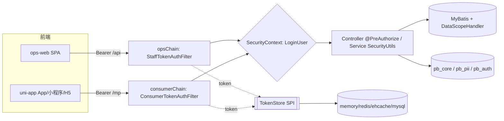
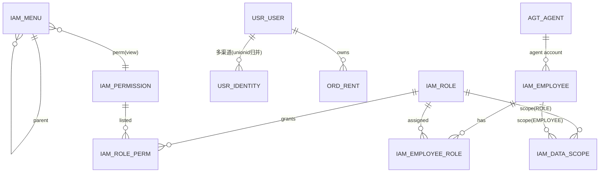
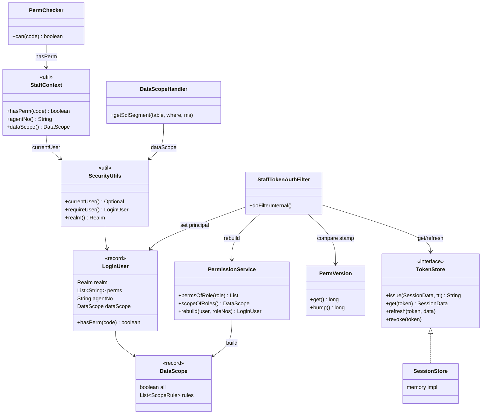
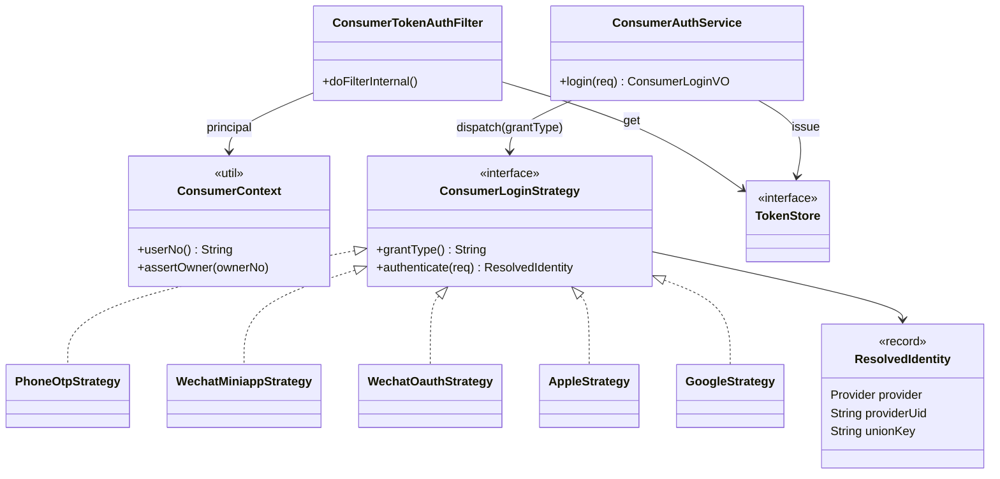
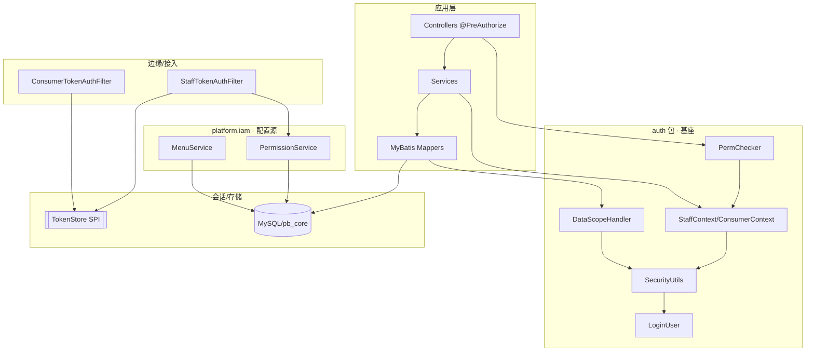
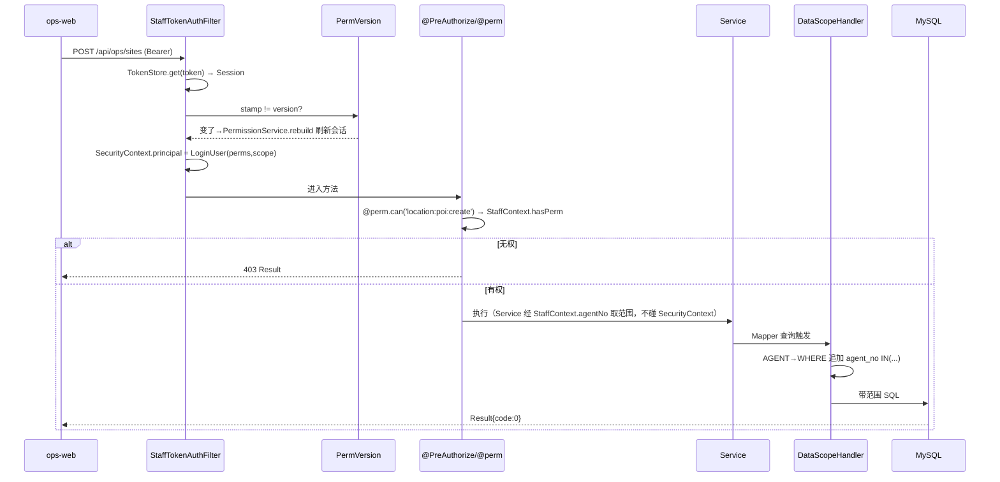
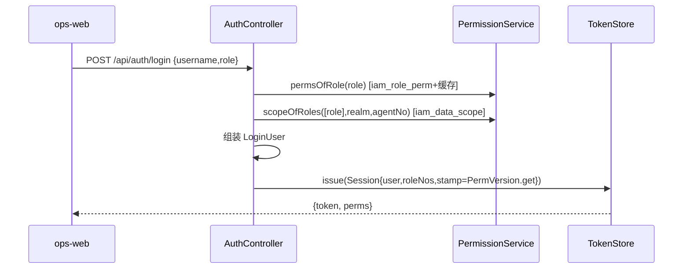
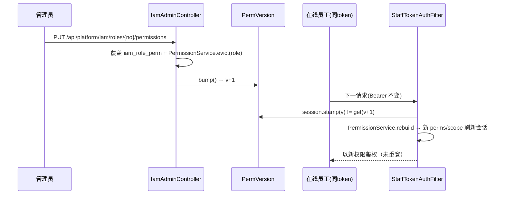
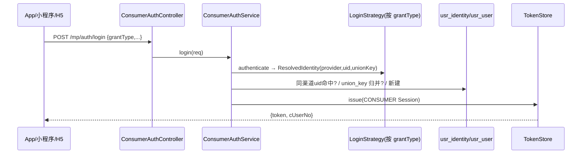
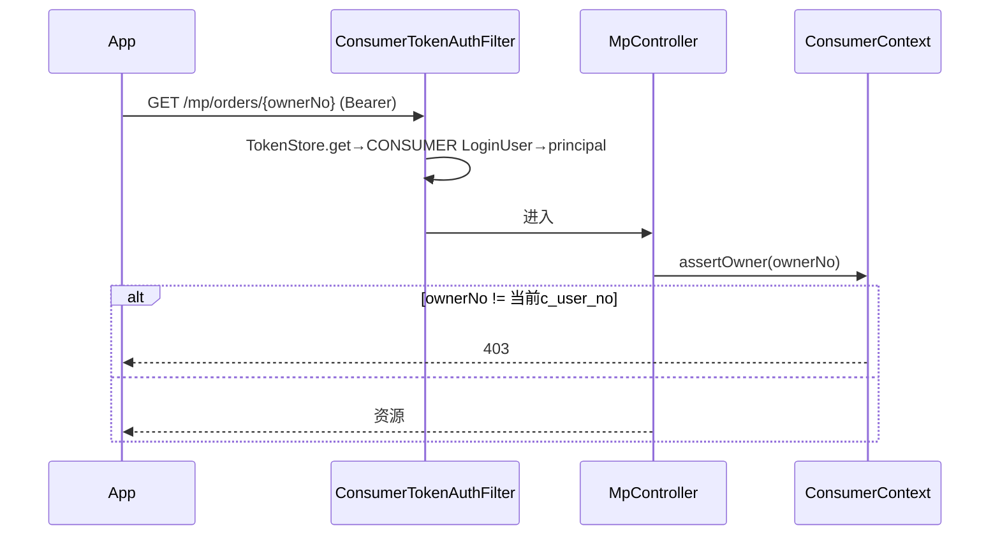

# 权限体系设计（运营端 + C 端 · 总体）

> 状态：总体设计（as-built + 设计态混合，逐段标注）· 创建 2026-07-12
> 汇总：[权限管理方案.md](./权限管理方案.md)（概念）· [运营端权限方案.md](./运营端权限方案.md)（运营端 as-built）· [运营端权限-动态配置实现步骤.md](./运营端权限-动态配置实现步骤.md)（动态化）· [TDD-认证鉴权.md](./TDD-认证鉴权.md) + [-实现细节.md](./TDD-认证鉴权-实现细节.md)（C 端）· [db-design.md](./db-design.md)（库表 SSOT）· [功能权限清单.md](../requirements/功能权限清单.md)（权限码 SSOT）。
> 代码根：`backend/powerbank-app/src/main/java/ai/neargo/powerbank/`。图例：✅已实现 · 🟡设计待落地。

---

## 1. 总览

| 维度 | 运营端（B 端） | C 端（消费者） |
|------|---------------|---------------|
| 主体 realm | `STAFF` / `AGENT` | `CONSUMER` |
| 载体 | ops-web（Next SPA）· Ops App | uni-app（App/小程序/H5） |
| 路径 | `/api/**`、`/internal/**` | `/mp/**` |
| 过滤器链 | `opsChain`（@Order 2，默认兜底） | `consumerChain`（@Order 1，`/mp/**`） |
| 认证过滤器 | `StaffTokenAuthFilter` | `ConsumerTokenAuthFilter` |
| 授权模型 | **RBAC**（功能权限码 + 数据范围） | **属主鉴权**（无 RBAC，只操作自己数据） |
| 上下文门面 | `StaffContext` | `ConsumerContext` |
| 数据隔离 | `tenant_id` + `data_scope`（AGENT 强制 `agent_no`） | `tenant_id` + `c_user_no`（openid×tenant） |

**三层 + 会话/菜单**：认证（你是谁）→ 功能授权（能做什么）→ 数据授权（能看哪些）；会话（TokenStore）与菜单（动态下发）横切。**架构红线**：业务代码只经 `SecurityUtils`/`StaffContext`/`ConsumerContext` 读身份，**不碰 `SecurityContextHolder`**（业务/权限分离）。两端**分链、分过滤器、分上下文，共用基座**（`LoginUser`/`TokenStore`/Spring Security 底座）。



---

## 2. 领域模型

**运营端本体**：员工 Employee →(N:M)→ 角色 Role →(N:M)→ 权限码 Permission；角色/员工 → 数据范围 DataScope；菜单 Menu 绑权限码；操作留痕 AuditLog。
**C 端本体**：消费者 CUser →(1:N)→ 多渠道身份 Identity（unionid 归并）；钱包/券/订单按 `c_user_no` 属主。
**会话**：Token → Session（LoginUser + 角色 + 权限版本戳），存于可切换 TokenStore。



---

## 3. 数据库设计

### 3.1 运营端 `iam_*`（库 `pb_core`）✅
| 表 | 关键列 | 说明 |
|----|--------|------|
| `iam_role` | `role_no`(=code MVP), code, name, **builtin**(内置只读), data_scope, scope_refs | 角色 |
| `iam_permission` | `code` UK, module, name | 权限码目录（分配选择器 + 校验）|
| `iam_role_perm` | role_no, perm_code（支持通配 `*`/`device:*`）| 角色→码 |
| `iam_employee_role` | employee_no, role_no | 员工→角色 |
| `iam_data_scope` | **subject_type(ROLE/EMPLOYEE)**, subject_no, scope_type, scope_refs `JSON` | 数据范围（角色级+员工级并集）|
| `iam_menu` | `menu_no`, parent_no, name, type(DIR/MENU), path, icon, sort, **perm**(查看码) | 菜单树 |
| `iam_audit_log` `append` | actor, action, target, detail `JSON`, ip, created_at | 操作留痕 |
| `iam_employee` | `employee_no`, name, user_id(→pb_auth), dept_id | 员工 |

### 3.2 C 端 `usr_*`（`pb_core`）✅ + 凭据 `cred_*`（`pb_auth`）🟡
| 表 | 关键列 | 库 |
|----|--------|----|
| `usr_user` | `c_user_no` UK, tenant_id, openid, unionid, nickname, credit_score, status | pb_core ✅ |
| `usr_identity` | c_user_no, provider(WECHAT_MP/OA/APPLE/GOOGLE/PHONE), provider_uid, **union_key**；UK(tenant,provider,uid) | pb_core ✅ |
| `pii_user` | c_user_no, phone`[KMS]`, real_name`[KMS]` | pb_pii 🟡 |
| `cred_credential` | `realm`(STAFF/AGENT/CONSUMER), 凭据 hash/OTP | pb_auth 🟡（auth-core 专属）|

### 3.3 会话/Token 存储 🟡（见 §7）
`sys_token`（**仅 `token-store=mysql` 模式用**）：`token` UK, realm, subject_no, role_nos, perm_stamp, payload `JSON`, expire_at, created_at；`KEY idx_token_expire(expire_at)`（清理任务）。memory/redis/ehcache 模式不落库。

---

## 4. 类图

### 4.1 共享基座 + 运营端 ✅（TokenStore SPI 为 🟡）



### 4.2 C 端 ✅



---

## 5. 上下游依赖关系

**调用方向（单向，禁反向）**：前端 → Controller → (Filter 已置 SecurityContext) → Service → Mapper → DB。**业务层禁依赖 `SecurityContextHolder`**，只依赖 `*Context` 工具。



- **包依赖**：`platform.iam` 依赖 `auth`（用 LoginUser/DataScope）；`auth` 的过滤器/服务反向依赖 `platform.iam`（PermissionService）——通过 Spring 注入，无编译环。
- **上游触点**：ops-web（`lib/api` 携 Bearer）、uni-app（`/mp` Bearer）。
- **下游依赖**：MySQL(pb_core)；🟡 Redis/Ehcache(会话)、pb_auth(auth-core 凭据)、nearpay(C 端支付,权限外)。

---

## 6. 调用链 / 工作流（从入口逐级）

### 6.1 运营端 · 一次受保护写请求 ✅


### 6.2 运营端 · 登录（DB 装配）✅


### 6.3 运营端 · 口径 B 权限变更即时生效 ✅


### 6.4 C 端 · 统一登录 + unionid 归并 ✅


### 6.5 C 端 · 属主鉴权请求（IDOR 防护）✅


---

## 7. 可切换 Token 存储方案（memory / redis / ehcache / mysql）🟡

### 7.1 SPI（抽象当前 `SessionStore`）
```java
public interface TokenStore {
  String issue(SessionData data, Duration ttl);   // 发放
  Optional<SessionData> get(String token);         // 反查(含惰性过期)
  void refresh(String token, SessionData data);    // 口径B 原地刷新
  void touch(String token, Duration ttl);          // 滑动续期
  void revoke(String token);                        // 登出/踢下线
}
record SessionData(LoginUser user, List<String> roleNos, long permStamp, Instant expireAt) {}
```
> 现 `SessionStore`(ConcurrentHashMap) 即 `MemoryTokenStore`；`StaffTokenAuthFilter`/`ConsumerTokenAuthFilter`/`AuthController` 只依赖 `TokenStore` 接口，切换零改。

### 7.2 四实现对比与选型
| 实现 | 持久化 | 多实例共享 | TTL/过期 | 依赖 | 适用 |
|------|-------|-----------|---------|------|------|
| `MemoryTokenStore` ✅ | ✗ | ✗ | 手动扫描 | 无 | 本机/单测 |
| `EhcacheTokenStore` | ✗（可溢出磁盘）| ✗(单节点) | ✓ 原生 | ehcache（`erp-cache-ehcache` 在库）| 单实例生产 |
| `RedisTokenStore`（**推荐**）| 可 AOF/RDB | ✓ | ✓ 原生 EXPIRE | spring-data-redis（在库）| 多实例生产 |
| `MysqlTokenStore` | ✓ 强持久 | ✓ | 需清理任务 | 已有 MySQL | 强审计/可查会话，性能次；建议 + Caffeine L1 |

### 7.3 配置开关
```yaml
powerbank:
  auth:
    token-store: memory   # memory | ehcache | redis | mysql
    token-ttl: 2h
    refresh-ttl: 30d       # C端 refresh
```
```java
@Bean @ConditionalOnProperty(name="powerbank.auth.token-store", havingValue="redis")
TokenStore redisTokenStore(StringRedisTemplate r, ObjectMapper om){ return new RedisTokenStore(r, om); }
// ehcache/mysql/memory 各一个 @ConditionalOnProperty；缺省 memory
```
- **序列化**：`SessionData`→JSON（Jackson）；Redis key `auth:token:{token}`，value=JSON，EXPIRE=ttl；MySQL 落 `sys_token.payload`。
- **口径 B 刷新**：`refresh()` 覆盖同 key（Redis SET/MySQL UPDATE）；memory 原地改。
- **登出/踢**：`revoke()` DEL/DELETE；改密/停用员工 → 按 subject_no 批量 revoke。
- **迁移**：MVP `memory` → 上线切 `redis`（仅改配置 + 起 Redis），无代码改动。

---

## 8. 动态调整权限方案 ✅（口径 B）

**三段**：配置面（改库）→ 缓存失效（`PermissionService.evict`）→ 版本推进（`PermVersion.bump`）→ 在线会话下一请求 `rebuild` 刷新。

| 变更 | 失效动作 | 生效 |
|------|---------|------|
| 角色权限（`iam_role_perm`）| `evict(roleNo)` + `bump()` | 该角色在线员工下一请求即时 |
| 员工角色（`iam_employee_role`）| `evict` 相关 + `bump()` | 同上 |
| 数据范围（`iam_data_scope`）| `bump()` | 下一请求 rebuild 重算 scope |
| 菜单（`iam_menu`）| 菜单树缓存清 | 下次 `/api/auth/menus` |

- **缓存**：`PermissionService` 按 `roleNo` 缓存权限码（当前 ConcurrentHashMap；多实例换 Redis 并订阅失效广播）。
- **一致性**：`LoginUser.perms` 登录时快照进会话；口径 B 用全局 `permStamp` 比对，变更即刷新（无需 TTL 兜底、无需重登）。多实例：`PermVersion` 需改为 Redis 全局计数（当前单机 AtomicLong）。

---

## 9. 权限管理方案（配置视角）✅ 最小闭环 / 🟡 全量

| 能力 | 端点 | 状态 |
|------|------|------|
| 权限码目录 | `GET /api/platform/iam/permissions` | ✅ |
| 角色列表/CRUD | `GET /api/platform/iam/roles`（列表 ✅）· POST/PUT/DELETE 🟡 | 部分 |
| **给角色配权限码** | `PUT /api/platform/iam/roles/{no}/permissions`（覆盖写，内置只读→400）| ✅ |
| 菜单树/CRUD | `GET /api/platform/iam/menus`（✅）· 增改 🟡 | 部分 |
| 员工↔角色 | `PUT /api/platform/employees/{no}/roles` | 🟡 |
| 数据范围配置 | `PUT .../data-scope`（角色级/员工级）| 🟡 |
| 审计 | `iam_audit_log` + `OperateLog` 切面 | 🟡 |

**规则**：内置角色 `builtin=1` 只读；所有配置写 `@PreAuthorize('org:role:update' 等)` + 审计 + 失效缓存 + bump 版本。前端菜单/按钮由 `GET /api/auth/menus` + `/permissions` 动态驱动（🟡 前端接线）。

---

## 10. as-built vs 设计（落地边界）

| 模块 | 状态 |
|------|------|
| 运营端认证/RBAC/@PreAuthorize/通配 | ✅ |
| 数据权限拦截器（`loc_site`）| ✅（🟡 扩 dev_cabinet/ord_rent/wo_order + REGION/SITE refs）|
| C 端认证/5 策略/unionid 归并/属主 | ✅（🟡 外部真验签、pb_auth 凭据）|
| 动态权限（DB 驱动 + 菜单 + 口径 B）| ✅（🟡 前端接线、后台角色/菜单全 CRUD）|
| TokenStore SPI + 配置开关（`powerbank.auth.token-store`）| ✅ memory(默认)/mysql(`sys_token`) 实测；redis/ehcache 已实现+装配（redis 待起 Redis 验证）|
| 多实例：Redis 缓存/版本广播、pb_auth、审计切面 | 🟡 |
```
