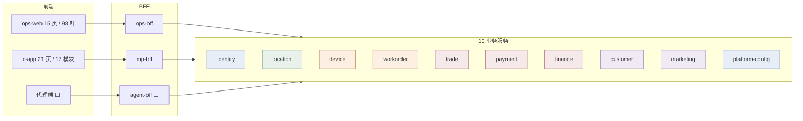

# 架构 — 业务模块微服务化 与 前端对应

> ⚠️ **已被取代，不要据此实施** —— 同样基于已作废的 10 服务前提。
> 模块边界现以 [业务模块分层](./业务模块分层.md)（脚本生成、可校验）为准，服务归属见 [架构设计总纲 §四](./架构设计总纲-多设备共享平台.md)。

> 创建：2026-07-30 · 定位：**纵向切片视图** —— 每个业务模块从前端页面一路到表，落在哪个微服务
> 关联：[架构-微服务边界与接口.md](./架构-微服务边界与接口.md)（横向服务拆分）· [ADR-016](./ADR/ADR-016-目标架构为微服务与服务边界.md)
> · [运营端功能清单](../requirements/运营端功能清单.md)（98 叶）· [C端功能清单](../requirements/C端功能清单.md)（17 模块）
>
> **为什么要有这份文档**：[架构-微服务边界与接口.md](./架构-微服务边界与接口.md) 是横切的（服务 → 表 → 接口），
> [功能清单](../requirements/运营端功能清单.md) 是纵切的（菜单 → 功能）。两者之间缺一层：
> **一个前端页面到底要打几个服务**。这个问题的答案决定了 BFF 要不要聚合、拆分会不会把页面拖慢 ——
> 也是本文 §四 的重点。
>
> 口径：**服务归属是目标态；「后端落点」「前端落点」是当前代码实际位置。** 未实现的标 ⬜。

> 📐 汇报用图见 [diagrams/](./diagrams/README.md)（7 张 16:9 矢量 SVG，`00-overview.svg` 为完整总架构）。

---

## 一、总览：15 运营模块 + 17 C端模块 → 10 服务

---

## 二、运营端：15 模块的纵向切片

> 「前端入口」= `ops-web` 真实路由（`lib/nav.ts` 的菜单叶）· 「后端落点」= 当前控制器与包 ·
> 「表」= 独占表前缀 · 「服务」= 拆分后归属

| # | 业务模块 | 前端入口 | 后端控制器（当前） | 域包 | 表前缀 | **目标服务** |
|:-:|---|---|---|---|---|---|
| 1 | 经营看板 | `/` | `OpsController.dashboard` | — | `[读]` 跨域聚合 | **⚠️ 跨 4 服务**（见 §四）|
| 2 | 设备管理（8 叶）| `/devices` `?tab=…` `/devices/detail` | `OpsController` `DeviceController` | `dev` | `dev_` | **device** |
| 3 | 告警管理（4 叶）| `/alarms` | `AlarmController` | `dev/alarm` | `dev_alarm_` | **workorder** |
| 4 | 工单管理（4 叶）| `/work-orders` | `OpsController` `WoExtController` | `wo` `wo/ext` | `wo_` | **workorder** |
| 5 | 站点与点位（8 叶）| `/locations` | `OpsController` `LocExtController` | `loc` `loc/ext` | `loc_` | **location** |
| 6 | 代理商管理（6 叶）| `/agents` | `AgentController` `AgentExtController` | `agent` `agent/ext` | `agt_` | **location** |
| 7 | 订单管理（7 叶）| `/orders` | `TradeController` `OrderOpsController` | `trade` `trade/order` | `ord_` | **trade** |
| 8 | 计费定价（3 叶）| `/pricing` | `PricingController` | `trade/price` | `price_` | **trade** |
| 9 | 财务管理（11 叶）| `/finance` | `TradeController` `FinanceController` | `trade/finance` | `acct_ share_ stl_ recon_ fin_` | **finance** |
| 10 | 用户管理（7 叶）| `/users` | `UserController` `UserOpsController` | `user/core` `user/asset` | `usr_ mbr_` | **customer** |
| 11 | 营销管理（8 叶）| `/marketing` | `MarketingController` | `user/marketing` `user/ad` | `mkt_ ad_ coupon_` | **marketing** |
| 12 | 客服管理（4 叶）| `/cs` | `CsController` | `user/cs` | `cs_` | **marketing** |
| 13 | 数据报表（6 叶）| `/reports` | ⬜ 无端点 | — | `[读]` 全聚合 | **⚠️ 跨全部服务** |
| 14 | 员工与权限（5 叶）| `/employees` | `PlatformController` `OrgController` `IamAdminController` | `platform/iam` `platform/org` | `iam_` | **identity** |
| 15 | 系统设置（16 叶）| `/system` | `SysConfigController` `SysSettingController` `SysDictController` `NotifyController` `PaymentChannelController` `VendorController` | `platform/sys` `platform/md` `platform/notify` `platform/tenant` | `sys_ md_ dict_ notify_ tenant openapi_` | **platform-config**（+`pay_channel`→payment、`gw_vendor`→gateway）|
| — | 库存调拨 | `/devices?tab=inventory` | `InventoryController` | `inv` | `inv_` | **device** |
| — | 登录 | `/login` | `AuthController` | `platform/iam` | `cred_`(pb_auth) | **identity** |

### 2.1 三处「菜单归属 ≠ 服务归属」

菜单是按运营人员的使用习惯组织的，服务是按数据归属切的，两者不必一致。以下三处刻意不同：

| 菜单位置 | 服务归属 | 为什么 |
|---|---|---|
| 告警管理独立成模块（`/alarms`）| **workorder** 服务 | 运营眼里告警是独立工作面，但数据上它唯一的下游是工单，拆开会把「告警→自动开单」闭环切成跨服务 saga |
| 代理商管理独立成模块（`/agents`）| **location** 服务 | 代理归属挂在站点上（`loc_site.agent_no` 是权威源），拆开等于把归属的唯一权威切两半 |
| 系统设置里的「支付渠道」「供应商接入」 | **payment** / **access-gateway** | 它们在菜单上归系统设置（运营视角都是"配置"），但数据分别属支付域与南向域 |

---

## 三、C 端：17 模块的纵向切片

| # | C端模块 | c-app 页面 | `/mp` 端点（当前控制器）| **目标服务** |
|:-:|---|---|---|---|
| 1 | 账户与登录 | `login` `auth/register` `auth/forgot` `splash` | `ConsumerAuthController` `/mp/auth/*` | **identity** + customer |
| 2 | 找柜与地图 | `home/index` | ⬜ `/mp/nearby/*` 未实现 | **location** + device |
| 3 | 扫码借出 | `order/confirm` | `RentController` `/mp/trade/orders/rent` | **trade**（→device 校验）|
| 4 | 免押与授权 | `order/confirm` | ⬜ `/mp/trade/deposit/free` | **payment** |
| 5 | 支付收银 | `order/confirm` `wallet` | ⬜ `/mp/trade/pay` | **payment** |
| 6 | 使用中 | `order/detail` | `RentController` `/mp/trade/orders/{no}` | **trade** |
| 7 | 归还与结算 | `order/detail` | `TradeInternalController`（事件驱动）| **trade** + payment + finance |
| 8 | 订单与账单 | `orders/index` `order/detail` | `RentController` `/mp/trade/orders` | **trade** |
| 9 | 钱包与押金 | `wallet/index` | `MpUserController` `/mp/user/wallet*` | **customer** |
| 10 | 会员与权益 | `membership/index` | `MpUserController` | **customer** |
| 11 | 优惠券与营销 | `coupons/index` `notice/index` | `MpSupportController` `/mp/user/coupons` `/mp/notice` | **marketing** |
| 12 | 报障与客服 | `order/feedback` | `MpSupportController` `/mp/user/report` | **marketing**(cs) → workorder / trade |
| 13 | 发票 | ⬜ | `MpUserController` `/mp/user/invoices` | **customer** + finance |
| 14 | 消息触达 | ⬜ | ⬜ `/mp/user/push-token` `/messages` | **platform-config** + customer |
| 15 | 邀请与分享 | ⬜ | ⬜ `/mp/user/invite` | **marketing** |
| 16 | 个人中心与设置 | `me/*`（7 页）| `MpUserController` `MpMetaController` | **customer** + platform-config |
| 17 | 蓝牙近场借还 | ⬜ | 走 access-gateway | **access-gateway** |

### 3.1 C 端的服务归属比运营端集中

C 端 17 模块只落在 6 个服务（trade / payment / customer / marketing / location+device / platform-config），
因为 C 端本质只做三件事：**找柜（location+device）· 借还付（trade+payment）· 我的资产与售后（customer+marketing）**。
这也是 `mp-bff` 比 `ops-bff` 好写的原因 —— 聚合面窄得多。

---

## 四、⚠️ 跨服务页面清单（本文最该被读的一节）

拆分的代价不体现在「一个页面对一个服务」的模块上，而体现在**一个页面要打多个服务**的地方。
这些页面在单体里是一次 join，拆分后必须由 BFF 聚合或维护读模型 —— 是拆分的主要成本所在。

| 前端页面 | 需要的服务 | 数据 | 拆分后的处理 |
|---|:-:|---|---|
| **经营看板** `/` | **4** | GMV/订单数(trade) · 活跃柜机/在线率(device) · 实时告警/待派工单(workorder) · 待审退款(trade)+待审提现(finance) | **必须做读模型**。BFF 并发调 4 个服务再拼会让首屏受最慢服务拖累；看板对实时性要求低（分钟级即可）→ 建 `rpt_dashboard` 物化表，由各服务事件更新 |
| **数据报表** `/reports` 6 叶 | **全部** | 设备分析 · 点位坪效 · 财务报表 · 消费者分析 | **必须做读模型/数仓**。禁止 BFF 实时聚合 —— 报表是全量扫描，跨服务实时聚合必然超时 |
| **订单详情**（页内抽屉）| **5** | 订单+时间线(trade) · 借还柜机(device) · 用户昵称(customer) · 支付流水(payment) · 分润记录(finance) | BFF 聚合（单条记录，并发 5 个调用可接受）。**前提**：各服务都提供 `GET /internal/*/by-order/{orderNo}` |
| **设备台账** `/devices` | **2** | 机柜(device) · 点位名/归属代理名(location) | 用 `dev_cabinet` 上的 `location_name`/`agent_no` **写入时快照**，列表页零跨服务调用（当前实现已如此）|
| **分润明细** `/finance?tab=records` | **3** | 分润记录(finance) · 订单号(trade) · 场地方/代理名(location) | `share_record` 冗余 `payee_name` 快照（当前实现已如此）|
| **工单列表** `/work-orders` | **2** | 工单(workorder) · 机柜/点位名(device+location) | `wo_order` 冗余 `location_name` 快照 |
| **用户钱包** `/users?tab=wallets` | **3** | 钱包(customer) · 订单数/额(trade) · 充值数/额(customer) | **价值画像必须走读模型** —— db-design 已明确不落冗余列，那就只能聚合；跨服务后需 `customer` 订阅 `OrderSettled` 维护本地计数 |
| **C端 首页** `home/index` | **3** | 附近网点(location) · 可借可还数(device) · 进行中订单(trade) · 公告(marketing) | `mp-bff` 聚合。可借可还数**必须走 device 的影子读模型**，不能实时查仓位 |
| **C端 订单详情** `order/detail` | **3** | 订单(trade) · 费用明细(trade) · 报障入口(marketing) | 主要在 trade，可接受 |

### 4.1 从这张表得出的三条设计约束

1. **看板与报表不能靠 BFF 实时聚合** —— 它们跨的服务最多、对实时性要求最低，正是读模型/CQRS 的标准适用场景。
   拆分前就应把 `/api/ops/dashboard` 与 `/api/ops/reports/*` 改为读物化表，否则拆分那天这两个页面直接不可用。
2. **列表页一律靠写入时快照，不靠读时 join** —— `location_name`/`agent_no`/`payee_name`/`nickname` 这类展示名
   在当前实现里已经是冗余快照（[db-design §1.4](./db-design.md)），拆分后天然零跨服务调用。
   **这是当初「展示名冗余、不随源改名回溯」那个决定的最大回报**，当时的理由是历史单据要留当时的名字，
   现在多了一条：它让拆分后的列表页不用跨服务。
3. **详情页可以 BFF 聚合，列表页不行** —— 详情是单条记录（N 个并发调用，N 固定），列表是 M 条
   （跨服务补字段 = M×N 次调用或 M 次批量调用）。所以补字段只能发生在详情页。

---

## 五、前端随拆分要做的改动

**结论先说：`ops-web` 与 `c-app` 的页面代码几乎不用改。** 因为两端都只依赖 BFF 的契约，
而 BFF 的对外端点在拆分前后保持不变 —— 变的是 BFF 内部从「调本地 service」变成「调远程服务」。

| 层 | 拆分前 | 拆分后 | 前端是否感知 |
|---|---|---|---|
| 页面 / 组件 | 调 `lib/api/https/*` | 不变 | **否** |
| `lib/api` 契约（161 方法）| 指向 `/api/**` | 不变 | **否** |
| BFF 端点 | 单体内控制器 | `ops-bff` 独立进程 | 否（路径不变）|
| BFF → 数据 | 进程内 service 调用 | `RestClient` 调各服务 | 否 |

**唯一会让前端感知的三处**：

1. **看板与报表改读模型后，数据有分钟级延迟** —— 需要在 UI 上标注数据时间（「统计截至 HH:mm」），
   否则运营会以为数字错了。这是**要改前端**的一处。
2. **划拨后归属可见性有秒级延迟**（事件驱动同步冗余列，[架构-微服务边界与接口 §四](./架构-微服务边界与接口.md)）
   —— 划拨成功后立刻刷新列表可能看不到，需要前端给一个「同步中」的提示或延迟刷新。
3. **跨服务操作的失败语义变多** —— 例如「投诉转工单」在单体里是本地事务，拆分后 workorder 服务不可用时
   要区分「已受理但转单失败，稍后重试」与「未受理」。前端的错误提示要能表达这个中间态。

---

## 六、当前代码与目标服务的对应（搬迁清单）

拆分时每个服务要带走的东西。**当前包结构已按目标边界组织**（[ADR-016](./ADR/ADR-016-目标架构为微服务与服务边界.md) 决策 2），
所以这份清单同时是「现在别写错」的对照表。

| 目标服务 | 带走的 Java 包 | 带走的控制器 | 表前缀 |
|---|---|---|---|
| **identity** | `platform/iam` `platform/org` `auth`(基础设施) | `AuthController` `IamAdminController` `PlatformController` `OrgController` | `iam_` + `pb_auth` |
| **location** | `loc` `loc/ext` `agent` `agent/ext` | `LocExtController` `AgentController` `AgentExtController` | `loc_` `agt_` |
| **device** | `dev`(除 alarm) `inv` | `DeviceController` `InventoryController` | `dev_` `inv_` |
| **workorder** | `dev/alarm` `wo` `wo/ext` | `AlarmController` `WoExtController` | `wo_` `dev_alarm_` |
| **trade** | `trade` `trade/order` `trade/price` | `TradeController` `OrderOpsController` `PricingController` `RentController` `TradeInternalController` | `ord_` `price_` |
| **payment** | `trade/pay` | `PaymentChannelController` | `pay_` |
| **finance** | `trade/finance` | `FinanceController` | `acct_ share_ stl_ recon_ fin_` |
| **customer** | `user/core` `user/asset` `user/consumer` | `UserController` `UserOpsController` `MpUserController` | `usr_ mbr_` + `pb_pii` |
| **marketing** | `user/marketing` `user/ad` `user/cs` | `MarketingController` `CsController` `MpSupportController` | `mkt_ ad_ coupon_ cs_` |
| **platform-config** | `platform/sys` `platform/md` `platform/notify` `platform/tenant` | `SysConfigController` `SysSettingController` `SysDictController` `NotifyController` `MpMetaController` | `sys_ md_ dict_ notify_ tenant openapi_` |
| **access-gateway** | `gw` | `VendorController` | `gw_` |

### 6.1 需要在拆分前处理的三处「包位置与服务归属不一致」

| 现状 | 问题 | 处理 |
|---|---|---|
| `OpsController` 一个类里混了 dashboard + 设备 + 工单 + 场所 | 横跨 4 个目标服务，无法整体搬迁 | **拆成 4 个控制器**（设备/工单/场所已各有 `DeviceController`/`WoExtController`/`LocExtController`，只需把 `OpsController` 里对应方法迁走，dashboard 独立成 `DashboardController`）|
| `TradeController` 混了订单 + 财务（share-rules/ledger/settlements/withdrawals）| 横跨 trade 与 finance | 财务方法迁到 `FinanceController`（**顺带修 punchlist 里「提现审批仍指向内存实现」那条**）|
| `UserController` 混了用户 + 券 | 横跨 customer 与 marketing | 券方法迁到 `MarketingController` |

> 这三处是历史遗留（骨架期一个控制器承载一个前缀），不影响当前运行，但**拆分前必须处理**，
> 否则一个类要被两个服务同时带走。已记入 punchlist。

---

## 七、待确认

1. **看板/报表读模型的建设时机** —— §四.1 说拆分前必须改。但读模型本身是不小的工程（物化表 + 事件订阅）。
   是否在 P2（抽 payment/finance）之前就做？还是先接受看板暂时跨服务聚合？
2. **`rpt_*` 物化表要不要现在就进 db-design** —— 当前 db-design 明确「数据报表 6 叶全走实时聚合，
   单次 >2s 再引物化表」。若采纳 §四.1，这条要改。
3. **代理端 BFF 是否独立** —— 代理端接口面几乎是运营端子集（靠数据范围裁剪），
   合进 `ops-bff` 可省一份聚合逻辑，但代理端的对外暴露面会与运营端耦合。
4. §五 的三处前端感知改动（数据时间标注 / 同步中提示 / 中间态错误语义）**需要产品确认交互**，
   不是纯技术决定。
