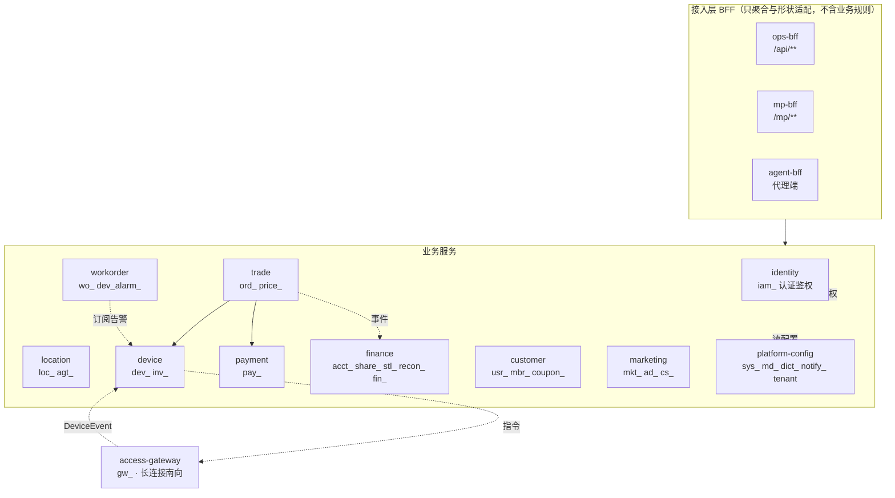

# 架构 — 微服务边界与接口契约

> ⚠️ **已被取代，不要据此实施** —— 本文基于 ADR-016 的 **10 服务**划分，该划分已由 [ADR-017](./ADR/ADR-017-单体与微服务双形态部署.md) 作废、由 [ADR-018](./ADR/ADR-018-多设备类型与多供应商的抽象边界.md) 重划为 **5 服务**。
> 现行方案见 [架构设计总纲](./架构设计总纲-多设备共享平台.md)。
> 保留本文是为了追溯当时的边界推导过程；**服务间接口契约的写法**仍可参考。


> 创建：2026-07-30 · 定位：**目标架构**（服务拆分、数据归属、服务间接口）
> 关联：[架构图.md](./架构图.md)（结构视图）· [api/README.md](../api/README.md)（对外端点）· [db-design.md](./db-design.md)（131 表）
>
> ## ⚠️ 本文与 ADR-001 的关系
> [ADR-001](./ADR/ADR-001-技术栈与服务粒度.md) 定的是「粗粒度域 + modulith 起步，按信号裂解」。
> 本文按微服务设计**服务边界与接口契约** —— 二者不矛盾但需明确口径：
>
> | | 现状 | 本文 |
> |---|---|---|
> | 部署 | 模块化单体 1 进程（`powerbank-app`） | **10 服务 + 3 BFF** |
> | 边界 | Java 包隔离 | 进程 + 独立库 |
> | 接口 | 进程内方法调用 | 同步 `RestClient` + 异步事件 |
>
> **本文是目标态与契约规范，不是「立刻拆」的施工令。** 价值在于：现在就按这些边界与接口写代码，
> 拆分才可能是「搬迁不重写」。**需要一个 ADR 记录这次口径变更**（建议 ADR-016）。

> 📐 汇报用图见 [diagrams/](./diagrams/README.md)（7 张 16:9 矢量 SVG，`00-overview.svg` 为完整总架构）。

---

## 一、拆分原则（先定判据，再画服务）

服务边界不是按「代码量」或「团队人数」切，而是按下面四条判据。**四条都不满足的模块不该独立成服务** —— 那是 nano-service，只会把方法调用换成网络调用。

| # | 判据 | 说明 |
|---|---|---|
| **D1** | **数据归属唯一** | 一张表只能有一个服务写。跨服务读走接口，**绝不跨库 join** |
| **D2** | **独立的变更节奏** | 能独立发布而不需要联动别人（否则合并部署更省事） |
| **D3** | **独立的伸缩或可用性要求** | 长连接、高写入、大促峰值 —— 负载曲线不同才值得分开 |
| **D4** | **合规/审计边界** | 资金、个人数据、凭据需要独立的访问审计与密钥 |

---

## 二、服务目录（10 服务 + 3 BFF + 1 南向）



### 2.1 逐服务：数据归属与拆分依据

| 服务 | 独占表（前缀） | 拆分依据 | 备注 |
|---|---|---|---|
| **identity** | `iam_*` | D2 D4 | 全域依赖但极少变；凭据在 `pb_auth`（独立 KMS） |
| **location** | `loc_*` `agt_*` | D1 D2 | 场地与代理归属同生命周期（代理归属挂在站点上），拆开会制造大量跨服务级联 |
| **device** | `dev_*`(除 alarm) `inv_*` | D1 D3 | 设备台账 + 影子 + OTA + 库存 |
| **workorder** | `wo_*` `dev_alarm_*` | D1 D3 | **告警与工单合一**：告警的唯一下游就是工单，拆开等于把一个闭环切两半 |
| **trade** | `ord_*` `price_*` | D1 D2 D3 | 订单状态机 + 计费引擎；大促峰值主要压在这里 |
| **payment** | `pay_*` | **D4** | 资金合规边界：独立审计、独立密钥、回调入口收敛 |
| **finance** | `acct_*` `share_*` `stl_*` `recon_*` `fin_*` | **D4** D2 | 会计边界：复式账只增、对外审计 |
| **customer** | `usr_*` `mbr_*` `coupon_*` | D1 D3 | C端用户资产；PII 在 `pb_pii`（独立 KMS） |
| **marketing** | `mkt_*` `ad_*` `cs_*` | D2 | 变更最频繁、与主链路解耦；客服受理归此处（它的上游是 C端诉求） |
| **platform-config** | `sys_*` `md_*` `dict_*` `notify_*` `tenant*` `openapi_*` | D2 | 配置/字典/主数据/触达；被全域读、极少写 |
| **access-gateway** | `gw_*` | **D3** | 长连接（Netty/MQTT）保活与业务解耦，扩缩容曲线完全不同 |

### 2.2 有意**不**拆的三处

| 曾考虑拆出 | 不拆的理由 |
|---|---|
| `dev_alarm_*` 独立成 alarm-service | 告警的唯一消费者是工单，且「告警→自动开单」要求幂等 + 同事务语义。拆开后这个闭环变成跨服务 saga，收益为零、复杂度翻倍（违反 D2：两者永远一起发布） |
| `cs_*` 独立成 support-service | 报障受理是薄薄一层分流器，规则来自 `md_problem` 字典，出口是工单/退款。独立后它自己几乎没有数据与逻辑 |
| `price_*` 独立成 pricing-service | 计费引擎是**纯函数**，被订单在同一次请求内高频调用。拆出去等于给每次算价加一次网络往返，且它没有独立的伸缩需求 |

---

## 三、服务间接口契约

### 3.1 两种交互，各有适用面

| 方式 | 用于 | 约束 |
|---|---|---|
| **同步 `RestClient`** | 需要立刻拿到结果才能继续的**查询**与**强一致校验** | 必须有超时 + 熔断 + 降级；**禁止跨服务事务** |
| **异步事件** | 状态既成事实后的**通知**与**衍生动作** | 至少一次投递 → 消费端**必须幂等** |

**判断口径**：能异步就异步。只有「不拿到答案就没法决定要不要继续」才用同步 —— 比如借出前校验库存。

### 3.2 同步接口清单（`/internal/**`，服务间专用）

| 提供方 | 接口 | 调用方 | 为什么必须同步 |
|---|---|---|---|
| device | `GET /internal/device/cabinets/{no}/availability` | trade | 借出前必须确认可借，拿不到答案就不能创单 |
| device | `POST /internal/device/commands` | trade / workorder | 下发弹仓/远控，需要立即拿到 `commandId` 做幂等 |
| identity | `POST /internal/identity/authz/check` | 各 BFF | 鉴权是请求路径上的强一致判定 |
| identity | `GET /internal/identity/data-scope/{subjectNo}` | 各服务 | 行级过滤条件，SQL 拼装前必须有 |
| location | `GET /internal/location/sites/{no}/ownership` | trade / device / workorder | 取 `agent_no` 归属（见 §四 的关键约束） |
| payment | `POST /internal/payment/preauth` `/capture` `/release` `/refund` | trade / finance | 资金动作要拿到确定结果才推进订单状态 |
| platform-config | `GET /internal/config/biz-rules/{category}` | finance / trade / customer | 手续费/计费默认值，**唯一来源** |
| platform-config | `GET /internal/config/problems` | marketing(cs) | 报障分流字典 |
| customer | `GET /internal/customer/{cUserNo}/risk` | trade | 借出前风控拦截（黑名单/欠费） |
| finance | `POST /internal/finance/ledger` | trade / payment | 记账要与业务动作同成败（见 §3.4 的补偿口径） |

### 3.3 领域事件清单

| 发布方 | 事件 | 订阅方 | 消费端幂等键 |
|---|---|---|---|
| access-gateway | `DeviceEvent`（ONLINE/OFFLINE/HEARTBEAT/SLOT_REPORT/**RENT_CONFIRMED**/**RETURNED**/FAULT/OTA_RESULT） | device · trade · workorder | `commandId` / `sn`+`eventAt` |
| device | `CabinetStatusChanged` · `PowerbankLifecycleChanged` | workorder · location | `cabinetNo`+`version` |
| device | `AlarmRaised` | workorder（自动开单） | `alarmNo` → `wo_order.source_ref` UK |
| trade | `OrderCreated` · `OrderInUse` · `OrderSettled` · `OrderException` | finance · customer · marketing | `orderNo`+`toStatus` |
| payment | `PayCaptured` · `PayRefunded` · `AuthReleased` | trade · finance | `refNo`+`eventType` → `pay_event_log` UK |
| finance | `ShareRecorded` · `SettlementGenerated` | location(代理收益) | `recordNo` / `settleNo` |
| customer | `UserBlacklisted` · `WalletChanged` | trade | `cUserNo`+`op`+`at` |
| location | **`OwnershipChanged`** | device · workorder · trade | `assignNo`（见 §四） |

### 3.4 跨服务一致性：三种手段，按代价从低到高

1. **事件最终一致（默认）** —— 归还结算后 `OrderSettled` → finance 记账 + 分润。允许秒级延迟。
2. **本地事务 + Outbox** —— 需要「业务写库」与「发事件」同成败时（创单 + 下发弹仓指令）。
3. **Saga 显式补偿** —— 只在资金动作上用。借出 saga：`preAuth` 成功但弹仓失败 → **补偿 `release` 解冻**。

> **禁止分布式事务（2PC/XA）**。资金正确性靠「先记账后执行 + 对账兜底」，不靠跨库锁。

---

## 四、⚠️ 拆分对已实现功能的关键冲击：数据范围与归属冗余列

这是本文最需要被读到的一节 —— 它影响的是**已经写好并测过**的代码。

### 4.1 冲击是什么

行级数据范围（`DataScopeHandler`）的实现方式是：在 `ord_rent`/`wo_order`/`dev_cabinet`/`loc_location`/`loc_site`
上各存一列 `agent_no`，SQL 层自动追加 `agent_no IN (...)`。这五张表在拆分后分属**四个服务**：

| 表 | 拆分后归属 |
|---|---|
| `loc_site` `loc_location` | location |
| `dev_cabinet` | device |
| `ord_rent` | trade |
| `wo_order` | workorder |

而当前的 `AgentOwnershipSync` 是**一个本地事务里级联更新这几张表**。拆库后这个事务不再存在。

### 4.2 拆分后的正确形态

```
location 服务（归属唯一权威）
  划拨 → 写 loc_site/loc_location.agent_no + agt_assignment（本地事务）
       → 发 OwnershipChanged{targetType, targetNo, agentNo, assignNo}
                  │
      ┌───────────┴────────────┐
      ▼                        ▼
  device 订阅               workorder 订阅
  更新 dev_cabinet.agent_no  （工单历史不改，见下）
```

**三条必须守住的规则**：

1. **归属的唯一权威是 location 服务。** 其它服务的 `agent_no` 是**本地读模型副本**，只能由
   `OwnershipChanged` 事件驱动更新，**不接受任何其它写入路径**。
2. **`ord_rent` / `wo_order` 的 `agent_no` 不订阅该事件** —— 它们是下单/开单时刻的快照
   （分润已按当时归属结算；回溯改写会让老代理丢失历史可见性、且与 `share_record` 对不上）。
   它们在**创建时**同步调 `GET /internal/location/sites/{no}/ownership` 取一次，之后永不变。
3. **数据范围过滤发生在各服务本地**（用本地副本），**不跨服务查询**。
   代价是划拨后存在秒级的可见性延迟窗口 —— 这是可接受的，因为划拨是低频运营动作。

### 4.3 单体阶段就要遵守的写法

即使现在还是单体，也应当：
- 归属写入**只经** `AgentOwnershipSync`（location 侧）这一个入口，其它域不直接改 `agent_no`；
- `ord_rent`/`wo_order` 创建时**取一次快照**，不做后续同步（当前实现已如此）；
- 把 `AgentOwnershipSync` 的级联视为「事件处理的同步替身」—— 拆分时把级联换成事件发布 + 订阅，
  业务语义不变。

> 这一节也解释了 §一 为什么把 `loc_*` 与 `agt_*` 放在同一个服务：代理归属挂在站点上，
> 拆开就等于把「归属的唯一权威」切成两半。

---

## 五、横切能力在微服务下的落位

| 能力 | 落位 | 说明 |
|---|---|---|
| **认证** | 边缘（BFF）验票 → 注入受信头；服务内只读头 | 服务间不再各自验票 |
| **功能权限 RBAC** | identity 提供权限集 → BFF/服务本地判定 | 权限集随会话缓存，`permStamp` 变更失效 |
| **数据范围** | identity 提供 scope → **各服务本地过滤** | 见 §四 |
| **审计** | 各服务本地写 → 汇聚到 identity 的 `iam_audit_log` | 走事件，避免同步写阻塞业务 |
| **配置/字典** | platform-config 提供 → 各服务**带 TTL 缓存** | 配置读远多于写，不缓存会把它打成瓶颈 |
| **幂等** | 各服务自持幂等表/唯一键 | 见 [api/README §八] 四种落法 |
| **链路追踪** | 全链路 traceId 透传（含事件属性） | 拆分后没有它排障成本指数上升 |
| **i18n** | `Accept-Language` 透传，各服务本地 MessageSource | |

---

## 六、演进路径（与 ADR-001 的裂解信号一致）

| 阶段 | 动作 | 触发信号 |
|---|---|---|
| **P0 当前** | 单体，但**按本文的边界组织包与接口** | — |
| **P1** | 抽 `access-gateway`（已定，长连接解耦） | 接入真实硬件 |
| **P2** | 抽 `payment` + `finance` | 资金合规审计要求独立边界（D4） |
| **P3** | 抽 `trade` | 大促峰值需独立扩缩容（D3） |
| **P4** | 抽 `device` + `workorder` | 设备量级上来，告警/工单写入压过交易 |
| **P5** | 其余按需 | platform-config 与 identity 是全域依赖，最后拆或永不拆 |

**每一步的前置条件（缺一不可）**：该服务的表已无跨域 join · 域间调用已走 `/internal` 接口或事件 ·
有链路追踪 · 有该服务独立的集成测试。

---

## 七、待确认

1. **是否立项 ADR-016** 记录「目标架构为微服务」这一口径变更？本文现在是设计稿，未经 ADR 追认。
2. **消息中间件选型**：`DomainEventPublisher` 目前默认 Logging 实现，拆分前需定 Kafka 还是别的；
   事件的 schema 演进策略（只增不改？registry？）也要一并定。
3. **BFF 是否三个还是一个**：`ops-bff`/`mp-bff`/`agent-bff` 分开可各自迭代，但要维护三份聚合逻辑。
   代理端的接口面几乎是运营端的子集 —— 是否合并进 `ops-bff` 靠数据范围区分？
4. **`marketing` 服务是否再拆出 `ad`**：广告是 P2 功能且与营销的变更节奏不同，但现在数据量为零，
   建议先合、有量再拆。
5. **§四.2 的秒级可见性延迟**是否可接受？若运营要求划拨后立即可见，需改为同步调用 location
   校验归属（代价是每次列表查询多一次跨服务往返）。
