# ShareHub 系统架构图（architecture-diagram.md）

> 创建：2026-07-29 · 定位：**架构的可视化视图**，与 [architecture.md](./architecture.md)（架构决策与选型）互补
> 口径：**图 = 代码实际结构 + v2 定稿设计**，不画未决方案。凡设计已定但未实现的，用 `⬜` 标注，不混淆现状与蓝图。
> 📐 **要做 PPT / 汇报？用 [diagrams/](./diagrams/README.md) 里的 SVG，不要截图本文的 mermaid。**
> 那里是 7 张 1600×900（16:9）矢量图，字号按投影重定（本文 mermaid 是仓库内阅读用，字号已提到 20px）。
> 其中 `00-overview.svg` 是**完整总架构**，一页含 3 端 / 3 BFF / 10 服务 / 4 数据存储 / 8 项横切 / 南向 / 外部。
>
> 上游锚点：[api/README.md](../api/README.md)（248 端点）· [db-design.md](./db-design.md)（131 表）· [运营端功能清单](../requirements/运营端功能清单.md)（98 菜单叶）· [实现状态总表](./实现状态总表.md)（实现度权威）

---

## 〇、读图前：现状与目标是两回事

[ADR-016](./ADR/ADR-016-目标架构为微服务与服务边界.md) 已定**目标架构为微服务**（10 服务 + 3 BFF + 1 南向）。
但**当前仍是模块化单体单进程**。本文两者都画，用标记区分，不要混读：

| | 现状（2026-07-30） | 目标（ADR-016） |
|---|---|---|
| 部署 | **模块化单体 1 进程**（`powerbank-app`） | 10 服务 + 3 BFF + 1 南向网关 |
| 域边界 | Java 包隔离，域间直接方法调用 | 进程 + 独立库 |
| 域间通信 | 进程内调用 | `RestClient`（同步）+ 事件（异步） |
| 何时拆 | 不预先拆 | 按信号裂解（§六） |

> **图上的标记**：`⬜` = 设计已定但未实现 · **粗体服务名** = 目标服务边界 · 无标记 = 当前已运行。
>
> 服务边界与接口契约见 [架构-微服务边界与接口.md](./架构-微服务边界与接口.md)；
> 「哪个页面要打几个服务」见 [架构-业务模块微服务化与前端对应.md](./架构-业务模块微服务化与前端对应.md)。

---

## 一、全景（拆成三张，各答一个问题）

> 原来这里是一张 29 节点 / 7 分组的大图，mermaid 自动布局下连线绕满全图、压住盒子内容。
> 现按「**一图一问题、≤12 节点、不用分组间连线**」重画为三张。

### 1.1 分了几层？（垂直，只看层次）

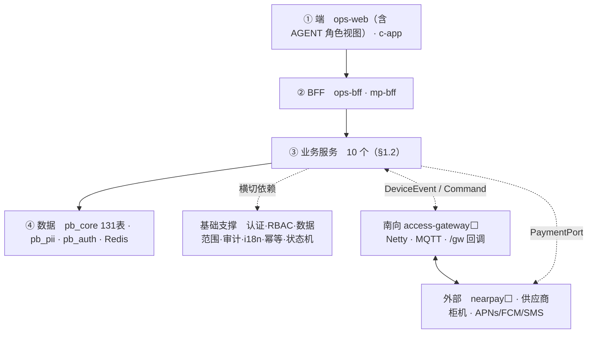

### 1.2 十个服务，谁依赖谁？（按依赖分层，箭头=调用方向）

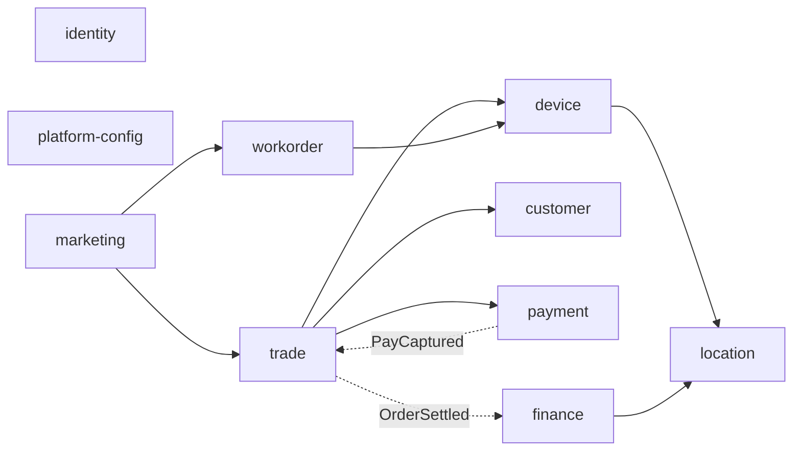

> **被全域依赖的两个不画连线**（否则 20 条线覆盖全图）：`identity`（鉴权 + 数据范围规格）与
> `platform-config`（字典/规则/触达）。**任何服务都可以调它们**，它们不调任何人。
> 虚线 = 异步事件，实线 = 同步调用。

### 1.3 请求怎么进来？（接入面，横向）

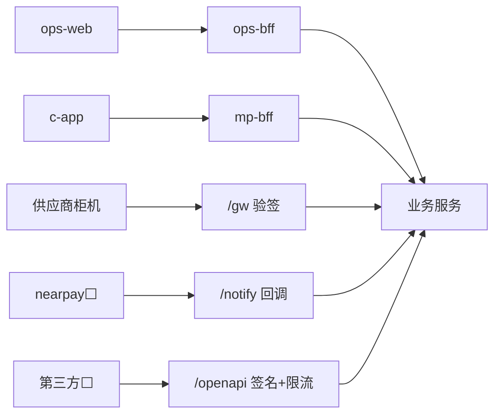

| 入口 | 鉴权 | 说明 |
|---|---|---|
| `ops-bff` `/api/**` | Bearer + RBAC + 数据范围 | 运营 6 前缀，见 §三 |
| `mp-bff` `/mp/**` | C 池会话 + 属主 | 返回端上可直接渲染的形状 |
| `/gw/**` | 供应商验签 | 南向回调 |
| `/notify/**` | 渠道验签 + 幂等 | nearpay 结果 |
| `/openapi/**` ⬜ | AppKey 签名 + 限流 | 第三方 |
| `/internal/**` | 内网 + 受信头透传 | 服务间，不对外 |

---

## 二、① 前端层

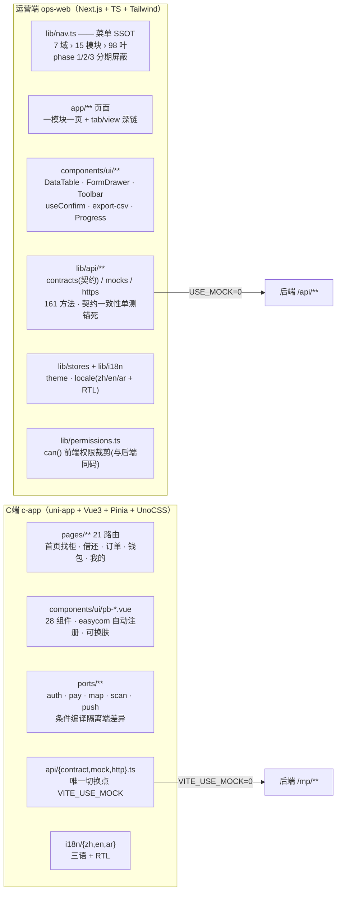

**两端的共同设计**：`contract` 接口 + `mock` / `http` 双实现，**切换点唯一**（一个环境变量）。前端可在后端未就绪时全量自洽开发 —— 这也是当前 ops-web 98 叶全部可点、但数据仍是 mock 的原因。

| 端 | 栈 | 角色/身份 | 认证池 | 状态 |
|---|---|---|---|---|
| ops-web | Next.js 静态导出 | ADMIN/OPS/CS/FINANCE/BD/VIEWER | STAFF | ✅ 98 叶全有页面（数据 mock）|
| 代理端 | **ops-web 的角色视图**（2026-09-23 定案，[ADR-012](./ADR/ADR-012-代理商模型.md)） | AGENT | AGENT | ⬜ **整体未建**（[G5](../requirements/运营端功能清单.md)）|
| c-app | uni-app（App 优先） | 消费者 | CONSUMER | 🟡 借还闭环通，多数页 mock |

---

## 三、② 接入层（端点前缀 = 接入面，不是领域）

> 这里原本画了 11 个盒子零连线的「图」，而紧接的表格已经把同样内容说了一遍 —— 删图留表。
> **前缀是接入面，不是领域**（§1.3 已给入口全景）。

**接入层的三条硬规则**：

1. **受信头边缘注入、内部只读** —— `X-Region-Id` / `X-User-Id` / `X-Merchant-Id`(承载 `tenant_id`) / `X-Roles` / `X-Store-Scope`；**客户端伪造的同名头在入口一律剥离**。
2. **`/mp` 与 `/api` 返回形状可以不同** —— `/mp` 是 BFF，必须返回端上直接可渲染的结构（订单详情带 `fees[]` + `timeline[]`）；`/api` 返回扁平结构给运营端表格。同一份数据两种投影，不强求统一。
3. **写操作统一形态** —— `POST /{collection}` 建、`POST /{collection}/{no}` 改、动作用动词后缀（`/dispatch` `/audit` `/handle` `/cancel` `/revoke` `/release` `/rollback`）。**全站零 DELETE**（软删除，见 [api/README §6A.3](../api/README.md)）。

---

## 四、③ 服务端业务域与模块

### 4.1 15 运营模块 → 10 服务

> 原来这里是一张 24 节点 / 5 分组 / 7 条分组间连线的图，是全文最糊的一张。
> 模块与服务是**多对一的归属关系**，本质是张表；图只用来看服务边界在哪。

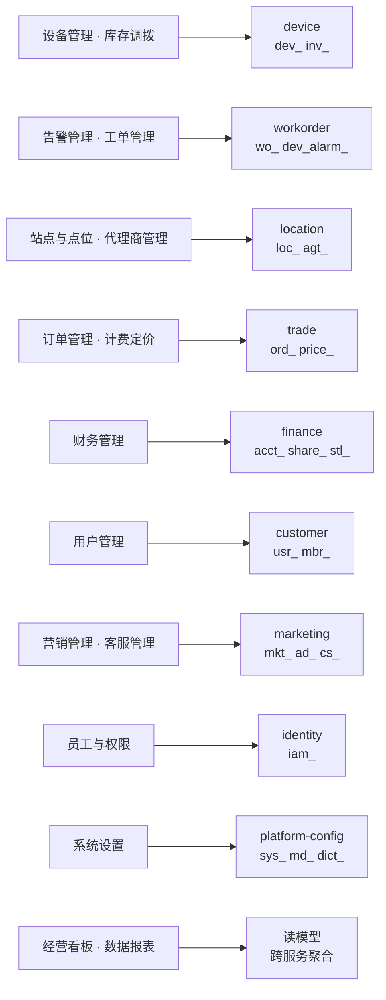

**三处「菜单归属 ≠ 服务归属」**（菜单按运营习惯组织，服务按数据归属切，不必一致）：

| 菜单位置 | 服务 | 为什么 |
|---|---|---|
| 告警管理是独立模块 | **workorder** | 告警唯一下游就是工单，拆开会把「告警→自动开单」闭环切成跨服务 saga |
| 代理商管理是独立模块 | **location** | 代理归属挂在站点上（`loc_site.agent_no` 是权威源），拆开=归属权威切两半 |
| 系统设置含「支付渠道」「供应商接入」 | **payment** / **access-gateway** | 运营视角都是"配置"，但数据分属支付域与南向域 |

> 逐模块的前端路由 / 控制器 / 表前缀完整对应见
> [架构-业务模块微服务化与前端对应.md §二](./架构-业务模块微服务化与前端对应.md)。

### 4.2 域间协作的三条主链路

| 链路 | 参与域 | 触发 | 关键幂等键 |
|---|---|---|---|
| **借还主链** | user → trade → gateway → ops | C端扫码 | `order_no` · `command_id` |
| **告警→工单链** | gateway → ops(告警) → ops(工单) | 设备上行 FAULT | `wo_order.source_ref`(alarm_no) |
| **诉求→处置链** | user(C端报障) → cs → wo / trade(退款) | C端提交 | `source_ref`(complaint_no) · `idempotency_key` |

> 三条链路的共同点：**跨域动作全部幂等**，重复触发返回首次结果而非产生第二张单。这是分布式下最容易出事的地方，也是 v2 专门立 [db-design §1.6 幂等键约定](./db-design.md) 的原因。

### 4.3 后端代码结构（实际）

```
backend/powerbank-app/src/main/java/ai/neargo/powerbank/
├── portal/                    ★接入层（薄控制器：路由 + @PreAuthorize + 调 service）
│   ├── ops/                   OpsController · TradeController · UserController
│   │                          PlatformController · AgentController · VendorController
│   └── mp/                    ConsumerAuthController · RentController
├── trade/                     OrdStateMachine · RentOrderService ✅落库
├── dev/                       CabinetService ✅落库
├── wo/                        WoStateMachine · WorkOrderService ✅落库
├── loc/                       LocService（站点/点位/场地方/合同）✅落库
├── agent/                     AgentService ✅落库
├── user/consumer/             5 登录策略 + unionid 归并 ✅落库
├── platform/iam/              动态 RBAC（角色/权限/菜单/数据范围）✅落库
├── auth/                      ★横切：双 Token 过滤链 · TokenStore 四实现 · 数据范围
├── config/                    SecurityConfig · MybatisPlusConfig · I18nConfig
├── common/                    ApiResponseWrapper · GlobalExceptionHandler · Messages
└── seed/SeedData              🟡 未落库域的内存种子（渐进替换中）
```

> **分层现状**：`loc / agt / dev / wo / trade` 五域已是完整四件套（Controller→Service→Mapper→Entity）并落库；`user / platform / gateway` 仍是 Controller 直连内存 `SeedData`。详见 [实现状态总表 §二](./实现状态总表.md)。

---

## 五、④ 基础支撑（横切能力）

> 这些不属于任何业务域，但**每个域都依赖**。它们是「一次做对、全域受益」的地基，也是最容易被业务功能挤掉的部分。

> 原来这里画了一张 20 个盒子、3 个分组、**零连线**的图 —— 没有边的「图」本质是列表，
> 画成盒子只是把信息摊得更难扫读。改回表格，按「谁保证什么」分组。

| 组 | 能力 | 实现位置 | 状态 |
|---|---|---|---|
| **安全** | 认证（双安全链：`/mp` C池 · 运营端 STAFF池） | `auth/*TokenAuthFilter` `config/SecurityConfig` | ✅ |
| | 会话存储（Memory / LocalCache / Redis / MySQL 四后端） | `auth/TokenStore` + `auth/store/*` | ✅ |
| | 功能权限 RBAC（`@perm.can()` · 89 权限码 · 前后端同通配语义） | neargo `rbac.PermChecker` | 🟡 仍读静态 `RolePerms` |
| | 数据范围（行级 · 5 表已注册） | neargo `DataScopeHandler` + `config/DataScopeRegistration` | ✅ B1 已补齐 |
| | 租户隔离（`tenant_id` 恒 `MAIN`） | neargo `TenantContext` | 🔒 休眠口子 |
| | 出参脱敏（手机/邮箱/密钥掩码，明文只在 `pb_pii`） | 各 service `toVO` | 🟡 部分 |
| **日志** | 操作审计（WORM 只增 · 7 年） | `iam_audit_log` + `@OperateLog` 切面 | ⬜ 切面未做 |
| | 报文留痕（上下行原始报文 · 可按 SN 回放） | `gw_message_log` | ⬜ |
| | 指令日志（幂等源 + 状态机） | `gw_command_log` | 🟡 占位 |
| | 触达记录（全渠道 + 成本核算） | `notify_log` | 🟡 骨架 |
| | 同意留痕（PDPL 可举证） | `usr_consent` | 🟡 骨架 |
| | APM / 链路追踪 | Prometheus + Grafana + SkyWalking | ⬜ |
| **管道** | 统一响应 `Result{code,msg,data}` + `PageResult` | `common/ApiResponseWrapper` | ✅ |
| | 全局异常 + `ErrorCode` | `common/GlobalExceptionHandler` | ✅ |
| | i18n（zh/en/ar + RTL） | `config/I18nConfig` + `common/Messages` | ✅ |
| | 审计四列自动填充 | `common/AuditMetaObjectHandler` | ✅ 本轮补 |
| | 通用 CRUD 基类（字典类实体） | `common/crud/AbstractCrudService` | ✅ 本轮补 |
| | 业务键生成（前缀注册表 60+ · 扫描 max+1） | `common/BizKey` | 🟡 基类内实现 |
| | 幂等（4 种落法） | 各表 UNIQUE + `Idempotency-Key` | 🟡 设计已定 |
| | 状态机（独立组件） | `Ord` `Wo` `Powerbank` `Alarm` `Settlement` `Withdrawal` | 🟡 部分 |
| | 事件（进程内 → Kafka 零改代码） | `DomainEventPublisher` | 🟡 抽象已在 |
| | 调度（对账/结算/超时关单/告警扫描） | XXL-Job | ⬜ |

### 5.1 权限体系（三层，缺一不可）


| 层 | 回答的问题 | 落点 | 状态 |
|---|---|---|---|
| ① 认证 | 你是谁 | `auth/*TokenAuthFilter` + `cred_credential` | ✅ |
| ② 功能权限 | 你能不能调这个接口 | `iam_role_perm` + `@PreAuthorize` | ✅（🟡 仍读静态 `RolePerms`，未接表）|
| ③ 数据范围 | 你能看哪几行 | `iam_data_scope` + MyBatis 拦截器 | 🟡 **仅 `loc_site` 注册**，`ord_rent`/`wo_order` 有列未注册 |
| ④ 脱敏 | 你能看到哪些字段的明文 | 服务端出参 + `pb_pii` | 🟡 部分 |

> ⚠️ **③ 是当前最大的安全缺口**：`ord_rent` 与 `wo_order` 都已有 `agent_no` 冗余列，但没注册到数据范围表 —— 意味着**代理商角色目前能看到全量订单与工单**。代理端（G5）开放前必须补齐。

### 5.2 日志的四种用途（别混为一谈）

| 类型 | 表 | 答什么问题 | 保留 |
|---|---|---|---|
| **操作审计** | `iam_audit_log` | 谁在什么时候改了什么（**合规追责**）| WORM 7 年 |
| **设备报文** | `gw_message_log` / `gw_command_log` | 设备到底收没收到、回了什么（**排障回放**）| 月分区，热 3 月 |
| **业务流水** | `ord_event_log` / `acct_ledger` / `usr_wallet_txn` | 状态怎么流转的、钱怎么走的（**对账**）| 7 年不删 |
| **应用日志/APM** | 不落库 | 服务健康、慢查询、异常栈（**运维**）| 日志平台 |

> 「设备日志」菜单叶展示的是**前两者的联合视图**：`gw_command_log`(下行) UNION `gw_message_log`(上行) 按时间轴排序 —— 因果关系一眼可读，这是相对竞品单向日志的实质差异。

---

## 六、⑤⑥ 部署形态与「微服务」演进路径

### 6.1 现状：2 进程

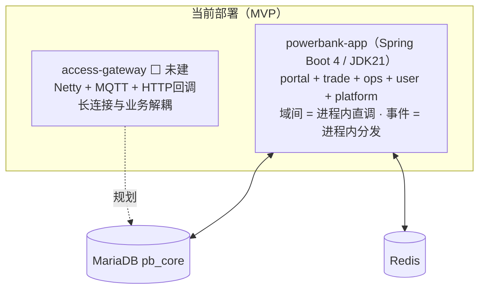

> `access-gateway` 独立进程是**已定的设计但尚未落地**：当前运营端的远程指令 `POST /cabinets/{no}/commands` 是回执占位（返回 `CMD+nano`），并未真正经网关下发到设备。

### 6.2 演进：按信号裂解，不预先拆

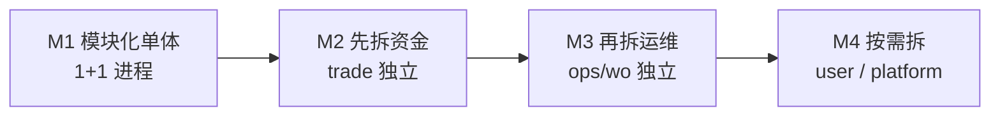

| 阶段 | 拆什么 | 触发信号 | 前置条件 |
|---|---|---|---|
| M1 | 不拆 | — | ✅ 当前 |
| M2 | **trade（订单/支付/账务）** | 资金链路需独立扩缩容 / 独立发布节奏 / 合规审计边界 | 域间调用先改为 `RestClient` + 事件；`pb_core` 按 `ord_`/`pay_`/`acct_` 前缀拆 schema |
| M3 | **ops + wo** | 设备量级上来，告警/工单写入压过交易 | `dev_heartbeat`/`gw_message_log` 已月分区，可整体搬走 |
| M4 | user / platform | 按需 | platform 是全域依赖，最后拆或永不拆 |

**拆分之所以是「搬迁不重写」，靠三个前置设计**（现在就要守住，否则将来拆不动）：
1. **表名 = `<子域前缀>_<实体>` 且库内唯一** → 拆库 = 纯 schema 迁移，零改名。
2. **跨域只有逻辑引用、不建物理 FK** → 拆开后不会有跨库外键要处理。
3. **域间通信已走 `DomainEventPublisher` 抽象** → 进程内分发换 Kafka，业务代码零改动。

> 反过来说：**任何一次「图省事直接 join 另一个域的表」都是在给未来的拆分埋雷**。这是 code review 要盯的第一条。

---

## 七、⑥ 数据层

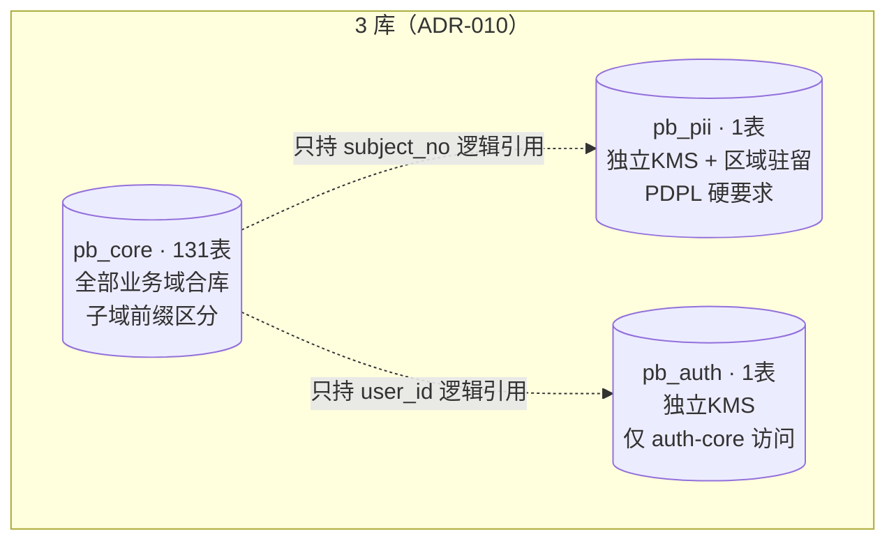

| 库 | 为什么单独 | 谁能访问 |
|---|---|---|
| `pb_core` | 业务数据，合库降低运维成本；子域前缀保留拆分能力 | 业务域 + access-gateway（仅 `gw_*`）|
| `pb_pii` | **PDPL 硬要求**：个人数据独立密钥 + 区域驻留，不能并入 core | 业务域经**脱敏接口**，不直连 |
| `pb_auth` | 凭据泄露爆炸半径必须最小 | **仅 neargo-auth-core** |

**分区与保留**：遥测（`dev_heartbeat`/`gw_message_log`）月分区热 3 月；资金流水（`acct_ledger`/`usr_wallet_txn`/`notify_log`）月分区留 7 年；审计（`iam_audit_log`/`usr_consent`）WORM 留 7 年。

**热路径索引**：数据范围过滤 + 列表排序一次走完 —— `(tenant_id, agent_no, status, created_at)`；C端属主查询 —— `(tenant_id, c_user_no, created_at)`。

---

## 八、关键链路时序

### 8.1 借出（跨 4 域 + 网关 + 外部支付）

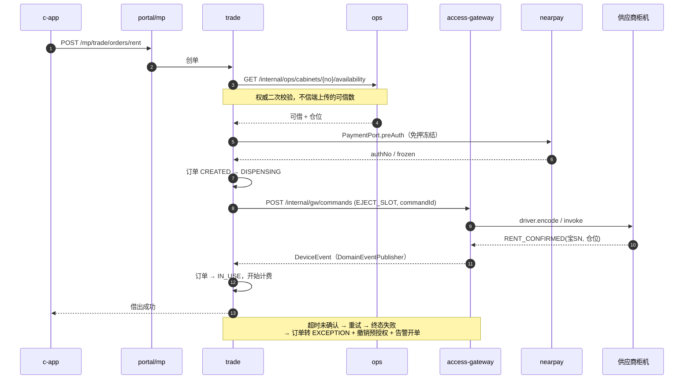

### 8.2 告警 → 工单（自动化闭环）

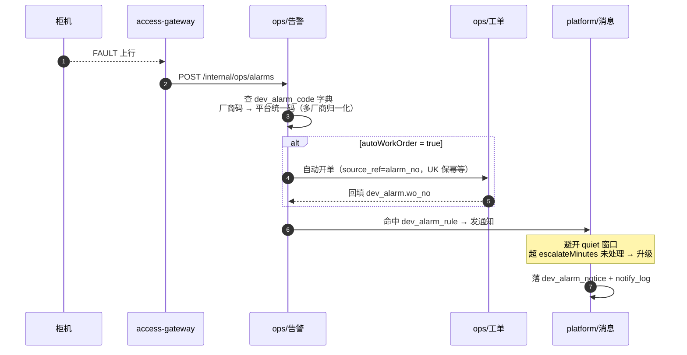

### 8.3 C端诉求 → 三条处置出口

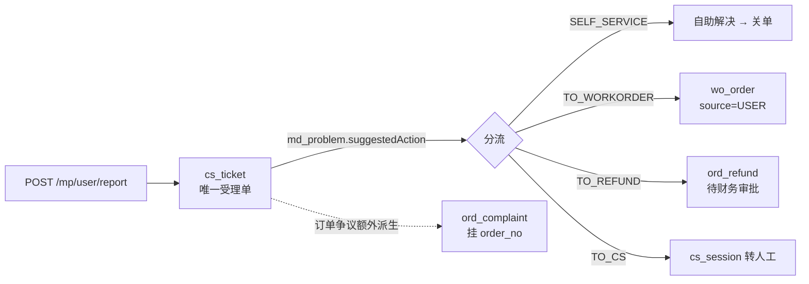

> 分流规则来自**字典而非代码** —— 运营在「问题管理」里调整处置策略，无需发版。

---

## 九、现状对照（图上哪些是真的）

| 层 | 组件 | 状态 |
|---|---|---|
| 前端 | ops-web 98 叶 | ✅ 全有页面（**数据 mock**）|
| 前端 | c-app 借还闭环 | 🟡 后端通，前端多数页仍 mock |
| 前端 | 代理端 | ⬜ 整体未建 |
| 接入 | `/api` 6 前缀 + `/mp` | 🟡 部分端点，248 设计端点中已实现约 30 |
| 业务域 | loc / agt / dev / wo / trade | ✅ 分层 + 落库 + E2E |
| 业务域 | user / platform / gateway | 🟡 Controller 直连内存 `SeedData` |
| 业务域 | 告警 / 报表 / 客服 / 营销 | ⬜ 无端点 |
| 网关 | access-gateway 进程 | ⬜ 未建（指令为占位回执）|
| 支撑 | 认证 · 双安全链 · RBAC | ✅ |
| 支撑 | 数据范围 | 🟡 **仅 `loc_site` 注册**（安全缺口）|
| 支撑 | 审计切面 · IdGenerator · iam 落库 | ⬜ |
| 支撑 | i18n（zh/en/ar + RTL）| ✅ |
| 数据 | `pb_core` | 🟡 部分表建；DDL 已备全量 131 表 |
| 数据 | `pb_pii` / `pb_auth` | ⬜ 未建（DDL 已备）|
| 外部 | nearpay | ⬜ 未接（`PaymentPort` Stub）|

> 权威实现度以 [实现状态总表](./实现状态总表.md) 为准，本表是它的架构视角摘要。

---

## 十、这张图暴露的三个结构性问题

1. **数据范围只注册了一张表** —— `ord_rent` / `wo_order` 有 `agent_no` 列却没接入拦截器，代理端一旦开放即越权。这是**安全问题不是功能问题**，优先级应高于任何新功能。
2. **access-gateway 未建，导致「设备可控」这条 MVP 主线其实是断的** —— 远程指令是占位回执，借出链路的 `EJECT_SLOT` 没有真正的对端。C端借还闭环目前跑通的是「状态机」而非「真实弹仓」。
3. **前端 98 叶全绿 vs 后端约 30 端点** —— 差距约 8 倍。前端已把设计空间铺满，后端补齐的顺序需要明确取舍，建议按 [实现状态总表 §六](./实现状态总表.md) 的优先级推进，而不是按菜单顺序。

---

## 十一、相关文档

| 文档 | 关系 |
|---|---|
| [architecture.md](./architecture.md) | 架构**决策与选型**（技术栈、ADR 索引、演进路线）——本文是它的可视化视图 |
| [api/README.md](../api/README.md) | 248 端点目录（接入层的完整展开）|
| [db-design.md](./db-design.md) | 131 表（数据层的完整展开）|
| [代码结构.md](./代码结构.md) | 目录级代码组织 |
| [权限体系设计.md](./权限体系设计.md) | §5.1 三层权限的详细设计 |
| [TDD-access-gateway.md](./TDD-access-gateway.md) | ⑤ 南向网关的详细设计 |
| [实现状态总表.md](./实现状态总表.md) | **实现度权威**（§九 是其架构视角摘要）|
