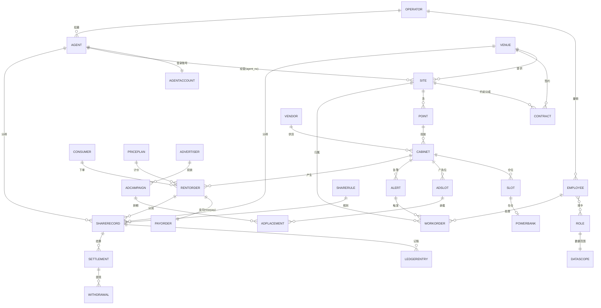

# 系统领域模型（本体 · 领域 · 实体 · 关系 · 追溯）

> 状态：草稿（待确认）· 创建 2026-07-11 · **系统建模主文档**
> 统一锚点：把「领域 → 实体 → 关系 → 库表 → 运营端功能」一次对齐。
> 上游：[领域模型-本体与关系](./领域模型-本体与关系.md)（主体本体+逻辑流程）· [db-design](./db-design.md)（库表 SSOT）· [运营端功能清单](../requirements/运营端功能清单.md)。
> 定位：单运营方（[ADR-011](./ADR/ADR-011-单运营方为主多租户为口子.md)）+ 代理商（[ADR-012](./ADR/ADR-012-代理商模型.md)）；支付委托 nearpay；MENA/AED/ar-en；3 库（core/pii/auth）。

---

## 一、分层与领域全景

```
L0 基础设施   MySQL · Redis · RocketMQ→Kafka · Nacos · EMQX · XXL-Job · OSS
L1 复用底座   ai-neargo commons ×8 + auth-core（Result/BaseEntity/TenantContext/DomainEventPublisher…）
L2 业务领域   ↓（powerbank 自建）
```

| # | 领域 Domain | 子域前缀 | 职责 | 部署 |
|---|-------------|---------|------|------|
| D0 | 租户（兼容层）| `tenant` | 隔离口子，产品不体现 | pb_core |
| D1 | 认证权限 IAM | `iam_` | 员工/角色/权限/数据范围/审计 | pb_core（凭据在 pb_auth）|
| D2 | 代理商 Agent | `agt_` | 代理档案/账号/归属 | pb_core |
| D3 | 设备 Device | `dev_` | 机柜/仓位/充电宝/影子/OTA/告警 | pb_core |
| D4 | 场所 Place | `loc_` | 场地方/站点/点位/合同 | pb_core |
| D5 | 接入网关 Gateway | `gw_` | 供应商/绑定/指令报文 | pb_core（access-gateway 进程）|
| D6 | 订单 Order | `ord_` | 租借订单状态机/事件 | pb_core |
| D7 | 计费 Pricing | `price_` | 计费模板/差异化定价 | pb_core |
| D8 | 支付 Payment | `pay_` | nearpay 交易引用（委托）| pb_core |
| D9 | 账务分润 Finance | `acct_`/`share_`/`stl_`/`recon_` | 复式记账/分润/结算/提现/对账 | pb_core |
| D10 | 用户 User | `usr_`/`coupon_`/`mbr_` | C端账户/信用/钱包/券/会员 | pb_core（PII 在 pb_pii）|
| D11 | 营销广告 Ad | `ad_` | 广告位/活动/创意/投放/曝光 | pb_core |
| D12 | 工单 WorkOrder | `wo_` | 工单/派单/SLA/巡检 | pb_core |
| D13 | 平台支撑 Platform | `notify_`/`dict_`/`md_` | 通知/字典/地区/参数 | pb_core |

---

## 二、主体本体（谁在用系统）
见[领域模型-本体与关系 §一/§三](./领域模型-本体与关系.md)。速览：
**平台方 Operator**(=MAIN) —招募→ **代理商 Agent**（体内·数据受限·分润）；—雇佣→ **运营人员 Staff**（角色+数据范围）；**场地方 Venue**（外部·提供站点·分成）；**C端用户 Consumer**；**广告主 Advertiser**（未来）。

---

## 三、领域 × 实体清单
> 实体 = 领域对象；★=聚合根。库表见 [db-design](./db-design.md)（此处不重列字段）。

### D1 认证权限 IAM
| 实体 | 定义 | 库表 | 关键关系 |
|------|------|------|---------|
| 员工 Employee ★ | 运营人员账号 | `iam_employee` | N—N 角色；数据范围 |
| 角色 Role ★ | 功能权限集 | `iam_role` | N—N 权限；1—1 数据范围策略 |
| 权限 Permission | 权限码（`模块:资源:动作`）| `iam_permission` | — |
| 数据范围 DataScope | ALL/REGION/LOCATION/AGENT/SELF | `iam_data_scope` | 绑角色/员工 |
| 审计 AuditLog | 操作留痕（只增）| `iam_audit_log` | — |
| 凭据 Credential | 登录凭据（auth-core）| `pb_auth.cred_*` | realm 区分员工/消费者/代理 |

### D2 代理商 Agent
| 代理商 Agent ★ | 经营伙伴 | `agt_agent` | 1—N 站点(agent_no)；分润对象；1—1 代理账号 |
| 代理账号 AgentAccount | 代理登录（AGENT 角色）| `agt_account` | 数据范围=自己 agent_no |

### D3 设备 Device
| 机柜 Cabinet ★ | 柜机/充电桩 | `dev_cabinet` | 属点位；1—N 仓位/广告位；产生订单 |
| 仓位 Slot | 柜内仓位 | `dev_slot` | 1—0/1 充电宝 |
| 充电宝 Powerbank ★ | 可租电池 | `dev_powerbank` | 随借还流动 |
| 设备影子 Shadow | 实时快照 | `dev_shadow` | 主 Redis |
| 心跳 Heartbeat | 遥测 | `dev_heartbeat` | 月分区 |
| OTA release/rollout/task | 固件升级三层 | `dev_ota_*` | |
| 告警 Alert | 设备告警 | `dev_alert` | →工单 |

### D4 场所 Place（层级：场地方→站点→点位→机柜）
| 场地方 Venue ★ | 提供场地的物业/商户 | `loc_venue` | 1—N 站点；签合同 |
| 站点 Site ★ | 网点（物理经营场所）| `loc_site` | 属场地方+区域+代理(agent_no)；1—N 点位 |
| 点位 Point | 站点内投放位 | `loc_location` | 属站点；1—N 机柜 |
| 合同 Contract | 场地方×站点 进场协议 | `loc_contract` | 驱动场地方分成 |

### D5 接入网关 Gateway
| 供应商 Vendor ★ | 硬件供应商 | `gw_vendor` | 1—N driver 配置；接入方式 TCP/MQTT/HTTP |
| 供应商配置 VendorConfig | 密钥/回调（租户级）| `gw_vendor_config` | `[KMS]` |
| 设备绑定 DeviceBinding | SN↔会话 | `gw_device_binding` | |
| 指令日志 CommandLog | 指令幂等/状态 | `gw_command_log` | commandId |
| 报文日志 MessageLog | 上下行留痕 | `gw_message_log` | 月分区 |

### D6/D7/D8 订单·计费·支付
| 租借订单 RentOrder ★ | 一次借还 | `ord_rent` | 用户×机柜；状态机；1—N 支付 |
| 订单事件 OrderEventLog | 状态流水 | `ord_event_log` | append |
| 计费模板 PricePlan ★ | 计费规则 | `price_plan` | 可按站点差异化 `price_rule` |
| 支付单 PayOrder | nearpay 交易引用 | `pay_order` | 委托 nearpay |
| 免押 PayAuth | 预授权编排 | `pay_auth` | nearpay 冻结 |
| 退款 PayRefund | 退款引用 | `pay_refund` | |

### D9 账务分润 Finance
| 账户 Account ★ | 记账账户 | `acct_account` | 复式 |
| 分录 LedgerEntry | 借贷分录（只增）| `acct_ledger` | 成对 |
| 分润规则 ShareRule ★ | 代理/场地方分成规则 | `share_rule` | dimension=VENUE/AGENT |
| 分润记录 ShareRecord | 逐单分润 | `share_record` | 关订单 |
| 结算单 Settlement ★ | 周期结算 | `stl_settlement` | payee=场地方/代理 |
| 提现 Withdrawal | 提现审核 | `stl_withdrawal` | →nearpay 打款 |
| 对账 Recon | 三方核对 | `recon_*` | nearpay↔支付↔账务 |

### D10 用户 User
| C端用户 Consumer ★ | openid×租户 | `usr_user`（PII→`pii_user`）| 下单/持券/钱包 |
| 信用 Credit | 信用分/黑名单 | `usr_credit` | 影响免押 |
| 钱包 Wallet | 余额/赠金/押金 | `usr_wallet`(+txn) | |
| 券模板/券 Coupon | 优惠券 | `coupon_tpl`/`usr_coupon` | |
| 会员 Membership | 会员/次卡 | `usr_membership` | |

### D11 营销广告 Ad（P2 未来）
| 广告位 AdSlot | 设备屏/机身广告位 | `ad_slot` | 属机柜 |
| 广告主 Advertiser | 投放方 | `ad_advertiser` | |
| 广告活动 AdCampaign ★ | 投放计划 | `ad_campaign` | 定向 区域/站点/场景 |
| 创意 AdCreative | 素材 | `ad_creative` | |
| 投放 AdPlacement | 创意×广告位×排期 | `ad_placement` | |
| 曝光 AdImpression | 曝光统计 | `ad_impression` | 月分区；未来分润 |

### D12 工单 WorkOrder
| 工单 WorkOrder ★ | 运维任务 | `wo_order` | 按站点归属派单；状态机 |
| 派单 Dispatch | 派单记录 | `wo_dispatch` | 就近/负载/手动 |
| SLA | 计时 | `wo_sla` | |
| 处理 Handle | 现场处理 | `wo_handle` | 拍照/换件 |
| 巡检计划 InspectionPlan | 周期巡检 | `wo_inspection_plan` | 自动开单 |

### D13 平台支撑 Platform
| 通知模板 NotifyTemplate | 多通道/多语模板 | `notify_template` | |
| 字典 Dict / 地区 Region | 枚举/区域 | `dict_*`/`md_region` | |

---

## 四、全局实体关系（跨域主链）



**关键跨域约束**
- 跨域**逻辑引用走业务键**（`site_no`/`agent_no`/`cabinet_no`/`order_no`…），**不建物理 FK**（ADR-002/010）。
- 归属链决定分润与数据可见：站点(agent_no→代理 / venue→场地方 / region→区域员工)。
- 所有实体继承 `BaseEntity`（含 `tenant_id` 默认 MAIN）。

---

## 五、追溯矩阵：领域 ↔ 实体 ↔ 库表 ↔ 运营端功能

| 领域 | 核心实体 | 库表（pb_core，除注）| 运营端模块 |
|------|---------|---------------------|-----------|
| IAM | Employee/Role/DataScope/Audit | `iam_*`（凭据 pb_auth）| 员工与权限 |
| 代理商 | Agent/AgentAccount | `agt_*` | 代理商管理 |
| 设备 | Cabinet/Slot/Powerbank/OTA/Alert | `dev_*` | 设备管理 |
| 场所 | Venue/Site/Point/Contract | `loc_*` | 站点与点位管理 |
| 网关 | Vendor/Binding/CommandLog | `gw_*` | 系统设置·供应商接入 |
| 订单 | RentOrder | `ord_*` | 订单管理 |
| 计费 | PricePlan | `price_*` | 计费定价 |
| 支付 | PayOrder/PayAuth/PayRefund | `pay_*`(nearpay 引用) | （订单/财务内）|
| 财务 | Account/Ledger/Share/Settle/Withdraw | `acct_*`/`share_*`/`stl_*` | 财务管理 |
| 用户 | Consumer/Credit/Wallet/Coupon | `usr_*`/`coupon_*`（PII pb_pii）| 用户管理 |
| 营销广告 | Coupon/AdSlot/AdCampaign | `coupon_*`/`ad_*` | 营销管理（含广告位）|
| 工单 | WorkOrder/Dispatch/SLA | `wo_*` | 工单管理 |
| 平台支撑 | NotifyTemplate/Dict/Region | `notify_*`/`dict_*`/`md_*` | 系统设置 |
| 数据 | （读聚合，只读副本）| — | 数据报表 |
| 看板 | （跨域聚合读）| — | 经营看板 |
| 客服 | 复用 订单/用户/工单 | — | 客服管理 |

> 一致性：运营端每个模块都能追到领域→实体→库表；反之每张业务表都归属明确领域与模块。租户 D0 只在库表层（tenant_id），无对应运营端模块（口子）。

## 六、聚合根与事务边界
- 聚合根（★）是一致性与事务边界：`RentOrder`（借还+计费+支付编排）、`WorkOrder`、`Cabinet`、`Site`、`Agent`、`Settlement`、`ShareRule`、`Employee/Role`、`Consumer`。
- 跨聚合/跨域用**领域事件**（`DomainEventPublisher`）+ Outbox，最终一致。
- 资金动作**先记账后执行**；设备指令**幂等**；事件消费**去重**。

## 七、待确认
1. ~~站点/点位两层~~ → **已定稿：两层（站点 Site→点位 Point）**（[ADR-013](./ADR/ADR-013-场所层级站点与点位.md)）。
2. IAM 数据范围首期粒度（AGENT 必做；REGION/LOCATION 是否同期）。
3. 广告域首期建位预留还是完整（本文 P2）。
