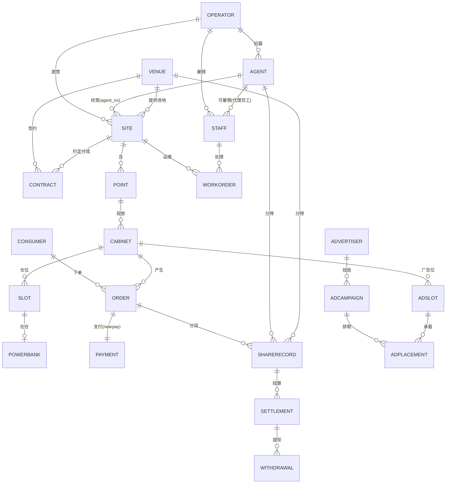

# 领域模型 · 本体与关系（domain ontology）

> 状态：草稿（待确认）· 创建 2026-07-11
> 目的：把「平台方 / 代理商 / 站点 / 场地方 / 运营人员 / 设备 / 订单 / 资金 / 广告」等领域对象及其关系钉清楚，作为数据库、权限、业务流程的**统一本体锚点**。
> 定位：单运营方自营（[ADR-011](./ADR/ADR-011-单运营方为主多租户为口子.md)）+ 代理商（[ADR-012](./ADR/ADR-012-代理商模型.md)）。

---

## 一、核心领域对象（本体清单）

### 主体（谁）
| 对象 | 定义 | 归属 | 备注 |
|------|------|------|------|
| **平台方 Operator** | 运营方自己，拥有整个系统 | = 主租户 `MAIN` | 顶层主体 |
| **代理商 Agent** | 平台方招募的区域/站点经营伙伴 | 属平台方（体内）| 用平台品牌、数据受限、参与分润（ADR-012）|
| **场地方 Venue** | 提供物理场地的商户/物业 | 外部合作方 | 收进场分成 |
| **运营人员 Staff** | 平台方（或代理）的员工 | 属平台方/代理 | 有角色 + 数据范围 |
| **C 端用户 Consumer** | 借还充电宝的终端用户 | — | openid×租户 |
| **广告主 Advertiser** | 在设备投广告的品牌方（未来）| 外部 | 广告收入来源 |

### 场所（在哪）—— 层级
```
平台方 Operator
  └─ 站点 Site（网点：一个物理经营场所，如某商场）
       └─ 点位 Point（站点内具体投放位，如 L1 东门）
            └─ 机柜 Cabinet（充电宝柜机/充电桩）
                 ├─ 仓位 Slot ── 充电宝 Powerbank
                 └─ 广告位 AdSlot（设备屏/机身，未来投广告）
```
| 对象 | 定义 | 关键归属 |
|------|------|---------|
| **站点 Site** | 物理经营场所（网点），含多个点位 | 场地方(物理) + 代理商(经营,可空=直营) + 区域 region |
| **点位 Point** | 站点内具体投放位置 | 属站点 |
| **机柜 Cabinet** | 柜机/充电桩设备 | 属点位；供应商 vendor |
| **仓位 Slot / 充电宝 Powerbank** | 三级台账最底层 | 属机柜；充电宝随借还流动 |
| **广告位 AdSlot** | 设备屏/机身广告位 | 属机柜；可按站点/区域定向 |

### 业务与资金（干什么）
| 对象 | 定义 |
|------|------|
| **合同 Contract** | 场地方×站点 的进场协议（分成率/进场费/期限）|
| **计费模板 PricePlan** | 时长/封顶/买断 计费规则，可按站点差异化 |
| **订单 Order** | 用户×机柜 的一次借还，产生收入 |
| **支付 Payment** | 委托 nearpay（收单/免押/退款）|
| **分润规则 ShareRule / 分润记录 ShareRecord** | 代理/场地方 的分成 |
| **结算 Settlement / 提现 Withdrawal** | 周期结算 → 打款(nearpay) |
| **工单 WorkOrder** | 设备运维任务，按站点归属派单 |
| **广告活动 AdCampaign / 创意 AdCreative / 投放 AdPlacement** | 广告主投放（未来）|

---

## 二、关系图（本体关系）



**关键基数**
- 平台方 1—N 代理商 1/0—N 站点（站点 `agent_no` 空=平台直营）
- 场地方 1—N 站点；合同绑定 场地方×站点 的分成率
- 站点 1—N 点位 1—N 机柜 1—N 仓位/广告位
- 订单收入 → 拆给：场地方(合同分成) + 代理(分润规则) + 平台(净收入)

---

## 三、主体关系分析（平台方 / 代理商 / 站点 / 场地方 / 运营人员）

| 关系 | 说明 |
|------|------|
| **平台方 ↔ 代理商** | 平台招募代理，代理经营分配的站点；代理是平台**体内**受限伙伴（非租户），用平台品牌、数据只见自己 |
| **平台方/代理商 ↔ 站点** | 站点归属：`agent_no` 有值=代理经营，空=平台直营。归属决定收益分配与数据可见性 |
| **场地方 ↔ 站点** | 场地方提供物理场地；一个场地方可有多站点；合同约定该站点分成 |
| **运营人员 ↔ 站点/区域** | 员工按**数据范围**（区域/站点/代理）管理站点：运维管设备工单、BD 管拓展、财务管分润、客服管订单 |
| **代理商 ↔ 运营人员** | 代理可有自己的操作账号（AGENT 角色），数据强制限自己 agent_no |
| **三方分钱** | 每笔订单：场地方按合同分成 + 代理按分润规则分成 + 平台留净收入；广告收入（未来）同理可分 |

**数据权限映射（基于归属链）**
| 角色 | 数据范围 | 可见 |
|------|---------|------|
| 平台 ADMIN | ALL | 全部站点/设备/订单/资金 |
| 运维 OPS / 区域经理 | REGION | 本区域站点及其设备/工单 |
| BD 拓展 | REGION | 本区域场地方/站点/合同 |
| 财务 FINANCE | ALL(财务) | 全域分润/结算 |
| 代理 AGENT | AGENT(自己) | 自己站点/设备/订单/收益 |
| 场地方(未来入口) | VENUE | 自己场地的站点收益 |

---

## 四、完整逻辑流程

### 流程 1 · 拓展签约建站（BD 主导）
```
BD 找场地方 → 谈判 → 签进场合同(分成率/进场费/期限)
  → 建站点 Site(挂场地方+区域) → 布点位 Point → 装机柜 Cabinet(选供应商)
  → (可选) 站点划给代理商(agent_no) → 设备上线接单
```

### 流程 2 · 借还交易（用户）
```
用户扫机柜码 → 校验站点/设备可用 → 创订单 → nearpay 免押/支付
  → 网关弹出充电宝 → 计费中 → 任意站点归还 → 停计费 → nearpay 请款/解冻 → 结单
```

### 流程 3 · 收入分配（每笔结算）
```
订单收入
  ├─ 场地方分成  ← 合同 share_rate（该站点）
  ├─ 代理分成    ← 分润规则 dimension=AGENT（站点归属代理时）
  └─ 平台净收入
  → 复式记账 acct_ledger（借现金/贷各应付）
  → 周期结算 Settlement(payee=场地方/代理) → 提现审核 → nearpay 打款
```

### 流程 4 · 运维（告警驱动）
```
设备告警/用户报障 → 生成工单 → 按站点归属派单(就近/负载,同区域/代理员工)
  → 现场处理 → 验收关单 → (代理站点) 通知代理
```

### 流程 5 · 广告投放（未来 P2）
```
广告主 → 建广告活动(预算/周期/定向:区域/站点/场景) → 上传创意
  → 投放到广告位 AdSlot(设备屏) → 排期播放 → 曝光统计
  → (未来) 广告收入 → 可纳入分润(场地方/代理分广告收益)
```

---

## 五、对象→模块→库表 映射
| 本体对象 | 运营端模块 | 库表（pb_core 子域）|
|---------|-----------|-------------------|
| 平台方/租户 | （后端兼容层，不体现）| `tenant`(隐藏) |
| 代理商 | 代理商管理 | `agt_agent` |
| 场地方 | 站点与点位管理 | `loc_venue` |
| 站点 Site | 站点与点位管理 | `loc_site`（新）|
| 点位 Point | 站点与点位管理 | `loc_location`(+`site_no`) |
| 合同 | 站点与点位管理 | `loc_contract` |
| 机柜/仓位/充电宝 | 设备管理 | `dev_cabinet`/`dev_slot`/`dev_powerbank` |
| 广告位/广告 | 营销管理·广告位 | `ad_slot`/`ad_campaign`/`ad_creative`/`ad_placement`（新）|
| 运营人员/角色/数据范围 | 员工与权限 | `iam_employee`/`iam_role`/`iam_data_scope` |
| 订单/分润/结算 | 订单/财务 | `ord_*`/`share_*`/`stl_*` |

## 六、待确认
1. ~~站点/点位层级~~ → **已定稿：两层（站点 Site 含多点位 Point）**（[ADR-013](./ADR/ADR-013-场所层级站点与点位.md)）。
2. 广告是否首期规划（P2）还是仅预留位（本文 P2）；广告收入是否纳入分润？
3. 场地方是否将来给自助入口（VENUE 数据范围看自己收益）？
