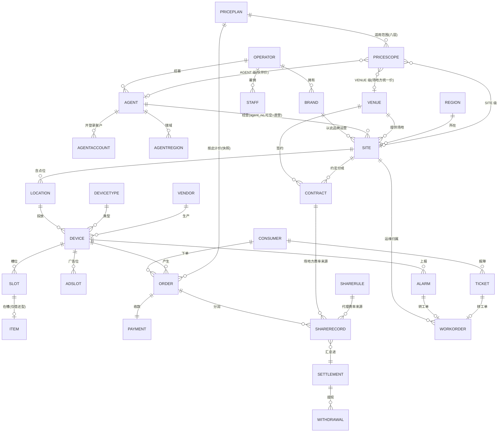

# 领域模型 · 本体与关系（domain ontology）

> **v2 · 2026-09-23 重整**（v1 创建于 2026-07-11）
> 依据：[ADR-026 取消租户概念](./ADR/ADR-026-取消租户概念-唯一运营方.md) · [ADR-012 代理商模型](./ADR/ADR-012-代理商模型.md) ·
> [ADR-013 场所层级](./ADR/ADR-013-场所层级站点与点位.md) · [ADR-021 通用设备命名与使用形态](./ADR/ADR-021-通用设备命名与使用形态.md) ·
> [ADR-004 分账双模式](./ADR/ADR-004-分账双模式.md) · 参照 ai-shop 的 `账号主体门店-关系定稿` 与 `全域命名基准`
>
> **本文是领域对象的统一本体锚点**：数据库、权限、接口、业务流程都以此对齐。
> 清单建在实测表结构上（28 个域 170 张表），每个对象都标了表名。
>
> **读法：先清单后关系。** §一 只回答「有哪些对象、各是什么」，不谈谁指向谁；
> §二 起才讲关联、泛化、依赖。对象定义错了，关系画得再好也没用。

---

## 一、领域对象清单与定义

### 1.0 术语裁定（先钉死，否则清单会打架）

| 词 | 裁定 | 理由 |
|---|---|---|
| **商户** | **禁用** | 三个语境三个意思：甲方 = 加盟商；简电云 = 场地方；支付行业 = 收单主体。ai-shop 因 `merchant` 二义性返工过一整轮 |
| **加盟商 / 代理商 / 城市合伙人** | 同一对象，代码与文档统一叫 **代理商 Agent** | 不新增主体 |
| **门店 / 站点** | 同一对象，统一叫 **站点 Site** | 「门店」是零售用语；我们的站点是别人的场地 |
| **租户** | **不存在** | ADR-026 |
| **品牌** | 归运营商的一等对象，**代理商不得拥有** | 2026-09-23 用户定 |
| **机柜 Cabinet** | 泛化为 **设备 Device** | ADR-021 |
| **主体 Entity** | 不作为独立对象。运营商是隐含单例，代理商就是代理商 | ai-shop 的 `entity` 是"一张营业执照"，我们没有多执照场景 |

### 1.1 主体层（谁）

| 对象 | 定义 | 标识 | 表 | 状态 / 生命周期 |
|---|---|---|---|---|
| **运营商 Operator** | **唯一**的平台拥有者。拥有品牌、全部数据、全部员工。不是表，是隐含单例 | — | *（隐含）* | — |
| **品牌 Brand** 🆕 | 运营商对 C 端呈现的经营身份：名称、Logo、App、客服、协议。一个运营商可有多个 | `brand_no` | *待建* `md_brand` | ENABLED / DISABLED |
| **代理商 Agent** | 运营商**体内**的分润伙伴：出钱买设备、包一片区域铺设与运维。用运营商的品牌，C 端无感知，参与统一分润 | `agent_no` | `agt_agent` | ENABLED / SUSPENDED |
| **代理账户 AgentAccount** | 代理商的登录凭据。一个代理商可开多个（老板 + 店长），账户必挂代理商 | `account_no` | `agt_account` | ACTIVE / DISABLED |
| **代理辖域 AgentRegion** | 代理商可经营的区域集合 | (`agent_no`,`region_id`) | `agt_agent_region` | — |
| **员工 Staff** | 运营商的内部人员，有部门、角色、数据范围 | `employee_no` | `iam_employee` · `iam_dept` · `iam_employee_role` | ACTIVE / DISABLED |
| **角色 Role** | 功能权限的集合；内置 7 个（ADMIN/OPS/CS/FINANCE/BD/VIEWER/AGENT） | `role_code` | `iam_role` · `iam_role_perm` · `iam_permission` | 内置只读 |
| **数据范围 DataScope** | 员工能看哪些数据：ALL / REGION / SITE / AGENT / SELF | — | `iam_data_scope` | — |
| **场地方 Venue** | **外部**：提供物理场地的商场 / 机场 / 门店，按进场合同拿分成。**不登录** | `venue_no` | `loc_venue` | ENABLED / DISABLED |
| **消费者 Consumer** | C 端终端用户。**没有角色，只有属主** | `c_user_no` | `usr_user` · `usr_identity` · `pii_user` | ACTIVE / LOGOFF |
| **供应商 Vendor** | 硬件厂商及其接入配置 | `vendor_code` | `gw_vendor` · `gw_vendor_config` · `gw_vendor_device_type` | ENABLED / DISABLED |
| **广告主 Advertiser** | 设备屏广告的投放方（L3） | `advertiser_no` | `ad_advertiser` | — |
| **凭据 Credential** | 三类登录主体共用的密码 / 第三方身份凭据 | `cred_ref` | `cred_credential` | — |

### 1.2 场所与资产层（在哪、是什么东西）

| 对象 | 定义 | 标识 | 表 | 状态 |
|---|---|---|---|---|
| **区域 Region** | 行政 / 经营区域字典，数据范围与辖域的锚点 | `region_id` | `md_region` | — |
| **站点 Site** | 一个物理经营场所（一个商场 = 一个站点）。**归属与分成的单元**：场地方是谁、代理商是谁、在哪个区域、以哪个品牌运营 | `site_no` | `loc_site` | 筹备 / 营业 / 暂停 / 撤场 |
| **站点生命周期 SiteLifecycle** | 站点的阶段流转记录：进件 → 签约 → 装机 → 运营 → 退场 | — | `loc_site_lifecycle` · `loc_site_lifecycle_log` | — |
| **商机 Lead** | BD 拓展的意向场地：商机、跟进记录、签约漏斗。**「选址找场地」这一环（L0 第一环）的载体**，签约后转为站点 | `lead_no` | `loc_lead` · `loc_lead_follow` | 意向 / 跟进中 / 已签约 / 放弃 |
| **场地方进件 VenueOnboarding** | 场地方自助申请入驻 + 平台审核；通过即建场地方档案（L2） | `apply_no` | `loc_venue_onboarding` | 待审 / 通过 / 驳回 |
| **点位 Location** | 站点内的具体投放位（「L1 东门」）。**归属继承站点，自己不承载归属** | `location_no` | `loc_location` | ENABLED / DISABLED |
| **设备 Device** | 放在点位上的机器：柜机 / 充电桩 / 按摩椅 / 储物柜。按**设备类型**特化（§三） | `device_no`（现 `cabinet_no`） | `dev_cabinet`（将改名 `dev_device`） | 离线 / 在线 / 故障 / 停用 |
| **设备类型 DeviceType** | 设备的种类登记：使用形态 / 计量 / 付费模式 / 指令族 / 扩展表 | `type_code` | `md_device_type` | ENABLED / DISABLED |
| **槽位 Slot** | 设备上的一个位置：仓位 / 枪 / 座 / 格口 | (`device_no`,`slot_index`) | `dev_slot` | 空 / 占用 / 故障 |
| **物品 Item** | 可移动物品，**仅借还型设备有**（充电宝）。借出后离开设备，归还可在任意站点 | `powerbank_no` | `dev_powerbank` | 在仓 / 借出 / 丢失 / 报废 |
| **设备影子 DeviceShadow** | 设备最后上报状态的快照（在线、电量、槽位） | `device_no` | `dev_shadow` · `dev_heartbeat` | — |
| **设备编码批次 CodeBatch** | 出厂码 / 贴码批次，按供应商归集 | `batch_no` | `dev_code_batch` | — |
| **固件版本 / 升级 OTA** | 固件发布、灰度投放、单台升级任务 | `release_no` | `dev_ota_release` · `dev_ota_rollout` · `dev_ota_task` | — |
| **库存 / 调拨 Inventory** | 仓库、库存、跨站点调拨单 | `transfer_no` | `inv_warehouse` · `inv_stock` · `inv_transfer` · `inv_transfer_item` | 草稿 / 在途 / 完成 |
| **广告位 AdSlot** | 设备屏 / 机身上的广告承载面 | `slot_no` | `ad_slot` | — |

### 1.3 交易层（一次使用）

| 对象 | 定义 | 标识 | 表 | 状态 |
|---|---|---|---|---|
| **价格方案 PricePlan** | 免费时长 / 单价 / 阶梯 / 封顶 / 买断 / 套餐；可按站点差异化、按时段调价 | `plan_no` | `price_plan` · `price_plan_item` · `price_ladder` · `price_plan_scope` · `price_rule` · `price_schedule` · `price_adjustment` | ENABLED / DISABLED |
| **订单 Order** | 消费者对一台设备的一次完整使用。通用主表 + 按形态的扩展表（§三） | `order_no` | `ord_rent`（将改 `ord_order`）+ `ord_rent_ext` · `ord_charge_ext` · `ord_locker_ext` | CREATED → ACTIVE → ENDED → SETTLED → CLOSED · EXCEPTION |
| **订单事件 OrderEvent** | 订单状态迁移的留痕 | — | `ord_event_log` | — |
| **预约 Reservation** | 预约取物 / 预约还位 / 预约枪位 | `reservation_no` | `ord_reservation` | — |
| **押金 Deposit** | 订单关联的押金冻结 / 解冻 / 买断记录 | — | `ord_deposit` | 冻结 / 解冻 / 没收 |
| **异常订单 Exception** | 未弹出 / 未归还 / 重复扣费等异常标记与处置 | — | `ord_exception` | 待处理 / 已处理 |
| **投诉 Complaint** | 消费者对订单的投诉，可转工单 | `complaint_no` | `ord_complaint` | — |
| **干预 Intervention** | 运营人工干预：强制归还 / 免单 / 补偿，带留痕 | — | `ord_intervention` | — |
| **退款 Refund（订单侧）** | 客服申请 → 财务审批 → 执行 | `refund_no` | `ord_refund` | 申请 / 审批 / 执行 / 驳回 |
| **支付单 Payment** | 一次收款 / 预授权 / 请款动作 | `pay_no` | `pay_order` · `pay_auth` · `pay_refund` · `pay_event_log` | — |
| **支付通道 PayChannel** | 收单通道及其适用市场 | `channel_code` | `pay_channel` · `pay_channel_scope` | — |

### 1.4 资金层（钱怎么分、怎么记、怎么出）

| 对象 | 定义 | 标识 | 表 | 状态 |
|---|---|---|---|---|
| **进场合同 Contract** | 场地方 × 站点 的进场协议：分成率 / 进场费 / 期限。**场地方分成的唯一依据** | `contract_no` | `loc_contract` · `loc_contract_attach` | 草稿 / 生效 / 到期 / 终止 |
| **分润规则 ShareRule** | 代理商 / 场地方 分多少：维度 VENUE / AGENT，模式 LEDGER / CHANNEL_SPLIT，带优先级 | `rule_no` | `share_rule` · `agt_commission` | ENABLED / DISABLED |
| **分润记录 ShareRecord** | 订单结算后**逐单生成**的分成明细，一笔订单典型 2 条（场地方 + 代理）。费率与来源在记录上**落快照** | `record_no` | `share_record` | 待结算 / 已结算 |
| **结算单 Settlement** | 按周期把某受益方的分润记录汇总成一张单，待确认 | `settle_no` | `stl_settlement` · `stl_settlement_detail` | 待确认 / 已确认 / 已打款 |
| **提现 Withdrawal** | 受益方发起 → 财务审核 → 打款 | `withdraw_no` | `stl_withdrawal` | 申请 / 审核 / 打款 / 驳回 |
| **账户 Account / 分录 Entry** | 复式记账：每个受益方一个账户，先记账后执行 | `account_no` | `acct_account` · `acct_ledger` | — |
| **对账 Recon** | 通道账单 ↔ 支付单 ↔ 账务分录 三方核对及差错 | `task_no` | `recon_task` · `recon_diff` | — |
| **发票 Invoice（运营侧）** | 给场地方 / 代理商开的结算发票，VAT / TRN | `invoice_no` | `fin_invoice` · `fin_invoice_item` | 草稿 / 已开 / 作废 |
| **银行 Bank** | 提现收款方字典：国家 / 币种 / IBAN | `bank_code` | `md_bank` | — |
| **税率 Tax** | VAT / TRN 配置，价内价外 | — | `sys_tax_setting` | — |

### 1.5 运维与服务层（出问题怎么发现、怎么修、怎么答）

| 对象 | 定义 | 标识 | 表 | 状态 |
|---|---|---|---|---|
| **告警 Alarm** | 设备上报的异常事实，归一化为告警码 + 厂商码 | `alarm_no` | `dev_alarm` · `dev_alert` | 未处理 / 已转工单 / 已关闭 |
| **告警码 AlarmCode** | 码 / 等级 / 建议处置 / 是否自动开工单 | `code` | `dev_alarm_code` | — |
| **告警通知规则 AlarmRule** | 码 → 目标 / 渠道 / 静默窗口 / 升级策略 | `rule_no` | `dev_alarm_rule` · `dev_alarm_notice` | — |
| **工单 WorkOrder** | 运维任务：开单 → 派单 → 接单 → 处理 → 完工 → 验收 → 关闭。来源：告警 / 报障 / 人工 / 巡检 | `wo_no` | `wo_order` · `wo_dispatch` · `wo_handle` | 状态机（前后端同一份） |
| **SLA** | 响应 / 解决时限与超时升级 | — | `wo_sla` · `wo_sla_rule` | — |
| **巡检计划 InspectionPlan** | 周期巡检路线，到期自动开单 | `plan_no` | `wo_inspection_plan` | — |
| **客服工单 Ticket** | 消费者报障 / 投诉的受理单，可转工单 / 转退款 | `ticket_no` | `cs_ticket` | — |
| **客服会话 Session** | 客服与消费者的沟通记录 | `session_no` | `cs_session` · `cs_message` | — |
| **问题类型 Problem** | C 端报障的问题字典（三语）+ 建议处置 | `problem_code` | `md_problem` | — |
| **指令 Command / 设备事件** | 平台 → 设备的指令及其状态；设备 → 平台的物理事件 | `command_id` | `gw_command_log` · `gw_message_log` · `gw_device_binding` | 下发 / 确认 / 超时 / 失败 |

### 1.6 用户资产与营销层

| 对象 | 定义 | 标识 | 表 | 状态 |
|---|---|---|---|---|
| **信用 Credit** | 消费者信用分及变更，决定免押额度 | — | `usr_credit` · `usr_credit_change` | — |
| **黑名单 / 白名单** | 拉黑拦下单；白名单免费用 | — | `usr_blacklist` · `usr_free_whitelist` | — |
| **钱包 Wallet** | 余额 / 赠金 / 流水 | — | `usr_wallet` · `usr_wallet_txn` | — |
| **充值套餐 / 充值单** | 套餐（含赠送、有效期、适用市场）与充值订单 | `pkg_no` | `usr_recharge_pkg` · `usr_recharge_pkg_market` · `usr_recharge_order` | — |
| **会员 Membership** | 会员计划 / 权益 / 消费者的会员状态 | `plan_no` | `mbr_plan` · `mbr_benefit` · `usr_membership` | — |
| **优惠券 Coupon** | 券模板 / 发放 / 消费者持券 | `tpl_no` | `coupon_tpl` · `usr_coupon` · `usr_coupon_issue` | — |
| **活动 Campaign** | 营销活动规则 | `campaign_no` | `mkt_campaign` | — |
| **推送 / 裂变** | 营销推送任务；邀请裂变规则与归因 | — | `mkt_push` · `mkt_referral` · `mkt_referral_rule` | — |
| **公告 Notice** | 三语公告，带生效期与置顶 | `notice_no` | `mkt_notice` | — |
| **广告活动 / 创意 / 投放 / 曝光** | 广告主投放链（L3） | `campaign_no` | `ad_campaign` · `ad_creative` · `ad_placement` · `ad_impression` | — |
| **收藏 / 消息 / 通知偏好 / 推送令牌** | 消费者的个人化设置 | — | `usr_favorite` · `usr_message` · `usr_notify_pref` · `usr_push_token` | — |
| **同意记录 Consent / 注销 Logoff** | PDPL 合规：明示同意、撤回、注销 | — | `usr_consent` · `usr_logoff` | — |
| **C 端发票 / 抬头** | 消费者开票申请与抬头 | — | `usr_invoice` · `usr_invoice_title` | — |

### 1.7 支撑与配置层

| 对象 | 定义 | 表 |
|---|---|---|
| **市场 Market** | 国家 / 币种 / 合规 / 开城 | `md_market_country` |
| **字典 Dict** | 业务字典项 | `dict_item` |
| **系统参数 / 业务规则** | 心跳阈值、指令超时、提现 / 预约 / 计费默认值 | `sys_param` · `sys_biz_rule` |
| **登录设置** | 各国可用登录方式开关 | `sys_login_setting` |
| **应用版本** | C 端强更、按平台 + 灰度 | `sys_app_version` |
| **通知模板 / 记录 / 拉黑** | 多通道模板（ar/en）、发送流水、触达拉黑 | `notify_template` · `notify_log` · `notify_blacklist` |
| **审计日志** | 关键操作留痕 | `iam_audit_log` |
| **菜单 Menu** | 运营端菜单树，功能点权限模型的载体（v4/06 规划由服务端下发） | `iam_menu` |
| **员工绩效 StaffPerf** | 运维 / 客服 / BD 绩效统计（L3） | `iam_staff_perf` |
| **令牌 Token** | 会话令牌存储；不透明令牌只存哈希，可撤销可踢人 | `sys_token` |
| **发件箱 Outbox** | 跨进程事件至少一次投递 | `sys_outbox` |
| **OpenAPI 应用** | 第三方应用注册、AppKey、限流（L3） | `openapi_app` |
| ~~租户~~ | **已取消**（ADR-026）。`tenant` / `tenant_config` 两表与各表的 `tenant_id` 列保留为恒 `MAIN` 的历史常量，不再是概念 | `tenant` · `tenant_config` |

---

## 二、关联关系（谁指向谁）

### 2.1 主干

```
Operator ──拥有──▶ Brand ──运营──▶ Site
Operator ──招募──▶ Agent ──经营(可划拨/收回)──▶ Site ──含──▶ Location ──投放──▶ Device ──槽位──▶ Slot ──在槽──▶ Item
Venue    ──提供场地──▶ Site
Venue × Site ──签──▶ Contract
Agent    ──开──▶ AgentAccount
Consumer ──下单──▶ Order ◀──产生── Device
Order ──收款──▶ Payment
Order ──分润──▶ ShareRecord ──汇总──▶ Settlement ──提现──▶ Withdrawal
Device ──上报──▶ Alarm ──转──▶ WorkOrder ◀──派给── Staff
```



### 2.2 站点上的两个正交归属（本模型与零售模型的根本差异）

| 列 | 是谁 | 拿什么钱 | 依据 | 关系性质 |
|---|---|---|---|---|
| `venue_no` | 场地方（谁的地盘） | 进场分成 | 进场合同 | **关联**（合同到期可换） |
| `agent_no` | 代理商（谁出的钱和人） | 代理分润 | 分润规则 | **关联，可划拨 / 收回**（`agt_assignment` 留痕） |

场地方不拥有设备，代理商不拥有场地——两者都只对站点有部分权利。
ai-shop 的教训（`账号主体门店-关系定稿 §3`）：「门店归属主体不可改」这句话是错的，执照升级 / 吊销 / 重组都会换主体。
**所以站点→代理商建模为关联而非归属**，我方 `agt_assignment(action=ASSIGN/RECLAIM)` 已经是这个形状。

> ⏳ **[ADR-027](./ADR/ADR-027-代理商类型与按站点责任模型.md)（待确认）拟进一步放宽**：
> 「一个站点一个代理商一种角色」→「一个站点 N 个**合作伙伴** × **责任**（出资 / 拓展 / 运维 / 效果管理 / 牵线）」，
> 责任挂在 `loc_site_partner(site_no, partner_no, role)` 上，分润按责任分条生成。
> `loc_site.agent_no` 保留为**主经营方**（承担运维的那个），仍是数据范围与派单的锚点。
> 伞概念改叫「合作伙伴」，细分为 城市合伙人 / 运营合伙人 / 渠道介绍人。确认前本文其余部分按现状（单代理商）描述。

### 2.3 快照原则（从 ai-shop 抄来的，我方已部分成立）

代理商可换、费率会变、合同会到期——**单据上的归属与费率必须落快照，不能回头 join 实时值**：

| 单据 | 快照列 | 现状 |
|---|---|---|
| 订单 `ord_rent.agent_no` | 下单时设备所属代理 | ✅ 有（注释写的「冗余」应改为「快照」——划拨收回后历史订单仍归原代理结算） |
| 工单 `wo_order.agent_no` | 开单时归属 | ✅ 有 |
| 设备 `dev_cabinet.agent_no` | 随站点划拨级联回写 | ✅ 有（这个是同步值不是快照，因为设备当前归谁决定当前数据范围） |
| 分润记录 `share_record` | 费率 + 来源（合同号 / 规则号） | ✅ 2026-09-23 打通，`source_no` 记来源 |
| 结算单 / 提现 | 账期、收款账户 | ⚠️ 待核 |

> 用今天的归属去推历史订单的结算方，会把已完成的资金流算到另一个受益方头上——**那是财务事故，不是数据问题**。

### 2.4 关键基数与不变式

| 约束 | 说明 |
|---|---|
| 运营商 1 — N 品牌 | 品牌归运营商；**代理商 0 品牌**（硬约束） |
| 代理商 1 — N 代理账户 | 账户必填 `agent_no`；无主账户不允许存在 |
| 代理商 0..1 — N 站点 | `agent_no` 空 = 运营商直营 |
| 场地方 1 — N 站点 | 一个商场业主可有多个站点 |
| 站点 1 — N 点位 1 — N 设备 1 — N 槽位 | 归属**逐级继承，不逐台维护**（ADR-013） |
| 物品不固定属设备 | 充电宝借出后位置是动态的；归还可在任意站点 |
| 一笔订单 → N 条分润记录 | 典型 2 条（场地方 + 代理）；平台净收入不单独记 |
| 一站一品牌 | 建议硬约束，避免归因歧义（§五待确认） |

### 2.5 收费方案怎么落到一笔订单上（[ADR-028](./ADR/ADR-028-收费方案的适用范围与取价优先级.md)，待确认）

一台设备上来一笔订单，系统要从所有可能适用的方案里**选出恰好一个**，再叠加倍率与权益，最后把结果**整体快照进订单**。

```
候选 = price_plan_scope 里 device_type 相符 且 币种相符 的行          ← 硬过滤
      └ 取层序最小者：DEVICE > LOCATION > SITE > VENUE > AGENT > SCENE > REGION > ALL
          └ 同层：厂商 / 型号 / 消费者品牌 过滤条件命中数多者优先        ← 「不同品牌的设备」在这里
              └ 仍并列：priority 降序 → 最新
                  └ 一个都没有 → 抛异常（绝不静默免单）
方案 ──展开──▶ 费用项 + 阶梯  ──×── 时段倍率（按开始时刻）──→ 封顶 ──→ 会员 / 券 ──→ 快照 {hit, specs, multiplier}
```

| 关联 | 说明 |
|---|---|
| PricePlan 1 — N PricePlanScope | 一个方案可挂多个范围；**同一范围只能有一个启用中的方案**（唯一键） |
| PricePlanScope → Device / Location / Site / Venue / Agent / Scene / Region | 八个层各指向一种对象；`ALL` 指向 `*` |
| Order → PricePlan | **快照关系，不是外键**：下单时展开成值写进 `price_snapshot`，之后改价不影响在途单 |
| PriceSchedule ⟂ PricePlan | 倍率是叠加层，不参与选方案 |

> 现状（实测）：取价键只有 `(deviceType, siteNo, sceneType)`；`price_plan_scope` 写了没人读；站点规则不看设备类型；
> 时段倍率配置了不生效。三处都在 ADR-028 第 1 步（L1）修，**必须在 L2 按摩椅之前**。

---

## 三、泛化关系（继承）—— 四处成立，三处有意不抽

### 3.1 设备类型：`Device` 是泛化，按**使用形态**特化（ADR-021）

```
                    Device（通用：站点/点位/槽位/在线态/指令/事件）
                          │
        ┌─────────────────┴─────────────────┐
   usageMode=RENTAL                    usageMode=SESSION
   物品离开设备，需归还                  在设备上就地使用一段时长
        │                                   │
   POWERBANK 充电宝              ┌──────────┼──────────┐
                            EV_CHARGER  MASSAGE_CHAIR  LOCKER
```

实现 = **注册表 + 策略**，不是 Java 继承：`md_device_type` 登记 + `DeviceTypeModule` SPI（选槽 / 指令 / 事件判定 / 计量）+ `ord_*_ext` 扩展表。
新增一种设备 = 登记一行 + 写一个实现，**不动主表、不动订单/资金/工单编排**。

### 3.2 订单形态：通用主表 + 形态扩展

```
Order（通用：订单号/设备/站点/用户/状态/金额/币种/起止）
  ├── RentalExt   借还型：物品号、归还设备/槽位、是否买断、时长     → ord_rent_ext
  ├── SessionExt  会话型：套餐码、计划/延长/实际时长、程序          → ord_session_ext（待建）
  ├── ChargingExt 充电型：电量、表底、功率曲线                     → ord_charge_ext
  └── LockerExt   储物型：格口、存取时间                           → ord_locker_ext
```

**资金侧只认主表**：分润、结算、账务、发票、对账只读通用字段。**不得为某种设备在主表加列。**
状态机两层：通用主状态 + 类型子状态。

### 3.3 分润受益方：`Payee` 是泛化

```
Payee（payeeType + payeeNo）
  ├── VENUE  场地方 ── 费率来源：进场合同
  └── AGENT  代理商 ── 费率来源：分润规则
```

共享整条资金链：`share_record` → `stl_settlement` → `stl_withdrawal` → `acct_account`。
**价值**：加第三类受益方只需加一个 `payeeType` + 一个费率来源。**约束**：只对某类受益方成立的字段不进主表。

### 3.4 登录主体：三个 Realm 共享会话与凭据机制

```
Principal（realm + subjectNo + 凭据 + 会话）
  ├── STAFF     员工      stk_  → 角色 + 数据范围
  ├── AGENT     代理账户  atk_  → 角色 + 强制 agent_no
  └── CONSUMER  消费者    ctk_  → 无角色，仅属主
```

ai-shop 同构（其 `usr_account` / `mch_account` / `sys_ops_staff` 三池独立——**这三个是 ai-shop 的表名，对应我方 `usr_user` / `agt_account` / `iam_employee`**），且明确「店员先注册成消费者才能上班是把雇佣关系塞进消费关系」——**三池不互相关联**。

### 3.5 有意**不**做的泛化

| 想抽的 | 为什么不抽 |
|---|---|
| `Party` 基类 | 运营商 / 代理商 / 场地方 / 消费者 的生命周期、标识、合规要求完全不同，抽出来只剩 `name` |
| `Entity` 经营主体（ai-shop 有） | ai-shop 的 entity = 一张营业执照，为多执照场景而生。我方一个代理商一个主体，没有多执照，**抽了就是过度设计**——ai-shop 自己也承认它最初把商户读成执照是一次返工 |
| `Place` 基类（站点 / 点位） | 站点承载归属与分成，点位只是位置，合并会让「归属挂在哪」变模糊 |
| 统一资产（设备 / 物品 / 广告位） | 生命周期不同（固定 / 流动 / 附属面）；等第二种可移动物品出现再抽 `dev_item` |
| **站点群 / 门店群** | ai-shop 在真实连锁需求出现前一直只有两级，第三级用 `plan.store_quota`（额度）+ 跨店聚合接口顶掉了。我方已有 `region` + `agt_agent_region` 承担分组语义，**不另建一层** |

---

## 四、依赖关系（行为上需要谁）

| 消费方 | 依赖 | 断了会怎样 |
|---|---|---|
| 计价引擎 | 价格方案 + 设备类型 + 会员权益 + 优惠券 | 算不出金额 |
| 订单编排 | `DeviceTypeModule`（选槽 / 指令 / 事件判定 / 计量） | 新设备接不进 |
| 订单编排 | 设备网关（南向指令与事件） | **设备不动**，订单停在 CREATED |
| 分润生成 | 进场合同（VENUE 费率）+ 分润规则（AGENT 费率） | 分润记录为空 |
| 结算 / 提现 | 分润记录 / 银行字典 + 支付通道 | 钱出不去 |
| 数据范围 | **站点归属链** + `DataScopeRegistration` | **越权**：未注册的表静默放行 |
| 工单派单 | 站点归属 + 员工区域 | 派错人 |
| C 端找附近 | 站点经纬度 | 距离恒 0 |

**单向依赖原则**：场所层不依赖交易层；交易层不依赖资金层的结算 / 提现（只发事件）。

**数据范围的两条性质**（ai-shop 把它写进了类注释，注明「powerbank 用事故换来的」）：
① 未注册的表 = 不过滤，漏注册不报错只静默放行；② 已注册的表 fail-closed，维度找不到列生成 `1=0`。
→ 我方 `DataScopeRegistration` 已扩到 `loc_site` + `wo_order`；**建议补 `DataScopeCoverageTest` 守卫**（带归属列的表必须都注册）。

---

## 五、品牌 Brand 的边界（**待确认**）

品牌归运营商、代理商不得有品牌——这条是定的。**品牌挂到哪一层**决定系统形态：

| 方案 | 绑定 | 后果 |
|---|---|---|
| **A 呈现层（推荐）** | Brand → Site（以此品牌运营）+ Brand → Consumer（注册来源） | 设备网络与用户账户全平台共享，**异地归还跨品牌照常**；品牌只影响 App 外观、名称、协议、客服 |
| B 隔离层 | 品牌成为数据边界 | 跨品牌不能借还；等于把 ADR-026 刚砍掉的租户换个名字建回来（历史上 `tenant.brand_name` 就是这么来的，ADR-007） |

待确认：① 品牌是否绑定市场 / 国家；② 消费者账户跨品牌共享还是独立（A 默认共享）；③ 一站一品牌是否作硬约束（建议是）。

---

## 六、数据范围（基于归属链解析）

| 角色 | 数据范围 | 解析路径 |
|---|---|---|
| ADMIN / FINANCE / VIEWER | ALL | — |
| OPS / BD | REGION | `region_id` → 站点 → 点位 → 设备 |
| AGENT | **强制 SELF** | `agent_no` → 站点 / 点位 / 设备 / 订单 / 工单 |
| 场地方（未来入口） | VENUE | `venue_no` → 站点 |

---

## 七、从 ai-shop 借来的判据（可直接用）

| # | 判据 | 用在我方 |
|---|---|---|
| 1 | **「通道或税务认的是它 → 归主体；顾客感知的是它 → 归门店」** | 分润 / 结算 / 发票归代理商或场地方；坪效 / 工单 / 告警归站点 |
| 2 | **资金三维度分开**：统计键 / 结算键 / 合规键 | `site_no`（这笔钱哪个站点挣的）/ 收款账户（打给谁）/ `agent_no`·`venue_no`（谁担责） |
| 3 | **结算模式不存枚举，是收款账户配置的结果** | 两个站点配同一账户就是合并结算 |
| 4 | **单据落快照，不 join 实时值** | §2.3 |
| 5 | **建表同时接读侧，否则是假能力** | 我方 `agent:settlement:read` 0 端点挂载、`settle_account` 只有写没有读，都是这个病 |
| 6 | **`limit 1` 必须带确定排序** | 多账户 / 多主体场景下随机挑一个的故障没人能复现 |
| 7 | **幂等键按单据不按人** | ai-shop 曾把「这个人已有商家」当幂等判据，第二张执照通过时静默覆盖第一个 |

---

## 八、与 v1 的差异

| # | 变化 | 依据 |
|---|---|---|
| 1 | 清单前置，覆盖全部 28 域 170 表的业务对象（v1 只有十几个） | 2026-09-23 用户要求「先清单再关联」 |
| 2 | 删除「平台方 = 主租户 MAIN」；运营商为隐含单例 | ADR-026 |
| 3 | 新增品牌 Brand（归运营商） | 2026-09-23 用户定 |
| 4 | **不建站点群**（用户澄清「只是比喻」；ai-shop 两级足够） | 2026-09-23 |
| 5 | 新增 §三 泛化（4 处成立 + 5 处有意不抽）、§四 依赖、§七 判据 | 本次 |
| 6 | 站点→代理商定性为**关联可换**，单据落快照 | ai-shop `账号主体门店-关系定稿` |
| 7 | 「商户」列为禁用词 | 术语裁定 |

## 九、待建对象

| 对象 | 表名建议 | 关键列 | 级 |
|---|---|---|:-:|
| 品牌 | `md_brand` | `brand_no` · 名称(三语) · Logo · 适用市场 · 状态 | 待定（先答 §五） |
| 站点加品牌 | `loc_site.brand_no` | 可空 | 同上 |
| 会话型订单扩展 | `ord_session_ext` | 套餐码 / 计划 / 延长 / 实际时长 | L2（随按摩椅） |
| 可移动物品通用表 | `dev_item` | 物品号 / 类型 / 当前位置 | 等第二种可移动物品（雨伞）出现再建；现只有 `dev_powerbank`（ADR-021） |
| 合作模式登记 | `md_partner_mode` | 模式码 / 责任集合 / 默认费率 | L0（[ADR-027](./ADR/ADR-027-代理商类型与按站点责任模型.md) 第 1 步，待确认） |
| 伙伴 × 站点责任 | `loc_site_partner` | `site_no` / `partner_no` / `role` / `rule_no` / 生效期 | L1（ADR-027 第 2 步，待确认） |
| 分润依据 | `share_rule.basis` · `share_record.basis` | INVEST / DEVELOP / OPERATE / MANAGE / REFER | L1（同上；幂等键改 `(order, payee, basis)`） |
| 适用范围扩展 | `price_plan_scope` 加 `device_type` / `level` / `priority` / 过滤列 / 生效期 | 八层 + 厂商 / 型号 / 消费者品牌过滤 | L1（[ADR-028](./ADR/ADR-028-收费方案的适用范围与取价优先级.md) 第 1 步；`price_rule` 退役） |
| 命中原因快照 | `ord_order.price_snapshot.hit` | level / ref / filters / planNo / multiplier | L1（同上） |
| 区域 → 市场 | `md_region.market_code` | 站点推导币种与时区，供取价硬过滤 | L2（ADR-028 §七；单市场时不需要） |
